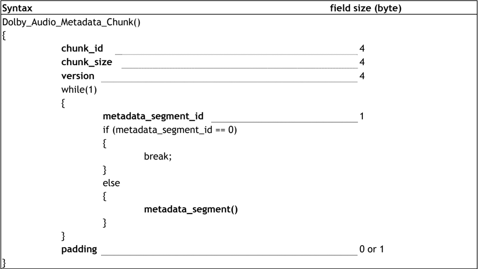
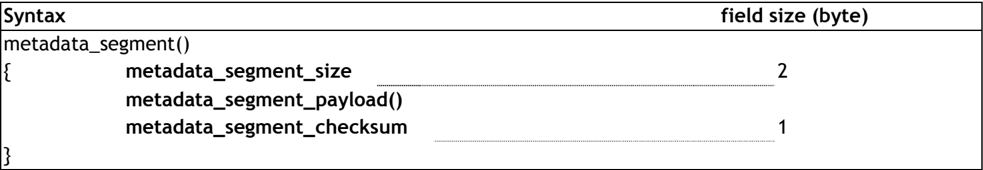
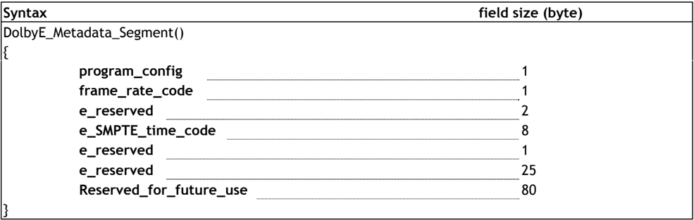
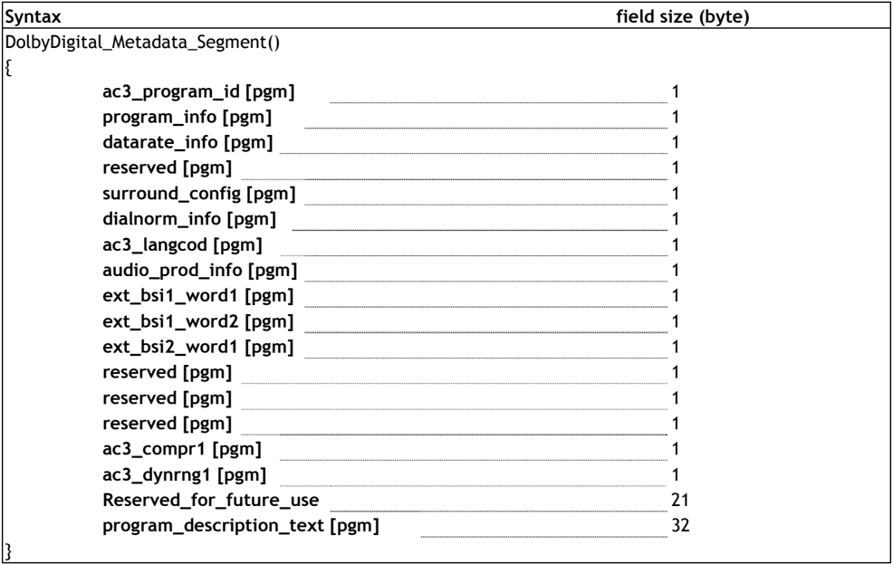
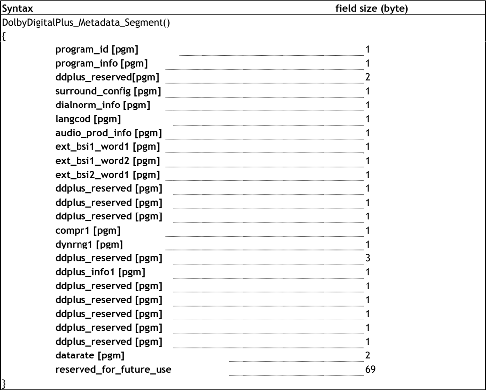
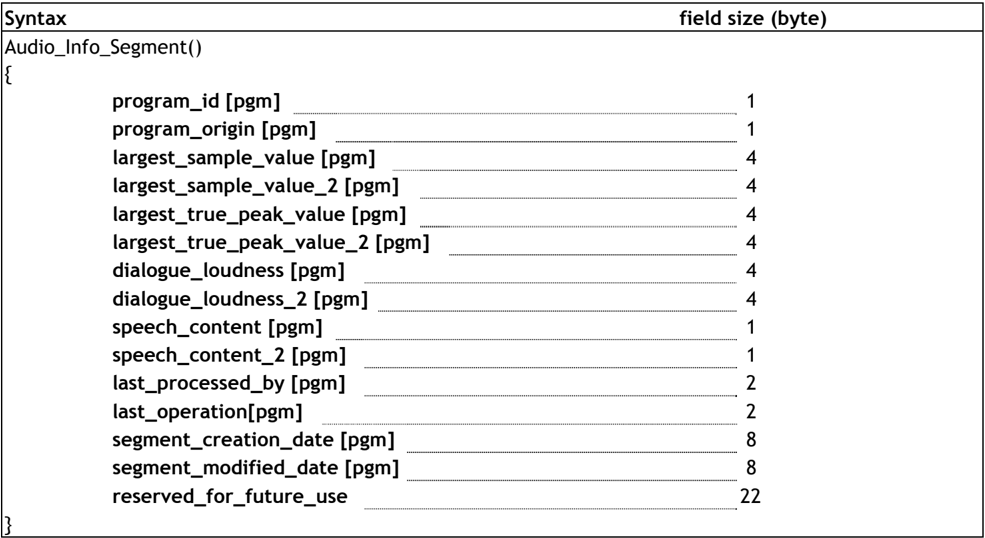

1


## Specification of the Broadcast Wave Format; a format for audio data files

Supplement 6: Dolby Metadata, &lt;dbmd&gt; chunk

(Corresponds to Dolby Version: 1.0.0.6)

Geneva October 2009

## Contents

| 1.                                                                                                                     | Introduction .................................................................................... 5                                                                                                              |
|------------------------------------------------------------------------------------------------------------------------|------------------------------------------------------------------------------------------------------------------------------------------------------------------------------------------------------------------|
| 1.1 Wave File Format Summary.............................................................................5             |                                                                                                                                                                                                                  |
| 2. Dolby audio Metadata chunk                                                                                          | ................................................................ 6                                                                                                                                               |
| 2.1 chunk_id                                                                                                           | ...................................................................................................6                                                                                                             |
| 2.2 chunk_size.................................................................................................6       |                                                                                                                                                                                                                  |
| 2.3 version                                                                                                            | .....................................................................................................6                                                                                                           |
| 2.4 metadata_segment_id                                                                                                | ...................................................................................7                                                                                                                             |
| 2.5 padding                                                                                                            | ....................................................................................................7                                                                                                            |
| 3. The Metadata                                                                                                        | Segment....................................................................... 7                                                                                                                                 |
| 3.1 metadata_segment_size.................................................................................8            |                                                                                                                                                                                                                  |
| 3.2 metadata_segment_payload()..........................................................................8              |                                                                                                                                                                                                                  |
| 3.3 metadata_segment_checksum..........................................................................8               |                                                                                                                                                                                                                  |
| 4. Dolby Metadata                                                                                                      | Segments.................................................................... 8                                                                                                                                   |
| 4.1 The Dolby E Metadata Segment Payload                                                                               | ..............................................................8                                                                                                                                                  |
| 4.1.1                                                                                                                  | program_config...................................................................................................9                                                                                               |
| 4.1.2                                                                                                                  | frame_rate_code............................................................................................... 10                                                                                                |
| 4.1.3                                                                                                                  | e_SMPTE_time_code........................................................................................... 11                                                                                                  |
| 4.2 The Dolby Digital Metadata Segment................................................................                 | 11                                                                                                                                                                                                               |
| 4.2.1 ac3_program_id                                                                                                   | ................................................................................................ 12                                                                                                              |
| 4.2.2 program_info                                                                                                     | ................................................................................................... 13                                                                                                           |
| surround_config                                                                                                        | ................................................................................................ 15                                                                                                              |
| 4.2.4                                                                                                                  |                                                                                                                                                                                                                  |
| 4.2.5                                                                                                                  | dialnorm_info................................................................................................... 16                                                                                              |
| 4.2.6                                                                                                                  | ac3_langcod..................................................................................................... 17                                                                                              |
| 4.2.7                                                                                                                  | audio_prod_info................................................................................................ 17                                                                                               |
| 4.2.8                                                                                                                  | ext_bsi1_word1................................................................................................. 18                                                                                               |
| 4.2.9                                                                                                                  | ext_bsi1_word2................................................................................................. 19                                                                                               |
| 4.2.10                                                                                                                 | ext_bsi2_word1................................................................................................. 21                                                                                               |
| 4.2.11 ac3_compr1 4.2.12 ac3_dynrng1                                                                                   | ..................................................................................................... 22 .................................................................................................... 23 |
| 4.2.13 4.3 The Dolby Digital Plus Metadata Segment                                                                     | 23 .......................................................... 23                                                                                                                                                 |
|                                                                                                                        | program_description_text....................................................................................                                                                                                     |
| 4.3.1 program_id...................................................................................................... | 24                                                                                                                                                                                                               |
| 4.3.2 program_info 4.3.3 surround_config                                                                               | ................................................................................................... 24 ................................................................................................ 26       |

| Dolby Metadata Chunk                                                                                                       | Dolby Metadata Chunk                                                                                                       | Tech 3285 (BWF) Suppl. 6                                                                                             |
|----------------------------------------------------------------------------------------------------------------------------|----------------------------------------------------------------------------------------------------------------------------|----------------------------------------------------------------------------------------------------------------------|
| 4.3.4                                                                                                                      |                                                                                                                            | dialnorm_info................................................................................................... 27  |
| 4.3.5 langcod ..........................................................................................................   | 4.3.5 langcod ..........................................................................................................   | 28                                                                                                                   |
| 4.3.6 audio_prod_info................................................................................................      | 4.3.6 audio_prod_info................................................................................................      | 28                                                                                                                   |
| 4.3.7 ext_bsi1_word1                                                                                                       | 4.3.7 ext_bsi1_word1                                                                                                       | ................................................................................................ 29                  |
| 4.3.8 ext_bsi1_word2                                                                                                       | 4.3.8 ext_bsi1_word2                                                                                                       | ................................................................................................ 30                  |
| 4.3.9 ext_bsi2_word1 ................................................................................................      | 4.3.9 ext_bsi2_word1 ................................................................................................      | 32                                                                                                                   |
| 4.3.10 compr1...........................................................................................................   | 4.3.10 compr1...........................................................................................................   | 33                                                                                                                   |
| 4.3.11 dynrng1 ..........................................................................................................  | 4.3.11 dynrng1 ..........................................................................................................  | 34                                                                                                                   |
| 4.3.12 ddplus_info1 ....................................................................................................   | 4.3.12 ddplus_info1 ....................................................................................................   | 34                                                                                                                   |
| 4.3.13 datarate .........................................................................................................  | 4.3.13 datarate .........................................................................................................  | 35                                                                                                                   |
| 4.4 Audio Info Segment.....................................................................................35              | 4.4 Audio Info Segment.....................................................................................35              |                                                                                                                      |
| 4.4.1 program_id......................................................................................................     | 4.4.1 program_id......................................................................................................     | 36                                                                                                                   |
| 4.4.2                                                                                                                      |                                                                                                                            | audio_origin..................................................................................................... 36 |
| 4.4.3 largest_sample_value .........................................................................................       | 4.4.3 largest_sample_value .........................................................................................       | 36                                                                                                                   |
| 4.4.4 largest_sample_value_2                                                                                               | 4.4.4 largest_sample_value_2                                                                                               | ...................................................................................... 37                            |
| 4.4.5 largest_true_peak_value .....................................................................................        | 4.4.5 largest_true_peak_value .....................................................................................        | 37                                                                                                                   |
| 4.4.6 largest_true_peak_value_2 ..................................................................................         | 4.4.6 largest_true_peak_value_2 ..................................................................................         | 37                                                                                                                   |
| 4.4.7 dialogue_loudness .............................................................................................      | 4.4.7 dialogue_loudness .............................................................................................      | 37                                                                                                                   |
| 4.4.8 dialogue_loudness_2                                                                                                  | 4.4.8 dialogue_loudness_2                                                                                                  | .......................................................................................... 37                        |
| 4.4.9 speech_content ................................................................................................      | 4.4.9 speech_content ................................................................................................      | 38                                                                                                                   |
| 4.4.10 speech_content_2                                                                                                    | 4.4.10 speech_content_2                                                                                                    | ............................................................................................. 38                     |
| 4.4.11 last_processed_by .............................................................................................     | 4.4.11 last_processed_by .............................................................................................     | 38                                                                                                                   |
| 4.4.12 4.4.13 segment_creation_date....................................................................................... | 4.4.12 4.4.13 segment_creation_date....................................................................................... | last_operation .................................................................................................. 38 |
| 4.4.14                                                                                                                     | 4.4.14                                                                                                                     | 39                                                                                                                   |
| segment_modified_date......................................................................................                | segment_modified_date......................................................................................                |                                                                                                                      |
| 5. Wave Format Compatibility.................................................................39                            | 5. Wave Format Compatibility.................................................................39                            |                                                                                                                      |
| 5.1                                                                                                                        | WAV Specifications .....................................................................................39                 | WAV Specifications .....................................................................................39           |
| 5.3                                                                                                                        | Bit Depth of the PCM Samples ........................................................................44                    | Bit Depth of the PCM Samples ........................................................................44              |
|                                                                                                                            | PCM Sample Rate .......................................................................................45                  | PCM Sample Rate .......................................................................................45            |
| 5.4                                                                                                                        |                                                                                                                            |                                                                                                                      |
| 5.5                                                                                                                        | Non-PCM Bitstreams ....................................................................................45                  | Non-PCM Bitstreams ....................................................................................45            |
| 7.                                                                                                                         | REFERENCES ...................................................................................46                           | REFERENCES ...................................................................................46                     |

## Specification of the Broadcast Wave Format; a format for audio data files

## Supplement 6: Dolby Metadata, &lt;dbmd&gt; Chunk

| EBU Committee   |   First Issued | Revised   | Re-issued   |
|-----------------|----------------|-----------|-------------|
| PMC             |           2009 |           |             |

Keywords: BWF, MBWF, RF64, Multichannel Broadcast Wave File, Audio file format, Dolby Metadata Chunk

## 1. Introduction

This  document  defines  a  new  chunk  type  as  an  extension  to  the  Broadcast  Wave  Format (BWF / MBWF / RF64)  specified  in  [1][2][3][4].  This  extension  is  intended  to  support  audio metadata associated with Dolby technologies, such as Dolby E, Dolby Digital and Dolby Digital Plus.

## 1.1 Wave File Format Summary

The WAVE file is based upon Microsoft's Resource Interchange File Format (RIFF), and is intended to carry  audio  data.  The  RIFF  specification  defines  basic  data  structures  called  'chunks',  which contain a 4-byte identification field, a size field, and a payload with specific types of information. Applications that read this format ignore unknown chunks and process the known ones.

WAVE files have to at least contain a format chunk and a data chunk . When carrying non-PCM data, an extra fact chunk is included to describe the data.

When  Windows  2000  was  released,  Microsoft  defined  an  extension  to  the  WAVE  file  format  to support  multi-channel  audio,  in  particular  for  PC  gaming  applications.  A new  extensible  wave format type was introduced, allowing the WAVE file to carry interleaved PCM audio channels, and assign different speaker positions to each channel. It also provides some solutions to ambiguities in the  original  WAVE  format  fields,  such  as  the  ambiguous  interpretation  of  wBitsPerSample, nBlockAlign and nChannels fields.

The  European  Broadcasting  Union  (EBU)  developed  the  Broadcast  Wave  Format  (BWF),  which extends  the  WAVE  file  format  to  better  support  the  exchange  of  audio  broadcasting  audio programmes  between  audio  workstations.  A  new  required broadcast  extension  &lt;bext&gt;  chunk is introduced.

To extend the BWF file format to  support  file  sizes  that  exceed  4 Gbyte,  the  Multichannel  BWF (MBWF) was defined. This defines an alternative RIFF format called RF64 which closely follows the original RIFF/WAVE/BWF format with the addition of a new chunk called ' ds64 ', which contains all the correct 64-bit values for the RF64 file size, and for data chunks. A few enhancements were also proposed  to  define  new  'speaker  positions'  for  stereo  channels,  control  data  and  for  non-PCM bitstreams (such as Dolby Digital and Dolby E.)

An RF64 file with a &lt;bext&gt; chunk becomes a MBWF file. The terms 'RF64' and 'MBWF' can then be considered synonymous.

## 2. Dolby audio Metadata chunk

The Dolby Audio Metadata Chunk is identified by the chunk id 'dbmd'. It is comprised of a variable number  of  metadata  segments.  This  syntax  is  loosely  based  upon  the  existing  Dolby E  audio metadata serial bitstream fields submitted as a SMPTE Registered Disclosure Document [5], which will facilitate the interaction of existing hardware equipment with software that processes these WAVE files.

All multi-byte fields follow the little-endian byte ordering.

Table 1: Chunk structure



## 2.1 chunk\_id

Field size:

32 bit.

Valid range:

fixed ASCII string 'dbmd'.

These four bytes identifiy the chunk as a Dolby Audio Metadata chunk.

## 2.2 chunk\_size

Field size:

4 byte.

Valid range:

0 - 0xFFFFFFFF.

The number of bytes in the Dolby Audio Metadata chunk, excluding the chunk\_id and chunk\_size fields.

## 2.3 version

Field size:

4 byte.

Valid range:

0 - 0xFFFFFFFF.

The current version number of this document (see title page), concatenated into a 32-bit integer. For example: version 1.15.2.0 corresponds to 0x010F0200.

## 2.4 metadata\_segment\_id

Field size:

1 byte.

Valid range:

See Table 2.

The  metadata\_segment\_id  field  indicates  the  type  of  metadata  contained  in  the  following metadata data segment. Note that the types defined in Table 2 are based on some of the existing 'data segment' types defined in [5].

Table 2: Metadata Segment Types

| metadata_segment_id   | Metadata Segment Type                |
|-----------------------|--------------------------------------|
| 0                     | None (Signals the end of a subframe) |
| 1                     | Dolby E Metadata                     |
| 2                     | Reserved                             |
| 3                     | Dolby Digital Metadata               |
| 4-6                   | Reserved                             |
| 7                     | Dolby Digital Plus Metadata          |
| 8                     | Audio Info                           |
| 9-255                 | Reserved for Future Extension        |

## 2.5 padding

Field size:

1 byte.

Valid range:

All values.

When present, this field is used to keep the size of the chunk (in byte) even. Its value should be ignored.

## 3. The Metadata Segment

The  Dolby  Audio  Metadata  chunk  is  composed  of  one  or  more  metadata  segments,  as  shown  in Table 3. These are structures that contain information on a specific Dolby file formats - such as Dolby E, Dolby Digital or Dolby Digital Plus. The reserved values 8-255 for the metadata\_segment\_id allow for future extension to new Dolby file formats.

The different types of payload are described in the next section.

Table 3: Metadata Segment



| Syntax                    | field size (byte)   |
|---------------------------|---------------------|
| metadata_segment()        |                     |
| { metadata_segment_size   | 2                   |
| metadata_segment_checksum | 1                   |

## 3.1 metadata\_segment\_size

```
Field size: 2 byte. Valid range: 0 - 65535 (0 is interpreted as 65535 byte).
```

This field specifies the number of byte in the metadata segment payload.

## 3.2 metadata\_segment\_payload()

The metadata\_segment\_payload() field contains a variable number of bytes depending on the type of  metadata  information  encoded.  Section 3  describes  the  syntax  for  the  metadata\_segments defined in Table 2 : Metadata Segment Types.

## 3.3 metadata\_segment\_checksum

Field size:

1 byte.

Valid range:

All values.

This  field  is  a  2's  complement  checksum  for  the  metadata  segment.  It  is  calculated  over  the metadata\_segment\_size and the metadata\_segment\_payload() fields.  The  checksum  is  initialized with the value of the metadata\_segment\_size byte, then bytes of the metadata\_segment\_payload are added sequentially from the beginning of the metadata\_segment\_payload. Any carry bits that are generated are thrown away by ANDing the totals with 0xFF.

The pseudo code for the operation is:

```
/* initialize the checksum to the metadata segment size */ checksum = metadata_segment_size; /* perform checksum on the metadata segment payload including unused bits */ for (j = 0; j < metadata_segment_size; j++) { data = metadata_segment_payload[j]; checksum = (checksum + data) & 0xFF; } /* take the 2's complement of the running checksum */ checksum = ((~checksum) + 1) & 0xFF.
```

## 4. Dolby Metadata Segments

## 4.1 The Dolby E Metadata Segment Payload

The  Dolby E  Metadata  segment  payload  structure  is  based  upon  the  Dolby E  Complete  Metadata Data Segment defined in [5]. A Dolby E metadata segment implies the existence of at least one Dolby Digital metadata segment for each Dolby Digital programme that it contains. There are no restrictions regarding the order in which these segments appear within the Dolby Audio metadata chunk.

Fields derived from [5] are preceded by a 'e\_'.

onfig

\_code ime\_code

1

1

2

8

1

Table 4: Dolby E Metadata Segment Payload



| Syntax                      | field size (byte)   |
|-----------------------------|---------------------|
| DolbyE_Metadata_Segment() { |                     |
| program_config              | 1                   |
| frame_rate_code             | 1                   |
| e_reserved                  | 2                   |
| e_SMPTE_time_code           | 8                   |
| e_reserved                  | 1                   |
| e_reserved                  | 25                  |
| Reserved_for_future_use     | 80                  |

## 4.1.1 program\_config

|   Bit 7 (MSB) |   Bit 6 | Bit 5            | Bit 4            | Bit 3            | Bit 2            | Bit 1            | Bit 0 (LSB)      |
|---------------|---------|------------------|------------------|------------------|------------------|------------------|------------------|
|             0 |       0 | e_program_config | e_program_config | e_program_config | e_program_config | e_program_config | e_program_config |

## 4.1.1.1 e\_program\_config

Field size:

6 bit.

Valid range:

0 - 23, and 63. Values 24 to 62 are Reserved.

This  field  indicates  how  the  programmes  were  originally  packed  into  the  Dolby E  frame.  The programme configuration field defines the number of separate programmes in the frame, and the number  of  separate  channels  in  each  programme.  It  also  identifies  where  in  the  sequence  of metadata fields, the field associated with a specific programme or channel within a programme will be  found,  by  specifying  the  order  in  which  the  programme  and  channel  data  is  packed  into  the Dolby E metadata segment.

Fields, such as the description\_text, have a [pgm] suffix to indicate that they apply to a programme as a whole. Other elements that only apply to individual channels use a [ch] suffix to indicate this. The system used to organize the metadata elements, shown in Table 5 , is to start with those that apply to the Left (L) channels for all the programmes, in programme sequence, followed by all the 'C' or Centre (also used for mono signals) channels in programme sequence, followed by the Left Surround (Ls), Right (R), Low Frequency Effects (LFE) and finally the Right Surround (Rs) channels, again in programme order, with the programme count beginning at zero.

Note that the Channel Sequence shown in Table 5 does not apply to the audio inputs and outputs of Dolby E  encoders  and  decoders.  It  is  only  used  to  locate  specific  parameters  within  the  serial metadata bitstream.

Table 5: Dolby E Programme Configuration 1

| Programme Config   | Programme Count   | Channel Count   | Programme Sequence            |
|--------------------|-------------------|-----------------|-------------------------------|
| 0                  | 2                 | 8               | 5.1 + 2                       |
| 1                  | 3                 | 8               | 5.1 + 1 + 1                   |
| 2                  | 2                 | 8               | 4 + 4                         |
| 3                  | 3                 | 8               | 4 + 2 + 2                     |
| 4                  | 4                 | 8               | 4 + 2 + 1 + 1                 |
| 5                  | 5                 | 8               | 4 + 1 + 1 + 1 + 1             |
| 6                  | 4                 | 8               | 2 + 2 + 2 + 2                 |
| 7                  | 5                 | 8               | 2 + 2 + 2 + 1 + 1             |
| 8                  | 6                 | 8               | 2 + 2 + 1 + 1 + 1 + 1         |
| 9                  | 7                 | 8               | 2 + 1 + 1 + 1 + 1 + 1 + 1     |
| 10                 | 8                 | 8               | 1 + 1 + 1 + 1 + 1 + 1 + 1 + 1 |
| 11                 | 1                 | 6               | 5.1                           |
| 12                 | 2                 | 6               | 4 + 2                         |
| 13                 | 3                 | 6               | 4 + 1 + 1                     |
| 14                 | 3                 | 6               | 2 + 2 + 2                     |
| 15                 | 4                 | 6               | 2 + 2 + 1 + 1                 |
| 16                 | 5                 | 6               | 2 + 1 + 1 + 1 + 1             |
| 17                 | 6                 | 6               | 1 + 1 + 1 + 1 + 1 + 1         |
| 18                 | 1                 | 4               | 4                             |
| 19                 | 2                 | 4               | 2 + 2                         |
| 20                 | 3                 | 4               | 2 + 1 + 1                     |
| 21                 | 4                 | 4               | 1 + 1 + 1 + 1                 |
| 22                 | 1                 | 8               | 7.1                           |
| 23                 | 1                 | 8               | 7.1 Screen                    |
| 24 - 62            | reserved          | reserved        | Reserved                      |
| 63                 | 1                 | N/A             | N/A                           |

## 4.1.2 frame\_rate\_code

|   Bit 7 (MSB) |   Bit 6 |   Bit 5 |   Bit 4 | Bit 3        | Bit 2        | Bit 1        | Bit 0 (LSB)   |
|---------------|---------|---------|---------|--------------|--------------|--------------|---------------|
|             0 |       0 |       0 |       0 | e_frame_rate | e_frame_rate | e_frame_rate | e_frame_rate  |

## 4.1.2.1 e\_frame\_rate

Field size:

4 bit.

Valid range:

See Table 6.

Indicates  the  frame  rate  of  the  video  reference  signal  that  the  device  producing  the  Dolby E metadata stream is locked to, as shown in Table 6.

1 Value 63 in Table 5 is a special value that is used in case of a single AC-3 programme not originated from Dolby E. In this case, the exact channel count is determined only by the ac3\_acmod field in the Dolby Digital segment.

Table 6: Valid Dolby E frame rates

| Frame Rate Code   | Frame Rate                                      |
|-------------------|-------------------------------------------------|
| 1                 | 24000/1001 ~ 23.98 Hz (film normalized to NTSC) |
| 2                 | 24 Hz (film rate)                               |
| 3                 | 25 Hz (PAL frame rate)                          |
| 4                 | 30000/1001 ~ 29.97 Hz (NTSC frame rate)         |
| 5                 | 30 Hz                                           |
| 0, 6 - 15         | reserved                                        |
| 16 - 255          | invalid                                         |

## 4.1.3 e\_SMPTE\_time\_code

Field size:

8 byte.

Valid range:

See Table 7.

This field contains information relating to the SMPTE timecode associated with the original Dolby E frame.

Table 7: SMPTE timecode associated with original Dolby E frame

| SMPTE Timecode Byte   | MSB   | Bit Number   | Bit Number   | Bit Number   | Bit Number   | Bit Number   | Bit Number   | LSB   |
|-----------------------|-------|--------------|--------------|--------------|--------------|--------------|--------------|-------|
| SMPTE Timecode Byte   | 7     | 6            | 5            | 4            | 3            | 2            | 1            | 0     |
| byte 0                | [63]  | [62]         | [61]         | [60]         | [55]         | [54]         | [53]         | [52]  |
| byte 1                | [59]  | [58]         | H20          | H10          | H8           | H4           | H2           | H1    |
| byte 2                | [47]  | [46]         | [45]         | [44]         | [39]         | [38]         | [37]         | [36]  |
| byte 3                | [43]  | M40          | M20          | M10          | M8           | M4           | M2           | M1    |
| byte 4                | [31]  | [30]         | [29]         | [28]         | [23]         | [22]         | [21]         | [20]  |
| byte 5                | [27]  | S40          | S20          | S10          | S8           | S4           | S2           | S1    |
| byte 6                | [15]  | [14]         | [13]         | [12]         | [7]          | [6]          | [5]          | [4]   |
| byte 7                | [11]  | DF           | F20          | F10          | F8           | F4           | F2           | F1    |

In Table 7, the notation [N] corresponds to the Nth bit of the SMPTE timecode word. Some of these values are identified explicitly for ease of reference. The values corresponding to BCD-coded hour, minutes, seconds, and frames are indicated with Hn, Mn, Sn, and Fn notation. The drop-frame flag is indicated as DF.

This SMPTE timecode value refers to the first frame of the original Dolby E file from which this PCM was originated.

It is possible that the SMPTE timecode field may not contain valid timecode information. In these cases, the timecode will be flagged as invalid by setting the BCD-coded hours field to the illegal value of 0x3F.

In some applications, the SMPTE timestamp field may be associated and/or desired for a single AC-3 audio programme that did not originate from Dolby E. In these cases it is recommended that the Dolby E metadata  segment  (e\_SMPTE\_time\_code)  still be created and populated with the appropriate values (e\_pgm\_config with a value of 63).

## 4.2 The Dolby Digital Metadata Segment

The  Dolby  Digital  (AC-3)  Metadata  segment  payload  structure  is  based  upon  the  Dolby  Digital Complete Metadata Data Segment with Extended BSI support as defined in [5]. Please note that

id [pgm]

[pgm]

[pgm]

fig [pgm]

[pgm]

pgm]

11 [pgm]

12 [pgm]

11 [pgm]

]

]

ogm]

pgm]

future\_use ription\_text [pgm]

1

1

1

fields derived from [5] are preceded by 'ac3\_'.

1

NOTE The entire Dolby Digital (AC-3) Metadata segment structure is outlined in Table 8 ,  below. The  remainder  of  this  section  describes  the  non-reserved  byte  (and  bit  field)  values  and  valid ranges for each. All reserved bytes are a mandatory part of the segment structure and must be passed on intact.

Table 8: Dolby Digital Metadata Segment Syntax

1



| Syntax                                                                                                                                                                                                                                                                                                                                                                                         | field size (byte)                     |
|------------------------------------------------------------------------------------------------------------------------------------------------------------------------------------------------------------------------------------------------------------------------------------------------------------------------------------------------------------------------------------------------|---------------------------------------|
| DolbyDigital_Metadata_Segment() { ac3_program_id [pgm] program_info [pgm] datarate_info [pgm] reserved [pgm] surround_config [pgm] dialnorm_info [pgm] ac3_langcod [pgm] audio_prod_info [pgm] ext_bsi1_word1 [pgm] ext_bsi1_word2 [pgm] ext_bsi2_word1 [pgm] reserved [pgm] reserved [pgm] reserved [pgm] ac3_compr1 [pgm] ac3_dynrng1 [pgm] Reserved_for_future_use program_description_text | 1 1 1 1 1 1 1 1 1 1 1 1 1 1 1 1 21 32 |

## 4.2.1 ac3\_program\_id

|   Bit 7 (MSB) |   Bit 6 |   Bit 5 | Bit 4          | Bit 3          | Bit 2          | Bit 1          | Bit 0 (LSB)    |
|---------------|---------|---------|----------------|----------------|----------------|----------------|----------------|
|             0 |       0 |       0 | ac3_program_id | ac3_program_id | ac3_program_id | ac3_program_id | ac3_program_id |

Field size:

5 bit.

Valid range:

0 - 7, or 31.

This  field  identifies  which  programme  within  a  Dolby E  frame  the  metadata  segment  payload applies  to.  The  program\_id  field  points  to  a  specific  programme,  based  on  the  fixed  order  of programmes specified by the Dolby E program\_config field (see § 6.1.2). The programme number for the first programme is zero.

Example: program\_config = 7, (2+2+2+1+1) and program\_id = 2, which means that the DolbyDigital\_Metadata\_Payload() refers to the third stereo programme for this specific program\_config.

A value of 31 indicates that the program\_id field should be ignored. This is typically the case for single Dolby Digital programmes that are not associated with any previous Dolby E packaging.

## 4.2.2 program\_info

|   Bit 7 (MSB) | Bit 6     | Bit 5     | Bit 4     | Bit 3     | Bit 2     | Bit 1 Bit   | 0 (LSB)   |
|---------------|-----------|-----------|-----------|-----------|-----------|-------------|-----------|
|             0 | ac3_lfeon | ac3_bsmod | ac3_bsmod | ac3_bsmod | ac3_acmod | ac3_acmod   | ac3_acmod |

## 4.2.2.1

ac3\_lfeon

Field size:

1 bit.

Valid range:

0 and 1.

This bit has a value of 1 if the LFE (low-frequency effects) channel is on, and a value of 0 if the LFE channel is off.

## 4.2.2.2

ac3\_bsmod

Field size:

3 bit.

Valid range:

0 - 7.

The Bitstream mode code indicates the type of programme service that is being carried as defined in Table 9.

Table 9: Bitstream mode code

| bsmod            | acmod      | Type of Service                            |
|------------------|------------|--------------------------------------------|
| 000              | any        | main audio service: complete main (CM)     |
| 001              | any        | main audio service: music and effects (ME) |
| 010              | any        | associated service: visually impaired (VI) |
| 011              | any        | associated service: hearing impaired (HI)  |
| 100              | any        | associated service: dialogue (D)           |
| 101              | any        | associated service: commentary (C)         |
| 110              | any        | associated service: emergency (E)          |
| 111              | 001        | associated service: voice over (VO)        |
| 111              | 010 to 111 | main audio service: karaoke                |
| All other values | any        | invalid                                    |

## 4.2.2.3 ac3\_acmod

Field size:

3 bit.

Valid range:

0 - 7.

This 3-bit code, shown in Table 10 , indicates which of the main service channels are in use. If the msb of acmod is 1, then the surround channels are in use and the ac3\_surmixlev parameter follows later  in  the  bitstream.  If  the  msb  of  acmod  is  0,  the  surround  channels  are  not  in  use  and  the ac3\_surmixlev is omitted from the bitstream. If the lsb of acmod is 0, the centre channel is not in use. If the lsb of acmod is a 1, the centre channel is in use.

NOTE that the channel ordering shown below does not apply to the audio inputs and outputs of Dolby Digital encoders and decoders.

Note: ac3-acmod = 000 is not a valid audio coding mode and therefore is a reserved value.

Table 10: Audio Coding Mode

|   ac3-acmod | Audio Coding Mode   | Channel Ordering   |
|-------------|---------------------|--------------------|
|         000 | reserved            | n/a                |
|         001 | 1/0                 | C                  |
|         010 | 2/0                 | L, R               |
|         011 | 3/0                 | L,C,R              |
|         100 | 2/1                 | L, R, S            |
|         101 | 3/1                 | L, C, R, S         |
|         110 | 2/2                 | L, R, Ls, Rs       |
|         111 | 3/2                 | L, C, R, Ls, Rs    |

## 4.2.3 datarate\_info

|   Bit 7 (MSB) |   Bit 6 |   Bit 5 | Bit 4        | Bit 3        | Bit 2        | Bit 1        | Bit 0 (LSB)   |
|---------------|---------|---------|--------------|--------------|--------------|--------------|---------------|
|             0 |       0 |       0 | ac3_datarate | ac3_datarate | ac3_datarate | ac3_datarate | ac3_datarate  |

## 4.2.3.1 ac3\_datarate

Field size:

5 bit.

Valid range:

0 - 31

Indicates  the  data  rate  that  should  be  used  to  encode  the  AC-3  bitstream  associated  with  the specified programme, as shown in Table 11 , below.

Table 11: AC-3 Data Rate information

| ac3_datarate   | Data rate in kbit/s   |
|----------------|-----------------------|
| 0              | 32 kbit/s             |
| 1              | 40 kbit/s             |
| 2              | 48 kbit/s             |
| 3              | 56 kbit/s             |
| 4              | 64 kbit/s             |
| 5              | 80 kbit/s             |
| 6              | 96 kbit/s             |
| 7              | 112 kbit/s            |
| 8              | 128 kbit/s            |
| 9              | 160 kbit/s            |
| 10             | 192 kbit/s            |
| 11             | 224 kbit/s            |
| 12             | 256 kbit/s            |
| 13             | 320 kbit/s            |
| 14             | 384 kbit/s            |
| 15             | 448 kbit/s            |
| 16             | 512 kbit/s            |
| 17             | 576 kbit/s            |
| 18             | 640 kbit/s            |
| 19 - 30        | reserved              |
| 31             | not specified         |

## 4.2.4 surround\_config

|   Bit 7 (MSB) |   Bit 6 | Bit 5       | Bit 4       | Bit 3         | Bit 2         | Bit 1 Bit 0 (LSB)   |
|---------------|---------|-------------|-------------|---------------|---------------|---------------------|
|             0 |       0 | ac3_cmixlev | ac3_cmixlev | ac3_surmixlev | ac3_surmixlev | ac3_dsurmod         |

## 4.2.4.1 ac3\_cmixlev

Field size:

2 bit.

Valid range:

0 - 3.

When three front channels are in use, this 2-bit code, shown in Table 12 ,  indicates  the  nominal down-mix level of the centre channel with respect to the left and right channels. If cmixlev is set to  the  reserved  code,  decoders  should  still  reproduce  audio.  The  intermediate  value  of  cmixlev (-4.5 dB) may be used in this case.

Table 12: AC-3 centre down-mix levels

|   ac3_cmixlev | Centre downmix level   |
|---------------|------------------------|
|            00 | 0.707 (-3.0 dB)        |
|            01 | 0.595 (-4.5 dB)        |
|            10 | 0.500 (-6.0 dB)        |
|            11 | reserved               |

## 4.2.4.2 ac3\_surmixlev

Field size:

2 bit.

Valid range:

0 - 3.

If surround channels are in use, this 2-bit code, shown in Table 13 , indicates the nominal down mix level of the surround channels. If surmixlev is set to the reserved code, the decoder should still reproduce audio. The intermediate value of surmixlev (-6 dB) may be used in this case.

Table 13: AC-3 surround down-mix levels

|   ac3_surmixlev | Surround downmix level   |
|-----------------|--------------------------|
|              00 | 0.707 (-3.0 dB)          |
|              01 | 0.500 (-6.0 dB)          |
|              10 | 0                        |
|              11 | reserved                 |

## 4.2.4.3 ac3\_dsurmod

Field size:

2 bit.

Valid range:

0 - 3.

When operating in the two channel mode, this 2-bit code, as shown in Table 14 indicates whether or  not  the  programme has been encoded in Dolby Surround. This information is  not  used  by  the AC-3  decoder,  but  may  be  used  by  other  portions  of  the  audio  reproduction  equipment.  If ac3\_dsurmod is set to the reserved code, the decoder should still reproduce audio. The reserved code may be interpreted as 'not indicated'.

Table 14: AC-3 Dolby Surround encoding history

| dsurmod   | Indication                 |
|-----------|----------------------------|
| '00'      | not indicated              |
| '01'      | NOT Dolby Surround encoded |
| '10'      | Dolby Surround encoded     |
| '11'      | reserved                   |

## 4.2.5 dialnorm\_info

| Bit 7 (MSB)   | Bit 6          | Bit 5      | Bit 4        | Bit 3        | Bit 2        | Bit 1        | Bit 0 (LSB)   |
|---------------|----------------|------------|--------------|--------------|--------------|--------------|---------------|
| ac3_langcode  | ac3_copyrightb | ac3_origbs | ac3_dialnorm | ac3_dialnorm | ac3_dialnorm | ac3_dialnorm | ac3_dialnorm  |

## 4.2.5.1 ac3\_langcode

Field size:

1 bit.

Valid range:

0 and 1.

If the 'language code exists' bit is a 1, the following 8 bits represent a language code. If this bit is a 0, the language of the audio service is not indicated.

## 4.2.5.2 ac3\_copyrightb

Field size:

1 bit.

Valid range:

0 and 1.

If this bit has a value of 1, the information in the bitstream is indicated as protected by copyright. It has a value of 0 if the information is not indicated as protected.

## 4.2.5.3 ac3\_origbs

Field size:

1 bit.

Valid range:

0 and 1.

The "original bitstream" bit has a value of 1 if this is an original bitstream. This bit has a value of 0 if this is a copy of another bitstream.

## 4.2.5.4 ac3\_dialnorm

Field size:

5 bit.

Valid range:

1 - 31 (0 is interpreted as 31).

When audio from different sources is reproduced, the apparent loudness of the dialogue element, which  generally  serves  as  a  reference  for  the  loudness  of  all  the  other  programme  elements, frequently  varies  from  source  to  source.  These  sources  might  be  different  programme  segments during a broadcast (i.e., the movie vs. a commercial message), different broadcast channels, or different media (disk vs. tape). The dialnorm parameter indicates the mean level of the dialogue during the programme, relative to 0 dBFS (or full-scale digital level).

The  5-bit  dialnorm  value  is  interpreted  as  an  unsigned  integer  that  indicates  how  many dB  the subjective dialogue level is below full scale.

The dialnorm parameter is used by that section of the sound reproduction system responsible for setting  the  reproduction  level.  Listeners  generally  set  the  system  volume  control  to  reproduce dialogue at their preferred loudness. The value of dialnorm can then be used to adjust the gain of the reproduction system so that the dialogue loudness of all the programmes is reproduced at 31 dB below  full scale. This  compensates  for the different dialogue  levels  from  programme  to programme, with the result that the loudness remains constant, at the listener's desired level, from programme to programme.

As an example, the level of a programme whose dialnorm value is 25 will be reduced by 6 dB so that the dialogue will be reproduced at 31 dB below full scale. Similarly, the level of a programme with  a  dialnorm  of  17  will  be  attenuated  by  14 dB.  See  the  appendix  in  [5]  for  a  discussion  of dialogue normalization, dynamic range control, etc.

## 4.2.6 ac3\_langcod

Field size:

1 byte.

Valid range:

See Table 7-7 in [5] for valid and reserved values.

This  field  indicates  the  language  of  the  audio  service  of  the  AC-3  bitstream  associated  with  the specified programme. Note that this element is present in the Dolby E frame regardless of the value of the 'language code exists' flag.

## 4.2.7 audio\_prod\_info

| Bit 7 (MSB)   | Bit 6        | Bit 5        | Bit 4        | Bit 3        | Bit 2        | Bit 1 Bit 0 (LSB)   |
|---------------|--------------|--------------|--------------|--------------|--------------|---------------------|
| ac3_prodie    | ac3_mixlevel | ac3_mixlevel | ac3_mixlevel | ac3_mixlevel | ac3_mixlevel | ac3_roomtyp         |

## 4.2.7.1 ac3\_audprodie

Field size:

1 bit.

Valid range:

0 and 1.

If  the  'audio  production  info  exists'  bit  is  a  1,  the  mix  level  and  roomtyp  fields  exist,  giving information about the audio production environment used in making the programme. If the 'audio production info exists' bit is a 0, the mix level and roomtyp fields exist in the bitstream, but have no meaning.

## 4.2.7.2 ac3\_mixlevel

Field size:

5 bit.

Valid range:

0 - 31.

The  'mixing  level'  code  indicates  the  absolute  acoustic  sound  pressure  level  of  an  individual programme during the final audio mixing session. The 5-bit code represents a value in the range 0 to 31. The peak mixing level is 80 plus the value of mixlevel dB SPL, or 80 to 111 dB SPL. The peak mixing level is the acoustic level of a sine wave in a single channel whose peaks reach 100% in the PCM representation. The absolute SPL value is typically measured by means of pink noise with an RMS value of 20 or 30 dB below the peak RMS sine wave level. The value of mixlevel is not typically used  within  the  AC-3  decoder,  but  may  be  used  by  other  parts  of  the  audio  reproduction equipment. Note that this element is present in the Dolby E frame regardless of the value of the 'audio production info exists' flag.

## 4.2.7.3 ac3\_roomtyp

Field size:

2 bit.

Valid range:

0 - 3.

The room type code, shown in Table 15 indicates the relative size and monitor frequency response curve  of  the  mixing  room  used  for  the  final  audio  mixing  session.  The  value  of  roomtyp  is  not typically  used  by  the  AC-3  decoder,  but  may  be  used  by  other  parts  of  the  audio  reproduction equipment. If roomtyp is set to the reserved code (which may be interpreted as 'not indicated') the decoder should still reproduce audio. Note that this element is present in the Dolby E frame regardless of the value of the 'audio production info exists' flag.

Table 15: AC-3 mixing room type

| Roomtyp          | Type of Mixing Room         |
|------------------|-----------------------------|
| '00'             | not indicated               |
| '01'             | large room, X curve monitor |
| '10'             | small room, flat monitor    |
| '11'             | reserved                    |
| All other values | invalid                     |

## 4.2.8 ext\_bsi1\_word1

|   Bit 7 (MSB) | Bit 6      | Bit 5           | Bit 4           | Bit 3           | Bit 2             | Bit 1             | Bit 0 (LSB)       |
|---------------|------------|-----------------|-----------------|-----------------|-------------------|-------------------|-------------------|
|             0 | ac3_xbsi1e | ac3_lorocmixlev | ac3_lorocmixlev | ac3_lorocmixlev | ac3_lorosurmixlev | ac3_lorosurmixlev | ac3_lorosurmixlev |

## 4.2.8.1 ac3\_xbsi1e

Field size:

1 bit.

Valid range:

0 and 1.

If the 'Extended bitstream information #1 exists' bit is a 1, the 2 words that contain the extended bitstream information #1 are valid.

## 4.2.8.2 ac3\_lorocmixlev

Field size:

3 bit.

Valid range:

See Table 16 .

Table 16: AC-3 centre mix level in a Lo/Ro downmix

|   lorocmixlev | clev            |
|---------------|-----------------|
|           000 | 1.414 (+3.0 dB) |
|           001 | 1.189 (+1.5 dB) |
|           010 | 1.000 (0.0 dB)  |
|           011 | 0.841 (-1.5 dB) |
|           100 | 0.707 (-3.0 dB) |
|           101 | 0.595 (-4.5 dB) |
|           110 | 0.500 (-6.0 dB) |
|           111 | 0.000 (-inf dB) |

The "Lo/Ro centre mix level" 3-bit code, shown in Table 16 , indicates the nominal down-mix level

of the centre channel with respect to the left and right channels in a Lo/Ro downmix.

NOTE: The meaning of this field is only defined as described if the audio coding mode is 3/0, 3/1 or 3/2.  If  the  audio  coding  mode  is  1+1,  1/0,  2/0,  2/1  or  2/2  then  the  meaning  of  this  field  is Reserved.Values 0x000 to 0x010 inclusive are Reserved.

## 4.2.8.3 ac3\_lorosurmixlev

Field size:

3 bit.

Valid range:

See Table 17 .

Table 17: AC-3 surround mix level in a Lo/Ro downmix

|   lorosurmixlev | slev                                            |
|-----------------|-------------------------------------------------|
|             000 | 1.414 (+3.0 dB) (Reserved in ATSC applications) |
|             001 | 1.189 (+1.5 dB) (Reserved in ATSC applications) |
|             010 | 1.000 (0.0 dB) (Reserved in ATSC applications)  |
|             011 | 0.841 (-1.5 dB)                                 |
|             100 | 0.707 (-3.0 dB)                                 |
|             101 | 0.595 (-4.5 dB)                                 |
|             110 | 0.500 (-6.0 dB)                                 |
|             111 | 0.000 (-inf dB)                                 |

The  "Lo/Ro  surround  mix  level"  3-bit  code,  shown  in Table 17 ,  indicates  the  nominal  down-mix level of the surround channels with respect to the left and right channels in a Lo/Ro downmix.

NOTE: The meaning of this field is only defined as described if the audio coding mode is 2/1, 3/1, 2/2  or  3/2.  If  the  audio  coding  mode  is  1+1,  1/0,  2/0,  or  3/0  then  the  meaning  of  this  field  is Reserved..Values 0x000 to 0x010 inclusive are Reserved.

ATSC Standard A/52B, Digital Audio Compression Standard (AC-3, E-AC-3) Revision B, 14 June 2005 states  that  the  values  '000',  '001'  and  '010'  are  Reserved.  It  further  states  that  for  ATSC  DTV applications,  the  decoder  shall  use  a  value  of  0.841  for  slev  if  one  of  the  reserved  values  is received.

## 4.2.9 ext\_bsi1\_word2

| Bit 7 (MSB)   | Bit 6       | Bit 5           | Bit 4           | Bit 3           | Bit 2             | Bit 1             | Bit 0 (LSB)       |
|---------------|-------------|-----------------|-----------------|-----------------|-------------------|-------------------|-------------------|
| ac3_dmixmod   | ac3_dmixmod | ac3_ltrtcmixlev | ac3_ltrtcmixlev | ac3_ltrtcmixlev | ac3_ltrtsurmixlev | ac3_ltrtsurmixlev | ac3_ltrtsurmixlev |

## 4.2.9.1

## ac3\_dmixmod

Field size:

2 bit.

Valid range:

See Table 18 .

The  preferred  stereo  downmix  mode  code,  as  shown  in Table 18 ,  indicates  the  type  of  stereo downmix preferred by the mastering engineer. This information may be used by the AC-3 decoder to automatically configure the type of stereo downmix, but may also be overridden or ignored. If dmixmod is set to the reserved code, the decoder should still reproduce audio. The reserved code may be interpreted as 'not indicated'.

Table 19: AC-3 preferred stereo down-mix mode code

|   dmixmod | Indication              |
|-----------|-------------------------|
|        00 | Not indicated           |
|        01 | Lt/Rt downmix preferred |
|        10 | Lo/Ro downmix preferred |
|        11 | Reserved                |

NOTE: The meaning of this field is only defined as described if the audio coding mode is 3/0, 2/1, 3/1, 2/2, or 3/2. If the audio coding mode is 1+1, 1/0, or 2/0 then the meaning of this field is Reserved.

## 4.2.9.2 ac3\_ltrtcmixlev

Field size:

3 bit.

Valid range:

See Table 20.

The 'Lt/Rt centre mix level' 3-bit code, shown in Table 20 , indicates the nominal down-mix level of the centre channel with respect to the left and right channels in a Lt/Rt downmix.

Table 20: AC-3 centre channel down-mix level in a Lt/Rt downmix

|   ltrtcmixlev | clev            |
|---------------|-----------------|
|           000 | 1.414 (+3.0 dB) |
|           001 | 1.189 (+1.5 dB) |
|           010 | 1.000 (0.0 dB)  |
|           011 | 0.841 (-1.5 dB) |
|           100 | 0.707 (-3.0 dB) |
|           101 | 0.595 (-4.5 dB) |
|           110 | 0.500 (-6.0 dB) |
|           111 | 0.000 (-inf dB) |

NOTE: The meaning of this field is only defined as described if the audio coding mode is 3/0, 3/1 or 3/2.  If  the  audio  coding  mode  is  1+1,  1/0,  2/0,  2/1,  or  2/2  then  the  meaning  of  this  field  is Reserved.

## 4.2.9.3 ac3\_ltrtsurmixlev

Field size:

1 byte.

Valid range:

See Table 21 .

Table 21: AC-3 surround channels down-mix level in a Lt/Rt downmix

|   ltrtsurmixlev | slev                                            |
|-----------------|-------------------------------------------------|
|             000 | 1.414 (+3.0 dB) (Reserved in ATSC applications) |
|             001 | 1.189 (+1.5 dB) (Reserved in ATSC applications) |
|             010 | 1.000 (0.0 dB) (Reserved in ATSC applications)  |
|             011 | 0.841 (-1.5 dB)                                 |
|             100 | 0.707 (-3.0 dB)                                 |
|             101 | 0.595 (-4.5 dB)                                 |
|             110 | 0.500 (-6.0 dB)                                 |
|             111 | 0.000 (-inf dB)                                 |

This 3-bit code, shown in Table 21 , indicates the nominal down mix level of the surround channels with respect to the left and right channels in a Lt/Rt downmix.

NOTE: The meaning of this field is only defined as described if the audio coding mode is 2/1, 3/1, 2/2  or  3/2.  If  the  audio  coding  mode  is  1+1,  1/0,  2/0  or  3/0  then  the  meaning  of  this  field  is Reserved.Values 0x000 to 0x010 inclusive are Reserved.

ATSC Standard A/52B, Digital Audio Compression Standard (AC-3, E-AC-3) Revision B, 14 June 2005 states  that  the  values  '000',  '001'  and  '010'  are  Reserved.  It  further  states  that  for  ATSC  DTV applications,  the  decoder  shall  use  a  value  of  0.841  for  slev  if  one  of  the  reserved  values  is received.

## 4.2.10 ext\_bsi2\_word1

| Bit 7 (MSB)   | Bit 6 Bit 5   | Bit 4            | Bit 3   | Bit 2         |   Bit 1 |   Bit 0 (LSB) |
|---------------|---------------|------------------|---------|---------------|---------|---------------|
| ac3_xbsi2e    | ac3_dsurexmod | ac3_dheadphonmod |         | ac3_adconvtyp |       0 |             0 |

## 4.2.10.1 ac3\_xbsi2e

Field size:

1 bit.

Valid range:

0 and 1.

If the "Extended bitstream information #2 exists" bit is a 1, the 2 words that contain the extended bitstream information #2 are valid.

## 4.2.10.2 ac3\_dsurexmod

Field size:

2 bit.

Valid range:

See Table 22 .

The  Dolby  Surround  EX™  mode  code,  as  shown  in Table 22 ,  indicates  whether  or  not  the programme  has  been  encoded  in  Dolby  Surround  EX.  This  information  is  not  used  by  the  AC-3 decoder, but may be used by other portions of the audio reproduction equipment. If dsurexmod is set  to  the  reserved  code,  the  decoder  should  still  reproduce  audio.  The  reserved  code  may  be interpreted as 'not indicated'.

Table 22: AC-3 Dolby Surround EX coding history

|   ac3_dsurexmod | Indication                    |
|-----------------|-------------------------------|
|              00 | Not indicated                 |
|              01 | Not Dolby Surround EX encoded |
|              10 | Dolby Surround EX encoded     |
|              11 | Reserved                      |

NOTE: The meaning of this field is only defined as described if the audio coding mode is 2/2 or 3/2. If  the  audio  coding  mode  is  1+1,  1/0,  2/0,  3/0,  2/1  or  3/1  then  the  meaning  of  this  field  is Reserved.

## 4.2.10.3 ac3\_dheadphonmod

Field size:

2 bit.

Valid range:

See Table 23 .

The  'Dolby  Headphone  mode'  code,  as  shown  in Table 23 ,  indicates  whether  or  not  the programme has been Dolby Headphone-encoded. This information is not used by the AC-3 decoder, but may be used by other portions of the audio reproduction equipment. If ac3\_dheadphonmod is set  to  the  reserved  code,  the  decoder  should  still  reproduce  audio.  The  reserved  code  may  be interpreted as 'not indicated'.

Table 23: AC-3 Dolby Headphone encoding history

|   dheadphonmod | Indication                  |
|----------------|-----------------------------|
|             00 | Not indicated               |
|             01 | Not Dolby Headphone encoded |
|             10 | Dolby Headphone encoded     |
|             11 | Reserved                    |

NOTE: The meaning of this field is only defined as described if the audio coding mode is 2/0. If the audio coding mode is 1+1, 1/0, 3/0, 2/1, 3/1, 2/2 or 3/2 then the meaning of this field is Reserved.

## 4.2.10.4 ac3\_adconvtyp

Field size:

1 bit.

Valid range:

0 and 1.

The "A/D converter type" code, as shown Table 24 , indicates the type of A/D converter technology used to capture the PCM audio. This information is not used by the AC-3 decoder, but may be used by other portions of the audio reproduction equipment. If the type of A/D converter used is not known, the "Standard" setting should be chosen.

Table 24: AC-3 A/D converter type code

| ac3_adconvtyp    | Indication   |
|------------------|--------------|
| 0                | Standard     |
| 1                | HDCD         |
| All other values | invalid      |

## 4.2.11 ac3\_compr1

Field size:

1 byte.

Valid range:

0 - 255 per Table 25 .

This field indicates the RF Compression Profile to be utilized by the AC-3 encoder associated with the specified programme.

Table 25: AC-3 RF Compression Profile

| ac3_compr1   | RF Compression Profile   |
|--------------|--------------------------|
| 0            | none                     |
| 1            | Film, Standard           |
| 2            | Film, Light              |
| 3            | Music, Standard          |
| 4            | Music, Light             |
| 5            | Speech                   |
| 6 - 255      | Reserved                 |

## 4.2.12 ac3\_dynrng1

Field size:

1 byte.

Valid range:

0 - 255 per Table 26 .

The  ac3\_dynrng1  field  indicates  the  Line  Mode  compression  profile  to  be  utilized  by  the  AC-3 encoder associated with the specified programme.

Table 26: AC-3 Line Mode Compression Profile

| ac3_dynrng1   | Line Mode compression profile   |
|---------------|---------------------------------|
| 0.            | none                            |
| 1.            | Film, Standard                  |
| 2.            | Film, Light                     |
| 3.            | Music, Standard                 |
| 4.            | Music, Light                    |
| 5.            | Speech                          |
| 6 - 255       | Reserved                        |

## 4.2.13 program\_description\_text

Field size:

32 byte.

Valid range:

ASCII characters and the string termination value 0x00.

This can contain up to a 32-character human-readable element (ASCII-formatted) that is part of a multi-character  text  description  of  the  associated  Dolby E  programme.  This  is  a  null-terminated string,  and  all  characters  after  'null'  can  be  ignored.  This  is  only  valid  for  the  given  number  of programmes in Dolby E, which can be inferred from the field: e\_program\_config.

## 4.3 The Dolby Digital Plus Metadata Segment

While a Dolby Digital Plus (E AC-3) stream can carry multiple programmes, the Dolby Digital Plus (DD+)  metadata  segment  defined  in  this  document  corresponds  to  exactly  one  programme substream.

NOTE: The entire Dolby Digital Plus (E AC-3) Metadata segment structure is outlined in Table 27 below. The remainder of this section describes the non-reserved byte (and bit  field)  values  and valid ranges for each. All reserved bytes are a mandatory part of the segment structure and must be passed on intact.

1]

use

1

2

1

1

Table 27: Dolby Digital Plus Metadata Segment Structure



| Syntax                                                                                                                                                                                                                                                                                                                                                                                                                                                                                           | field size (byte)                                |
|--------------------------------------------------------------------------------------------------------------------------------------------------------------------------------------------------------------------------------------------------------------------------------------------------------------------------------------------------------------------------------------------------------------------------------------------------------------------------------------------------|--------------------------------------------------|
| DolbyDigitalPlus_Metadata_Segment()                                                                                                                                                                                                                                                                                                                                                                                                                                                              |                                                  |
| program_id [pgm] program_info [pgm] ddplus_reserved[pgm] surround_config [pgm] dialnorm_info [pgm] langcod [pgm] audio_prod_info [pgm] ext_bsi1_word1 [pgm] ext_bsi1_word2 [pgm] ext_bsi2_word1 [pgm] ddplus_reserved [pgm] ddplus_reserved [pgm] ddplus_reserved [pgm] compr1 [pgm] dynrng1 [pgm] ddplus_reserved [pgm] ddplus_info1 [pgm] ddplus_reserved [pgm] ddplus_reserved [pgm] ddplus_reserved [pgm] ddplus_reserved [pgm] ddplus_reserved [pgm] datarate [pgm] reserved_for_future_use | 1 1 2 1 1 1 1 1 1 1 1 1 1 1 1 3 1 1 1 1 1 1 2 69 |

## 4.3.1 program\_id

Field size:

1 byte.

Valid range:

0-255.

This 8-bit field corresponds to the Dolby Digital Plus substream\_id field, which allows this format to carry multiple audio programmes within one stream.

## 4.3.2 program\_info

|   Bit 7 (MSB) | Bit 6   | Bit 5   | Bit 4   | Bit 3   | Bit 2   | Bit 1   | Bit 0 (LSB)   |
|---------------|---------|---------|---------|---------|---------|---------|---------------|
|             0 | lfeon   | bsmod   | bsmod   | bsmod   | acmod   | acmod   | acmod         |

## 4.3.2.1 lfeon

Field size:

1 bit.

Valid range:

0 and 1.

This bit has a value of 1 if the LFE (low-frequency effects) channel is on, and a value of 0 if the LFE channel is off.

## 4.3.2.2

bsmod

Field size:

3 bit.

Valid range:

0 - 7

The Bitstream mode code indicates the type of programme service that is being carried as defined in Table 28 .

Table 28: DD+ Bitstream mode codes

| bsmod            | acmod      | Type of Service                            |
|------------------|------------|--------------------------------------------|
| 000              | any        | main audio service: complete main (CM)     |
| 001              | any        | main audio service: music and effects (ME) |
| 010              | any        | associated service: visually impaired (VI) |
| 011              | any        | associated service: hearing impaired (HI)  |
| 100              | any        | associated service: dialogue (D)           |
| 101              | any        | associated service: commentary (C)         |
| 110              | any        | associated service: emergency (E)          |
| 111              | 001        | associated service: voice over (VO)        |
| 111              | 010 to 111 | main audio service: karaoke                |
| All other values | any        | invalid                                    |

4.3.2.3

acmod

Field size:

3 bit.

Valid range:

0 - 7.

This 3-bit code, shown in Table 29 , indicates which of the main service channels are in use. If the msb of acmod is 1, then the surround channels are in use and the surmixlev parameter follows later in the bitstream. If the msb of acmod is 0, the surround channels are not in use and the surmixlev is omitted from the bitstream. If the lsb of acmod is 0, the centre channel is not in use. If the lsb of acmod is a 1, the centre channel is in use.

NOTE that the Channel Ordering shown below does not apply to the audio inputs and outputs of Dolby Digital Plus encoders and decoders.

Table 29: DD+ Audio Coding Modes

|   acmod | Audio Coding Mode   | Channel Ordering   |
|---------|---------------------|--------------------|
|     000 | reserved            | n/a                |
|     001 | 1/0                 | C                  |
|     010 | 2/0                 | L, R               |
|     011 | 3/0                 | L,C,R              |
|     100 | 2/1                 | L, R, S            |
|     101 | 3/1                 | L, C, R, S         |
|     110 | 2/2                 | L, R, Ls, Rs       |
|     111 | 3/2                 | L, C, R, Ls, Rs    |

## 4.3.3 surround\_config

|   Bit 7 (MSB) |   Bit 6 | Bit 5   | Bit 4   | Bit 3     | Bit 2     | Bit 1   | Bit 0 (LSB)   |
|---------------|---------|---------|---------|-----------|-----------|---------|---------------|
|             0 |       0 | cmixlev | cmixlev | surmixlev | surmixlev | dsurmod | dsurmod       |

## 4.3.3.1 cmixlev

Field size:

2 bit.

Valid range:

0 - 4

When three front channels are in use, this 2-bit code, shown in Table 30 ,  indicates  the  nominal down-mix level of the centre channel with respect to the left and right channels. If cmixlev is set to  the  reserved  code,  decoders  should  still  reproduce  audio.  The  intermediate  value  of  cmixlev (-4.5 dB) may be used in this case.

Table 30: DD+ Centre channel down-mix codes

| cmixlev          | Centre downmix level   |
|------------------|------------------------|
| 00               | 0.707 (-3.0 dB)        |
| 01               | 0.595 (-4.5 dB)        |
| 10               | 0.500 (-6.0 dB)        |
| 11               | reserved               |
| All other values | invalid                |

## 4.3.3.2 surmixlev

Field size:

2 bit.

Valid range:

0 - 4 (All values).

If surround channels are in use, this 2-bit code, shown in Table 31 , indicates the nominal down mix level  of  he  surround  channels.  If  surmixlev  is  set  to  the  reserved  code,  the  decoder  should  still reproduce audio. The intermediate value of surmixlev (-6 dB) may be used in this case.

Table 31: DD+ Surround channels down-mix codes

| surmixlev        | Surround downmix level   |
|------------------|--------------------------|
| 00               | 0.707 (-3.0 dB)          |
| 01               | 0.500 (-6.0 dB)          |
| 10               | 0                        |
| 11               | reserved                 |
| All other values | invalid                  |

## 4.3.3.3 dsurmod

Field size:

2 bit.

Valid range:

0 - 4.

When operating in the two-channel mode, this 2-bit code, as shown in Table 32 , indicates whether or not the programme has been encoded in Dolby Surround. This information is not used by the DD+ decoder, but may be used by other portions of the audio reproduction equipment. If dsurmod is set

to  the  reserved  code,  the  decoder  should  still  reproduce  audio.  The  reserved  code  may  be interpreted as 'not indicated'.

Table 32: DD+ Dolby Surround coding indication

| dsurmod          | Indication                 |
|------------------|----------------------------|
| 00               | not indicated              |
| 01               | NOT Dolby Surround encoded |
| 10               | Dolby Surround encoded     |
| 11               | reserved                   |
| All other values | invalid                    |

## 4.3.4 dialnorm\_info

| Bit 7 (MSB)   | Bit 6      | Bit 5   | Bit 4    | Bit 3    | Bit 2    | Bit 1    | Bit 0 (LSB)   |
|---------------|------------|---------|----------|----------|----------|----------|---------------|
| langcode      | copyrightb | origbs  | dialnorm | dialnorm | dialnorm | dialnorm | dialnorm      |

## 4.3.4.1 langcode

Field size:

1 bit.

Valid range:

0 and 1.

If the 'language code exists' bit is a 1, the following 8 bits represent a language code. If this bit is a 0, the language of the audio service is not indicated.

## 4.3.4.2 copyrightb

Field size:

1 bit.

Valid range:

0 and 1.

If this bit has a value of 1, the information in the bitstream is indicated as protected by copyright. It has a value of 0 if the information is not indicated as protected.

## 4.3.4.3 origbs

Field size:

1 bit.

Valid range:

0 and 1.

The "original bitstream" bit has a value of 1 if this is an original bitstream. This bit has a value of 0 if this is a copy of another bitstream.

## 4.3.4.4 dialnorm

Field size:

5 bit.

Valid range:

1 - 31 (0 is interpreted as 31).

When audio from different sources is reproduced, the apparent loudness of the dialogue element, which  generally  serves  as  a  reference  for  the  loudness  of  all  the  other  programme  elements, frequently  varies  from  source  to  source.  These  sources  might  be  different  programme  segments during  a  broadcast  (i.e.  the  movie  vs.  a  commercial  message)  different  broadcast  channels,  or

different media (disk vs. tape). The dialnorm parameter indicates the mean level of the dialogue during the programme, relative to 0 dBFS (or full-scale digital level).

The  5-bit  dialnorm  value  is  interpreted  as  an  unsigned  integer  that  indicates  how  many  dB  the subjective dialogue level is below full scale.

The dialnorm parameter is used by the section of the sound reproduction system responsible for setting  the  reproduction  level.  Listeners  generally  set  the  system  volume  control  to  reproduce dialogue at their preferred loudness. The value of dialnorm can then be used to adjust the gain of the reproduction system so that the dialogue loudness of all the programmes is reproduced at 31 dB below  full scale. This  compensates  for the different dialogue  levels  from  programme  to programme, with the result that the loudness remains constant, at the listener's desired level, from programme to programme.

As an example, the level of a programme whose dialnorm value is 25 will be reduced by 6 dB so that the dialogue will be reproduced at 31 dB below full scale. Similarly, the level of a programme with  a  dialnorm  of  17  will  be  attenuated  by  14 dB.  See  the  appendix  in  [5]  for  a  discussion  of dialogue normalization, dynamic range control, etc.

## 4.3.5 langcod

Field size:

1 byte.

Valid range:

See Table 7-7 in [5] for valid and reserved values.

Default Value: 0 (Unknown/Not Applicable)

This  field  indicates  the  language  of  the  audio  service  of  the  DD+  bitstream  associated  with  the specified programme.

## 4.3.6 audio\_prod\_info

| Bit 7 (MSB)   | Bit 6    | Bit 5    | Bit 4    | Bit 3    | Bit 2    | Bit 1   | Bit 0 (LSB)   |
|---------------|----------|----------|----------|----------|----------|---------|---------------|
| prodie        | mixlevel | mixlevel | mixlevel | mixlevel | mixlevel | roomtyp | roomtyp       |

## 4.3.6.1

audprodie

Field size:

1 bit.

Valid range:

0 and 1.

If  the  'audio  production  info  exists'  bit  is  a  1,  the  mix  level  and  roomtyp  fields  exist,  giving information about the audio production environment used in making the programme. If the 'audio production info exists' bit is a 0, the mix level and roomtyp fields exist in the bitstream, but have no meaning.

## 4.3.6.2 mixlevel

Field size:

5 bit.

Valid range:

0 - 31.

The  'mixing  level'  code  indicates  the  absolute  acoustic  sound  pressure  level  of  an  individual programme during the final audio mixing session. The 5-bit code represents a value in the range 0

to 31. The peak mixing level is 80 plus the value of mixlevel dB SPL, or 80 to 111 dB SPL. The peak mixing level is the acoustic level of a sine wave in a single channel whose peaks reach 100% in the PCM representation. The absolute SPL value is typically measured by means of pink noise with an RMS value of 20 or 30 dB below the peak RMS sine wave level. The value of mixlevel is not typically used within the DD+ decoder, but may be used by other parts of the audio reproduction equipment.

## 4.3.6.3 roomtyp

Field size:

2 bit.

Valid range:

0 - 3.

The room type code, shown in Table 33 , indicates the relative size and monitor frequency response curve  of  the  mixing  room  used  for  the  final  audio  mixing  session.  The  value  of  roomtyp  is  not typically  used  by  the  AC-3  decoder,  but  may  be  used  by  other  parts  of  the  audio  reproduction equipment. If roomtyp is set to the reserved code (which may be interpreted as 'not indicated') the decoder should still reproduce audio.

Table 33: DD+ Roomtype code

| Roomtyp          | Type of Mixing Room         |
|------------------|-----------------------------|
| '00'             | not indicated               |
| '01'             | large room, X curve monitor |
| '10'             | small room, flat monitor    |
| '11'             | reserved                    |
| All other values | invalid                     |

## 4.3.7 ext\_bsi1\_word1

| Bit 7 (MSB)   | Bit 6         | Bit 5         | Bit 4         | Bit 3         | Bit 2         | Bit 1         | Bit 0 (LSB)   |
|---------------|---------------|---------------|---------------|---------------|---------------|---------------|---------------|
| 0 lorocmixlev | 0 lorocmixlev | 0 lorocmixlev | 0 lorocmixlev | 0 lorocmixlev | lorosurmixlev | lorosurmixlev | lorosurmixlev |

## 4.3.7.1 lorocmixlev

Field size:

3 bit.

Valid range:

See Table 34 .

The "Lo/Ro centre mix level" 3-bit code, shown in Table 34 , indicates the nominal down-mix level of the centre channel with respect to the left and right channels in a Lo/Ro downmix.

Table 34: DD+ centre mix level in a Lo/Ro downmix

|   lorocmixlev | clev            |
|---------------|-----------------|
|           000 | 1.414 (+3.0 dB) |
|           001 | 1.189 (+1.5 dB) |
|           010 | 1.000 (0.0 dB)  |
|           011 | 0.841 (-1.5 dB) |
|           100 | 0.707 (-3.0 dB) |
|           101 | 0.595 (-4.5 dB) |
|           110 | 0.500 (-6.0 dB) |
|           111 | 0.000 (-inf dB) |

NOTE: The meaning of this field is only defined as described if the audio coding mode is 3/0, 3/1 or 3/2.  If  the  audio  coding  mode  is  1+1,  1/0,  2/0,  2/1  or  2/2  then  the  meaning  of  this  field  is Reserved. Values 0x000 to 0x010 inclusive are Reserved.

## 4.3.7.2 lorosurmixlev

Field size:

3 bit.

Valid range:

See Table 35.

The  "Lo/Ro  surround  mix  level"  3-bit  code,  shown  in Table 35 ,  indicates  the  nominal  down-mix level of the centre channel with respect to the left and right channels in a Lo/Ro downmix.

Table 35: DD+ surround mix levels in a Lo/Ro downmix

|   lorosurmixlev | slev                                            |
|-----------------|-------------------------------------------------|
|             000 | 1.414 (+3.0 dB) (Reserved in ATSC applications) |
|             001 | 1.189 (+1.5 dB) (Reserved in ATSC applications) |
|             010 | 1.000 (0.0 dB) (Reserved in ATSC applications)  |
|             011 | 0.841 (-1.5 dB)                                 |
|             100 | 0.707 (-3.0 dB)                                 |
|             101 | 0.595 (-4.5 dB)                                 |
|             110 | 0.500 (-6.0 dB)                                 |
|             111 | 0.000 (-inf dB)                                 |

NOTE: The meaning of this field is only defined as described if the audio coding mode is 2/1, 3/1, 2/2  or  3/2.  If  the  audio  coding  mode  is  1+1,  1/0,  2/0,  or  3/0  then  the  meaning  of  this  field  is Reserved..Values 0x000 to 0x010 inclusive are Reserved.

ATSC Standard A/52B, Digital Audio Compression Standard (AC-3, E-AC-3) Revision B, 14 June 2005 states  that  the  values  '000',  '001'  and  '010'  are  Reserved.  It  further  states  that  for  ATSC  DTV applications,  the  decoder  shall  use  a  value  of  0.841  for  slev  if  one  of  the  reserved  values  is received.

## 4.3.8 ext\_bsi1\_word2

| Bit 7 (MSB)   | Bit 6   | Bit 5       | Bit 4       | Bit 3       | Bit 2         | Bit 1         | Bit 0 (LSB)   |
|---------------|---------|-------------|-------------|-------------|---------------|---------------|---------------|
| dmixmod       | dmixmod | ltrtcmixlev | ltrtcmixlev | ltrtcmixlev | ltrtsurmixlev | ltrtsurmixlev | ltrtsurmixlev |

## 4.3.8.1 dmixmod

Field size:

2 bit.

Valid range:

See Table 36 .

The  Preferred  stereo  downmix  mode  code,  as  shown  in Table 36 ,  indicates  the  type  of  stereo downmix preferred by the mastering engineer. This information may be used by the DD+ decoder to automatically configure the type of stereo downmix, but may also be overridden or ignored.

Table 36: DD+ downmix mode indication

| dmixmod          | Indication                     |
|------------------|--------------------------------|
| 00               | Not indicated                  |
| 01               | Pro Logic downmix preferred    |
| 10               | Stereo downmix preferred       |
| 11               | Pro Logic II downmix preferred |
| All other values | invalid                        |

NOTE: The meaning of this field is only defined as described if the audio coding mode is 3/0, 2/1, 3/1, 2/2, or 3/2. If the audio coding mode is 1+1, 1/0, or 2/0 then the meaning of this field is Reserved.

4.3.8.2

ltrtcmixlev

Field size:

3 bit.

Valid range:

See Table 37 .

The 'Lt/Rt centre mix level' 3-bit code, shown in Table 37 , indicates the nominal down mix level of the centre channel with respect to the left and right channels in a Lt/Rt downmix.

Table 37: DD+ centre mix level in a Lt/Rt downmix

| ltrtcmixlev      | clev            |
|------------------|-----------------|
| 000              | 1.414 (+3.0 dB) |
| 001              | 1.189 (+1.5 dB) |
| 010              | 1.000 (0.0 dB)  |
| 011              | 0.841 (-1.5 dB) |
| 100              | 0.707 (-3.0 dB) |
| 101              | 0.595 (-4.5 dB) |
| 110              | 0.500 (-6.0 dB) |
| 111              | 0.000 (-inf dB) |
| All other values | invalid         |

NOTE: The meaning of this field is only defined as described if the audio coding mode is 3/0, 3/1 or 3/2.  If  the  audio  coding  mode  is  1+1,  1/0,  2/0,  2/1,  or  2/2  then  the  meaning  of  this  field  is Reserved.

## 4.3.8.3

ltrtsurmixlev

Field size:

3 bit.

Valid range:

See Table 38 .

This 3-bit code, shown in Table 38 , indicates the nominal down mix level of the surround channels with respect to the left and right channels in a Lt/Rt downmix.

Table 38: DD+ surround mix levels in a Lt/Rt downmix

|   ltrtsurmixlev | slev                                            |
|-----------------|-------------------------------------------------|
|             000 | 1.414 (+3.0 dB) (Reserved in ATSC applications) |
|             001 | 1.189 (+1.5 dB) (Reserved in ATSC applications) |
|             010 | 1.000 (0.0 dB) (Reserved in ATSC applications)  |
|             011 | 0.841 (-1.5 dB)                                 |
|             100 | 0.707 (-3.0 dB)                                 |
|             101 | 0.595 (-4.5 dB)                                 |
|             110 | 0.500 (-6.0 dB)                                 |
|             111 | 0.000 (-inf dB)                                 |

NOTE: The meaning of this field is only defined as described if the audio coding mode is 2/1, 3/1, 2/2  or  3/2.  If  the  audio  coding  mode  is  1+1,  1/0,  2/0  or  3/0  then  the  meaning  of  this  field  is Reserved.Values 0x000 to 0x010 inclusive are Reserved.

ATSC Standard A/52B, Digital Audio Compression Standard (AC-3, E-AC-3) Revision B, 14 June 2005 states  that  the  values  '000',  '001'  and  '010'  are  Reserved.  It  further  states  that  for  ATSC  DTV applications,  the  decoder  shall  use  a  value  of  0.841  for  slev  if  one  of  the  reserved  values  is received.

## 4.3.9 ext\_bsi2\_word1

|   Bit 7 (MSB) | Bit 6     | Bit 5     | Bit 4        | Bit 3        | Bit 2     |   Bit 1 |   Bit 0 (LSB) |
|---------------|-----------|-----------|--------------|--------------|-----------|---------|---------------|
|             0 | dsurexmod | dsurexmod | dheadphonmod | dheadphonmod | adconvtyp |       0 |             0 |

## 4.3.9.1 dsurexmod

Field size:

2 bit.

Valid range:

See Table 39 .

The  Dolby  Surround  EX™  mode  code,  as  shown  in Table 39 ,  indicates  whether  or  not  the programme  has  been  encoded  in  Dolby  Surround  EX.  This  information  is  not  used  by  the  DD+ decoder, but may be used by other portions of the audio reproduction equipment. If dsurexmod is set  to  the  reserved  code,  the  decoder  should  still  reproduce  audio.  The  reserved  code  may  be interpreted as 'not indicated'.

Table 39: DD+ Dolby Surround EX™ coding indication

| dsurexmod        | Indication                    |
|------------------|-------------------------------|
| 00               | Not indicated                 |
| 01               | Not Dolby Surround EX encoded |
| 10               | Dolby Surround EX encoded     |
| 11               | Reserved                      |
| All other values | invalid                       |

NOTE: The meaning of this field is only defined as described if the audio coding mode is 2/2 or 3/2. If  the  audio  coding  mode  is  1+1,  1/0,  2/0,  3/0,  2/1  or  3/1  then  the  meaning  of  this  field  is Reserved.

## 4.3.9.2 dheadphonmod

Field size:

2 bit.

Valid range:

See Table 40.

The  'Dolby  Headphone  mode'  code,  as  shown  in Table 40 ,  indicates  whether  or  not  the programme has been Dolby Headphone-encoded. This information is not used by the DD+ decoder, but may be used by other portions of the audio reproduction equipment. If dheadphonmod is set to the reserved code, the decoder should still reproduce audio. The reserved code may be interpreted as 'not indicated'.

Table 40: DD+ Dolby Headphone mode codes

| dheadphonmod     | Indication                  |
|------------------|-----------------------------|
| 00               | Not indicated               |
| 01               | Not Dolby Headphone encoded |
| 10               | Dolby Headphone encoded     |
| 11               | Reserved                    |
| All other values | invalid                     |

NOTE: The meaning of this field is only defined as described if the audio coding mode is 2/0. If the audio coding mode is 1+1, 1/0, 3/0, 2/1, 3/1, 2/2 or 3/2 then the meaning of this field is Reserved.

## 4.3.9.3

adconvtyp

Field size:

1 bit.

Valid range:

0 and 1.

The "A/D converter type" code, as shown Table 41 , indicates the type of A/D converter technology used to capture the PCM audio. This information is not used by the DD+ decoder, but may be used by other portions of the audio reproduction equipment. If the type of A/D converter used is not known, the "Standard" setting should be chosen.

Table 41: DD+ A/D converter type code

| adconvtyp        | Indication   |
|------------------|--------------|
| 0                | Standard     |
| 1                | HDCD         |
| All other values | invalid      |

## 4.3.10 compr1

Field size:

1 byte.

Valid range:

0 - 255.

This field indicates the RF compression profile of the DD+ substream associated with the specified programme. See Table 42 .

Table 42: DD+ RF compression profile

| compr1   | RF Compression Profile   |
|----------|--------------------------|
| 0        | none                     |
| 1        | Film, Standard           |
| 2        | Film, Light              |
| 3        | Music, Standard          |
| 4        | Music, Light             |
| 5        | Speech                   |
| 6 - 255  | Reserved                 |

## 4.3.11 dynrng1

Field size:

1 byte.

Valid range:

0 - 255.

This field indicates the Line mode compression profile of the DD+ substream associated with the specified programme. See Table 43 .

## 4.3.12 ddplus\_info1

|   Bit 7 (MSB) |   Bit 6 |   Bit 5 |   Bit 4 | Bit 3       | Bit 2       |   Bit 1 |   Bit 0 (LSB) |
|---------------|---------|---------|---------|-------------|-------------|---------|---------------|
|             0 |       0 |       0 |       0 | stream_type | stream_type |       0 |             0 |

## 4.3.12.1

stream\_type

Field size:

2 bit.

Valid range:

0 - 3 as per Table 43 .

Table 43: DD+ stream type

|   stream_type | Stream Type                                                         |
|---------------|---------------------------------------------------------------------|
|             0 | Type 0 - Independent stream or substream                            |
|             1 | Type 1 - Dependent substream                                        |
|             2 | Type 2 - Independent stream/substream transcoded from Dolby Digital |
|             3 | Type 3 - Reserved                                                   |

The stream type definitions taken from [7] are as follows:

Type 0: The E AC-3 frames comprise an independent stream or substream. The programme may be decoded independently of any other substreams that might exist in the bit stream.

Type 1: The E AC-3 frames comprise a dependent substream. The programme must be decoded in conjunction with the independent substream with which it is associated.

Type 2: The E AC-3 frames comprise an independent stream or substream that was previously coded in AC-3. Type 2 streams must be independently decodable, and may not have any dependent streams associated with them.

Type 3: Reserved.

ogm]

alue [pgm]

k\_value [pgm]

s [pgm]

## 4.3.13 datarate

s\_2 [pgm]

pgm]

2 [pgm]

y [pgm]

m]

ure\_use

Field size:

2 byte.

Valid range:

0 - 0xFFFFFFFF.

1

1

1

This 2 byte field indicates the data rate of the Dolby Digital Plus bitstream in kilobit per second. NOTE: A value of 0 indicates that the data rate is not available.

The maximum recommended data rate for users of this specification is 1,532 kbit/s. The minimum recommended data  rates  are  shown  in Table 44 ,  and  are  dependent  on  the  audio  coding  mode parameter.

Table 44: DD+ minimum recommended data rates

| Audio Coding Mode (acmod)   | Minimum Data Rate   |
|-----------------------------|---------------------|
| 1/0                         | 32 kbit/s           |
| 2/0                         | 64 kbit/s           |
| 3/0                         | 107 kbit/s          |
| 2/1                         | 107 kbit/s          |
| 3/1                         | 149 kbit/s          |
| 2/2                         | 149 kbit/s          |
| 3/2                         | 160 kbit/s          |

## 4.4 Audio Info Segment

The Audio Info is an optional segment that can include several useful attributes regarding the audio programme(s)  associated  with  the  file.  Note,  in  the  event  that  any  of  the  individual  parameter values within the Audio\_Info\_Segment() are not available, that value's (byte(s)) shall be set to '0' (zero) unless otherwise noted.

Table 45: Audio Info Segment Structure



|                                                                                                                                                                                                                                                                                                                                                                                                               | field size (byte)              |
|---------------------------------------------------------------------------------------------------------------------------------------------------------------------------------------------------------------------------------------------------------------------------------------------------------------------------------------------------------------------------------------------------------------|--------------------------------|
| Syntax Audio_Info_Segment() { program_id [pgm] program_origin [pgm] largest_sample_value [pgm] largest_sample_value_2 [pgm] largest_true_peak_value [pgm] largest_true_peak_value_2 dialogue_loudness [pgm] dialogue_loudness_2 [pgm] speech_content [pgm] speech_content_2 [pgm] last_processed_by [pgm] last_operation[pgm] segment_creation_date [pgm] segment_modified_date [pgm] reserved_for_future_use | 1 1 4 4 4 4 4 4 1 1 2 2 8 8 22 |

## 4.4.1 program\_id

Field size:

1 byte.

Valid range:

0 - 255.

This field may correspond to the AC-3 ac3\_program\_id field, if the PCM file originates from an AC-3 or a Dolby E file, or the Dolby Digital Plus program\_id field - as specified by the audio\_origin field.

## 4.4.2 audio\_origin

Field size:

1 byte.

Valid range:

0 - 34.

This field contains the data type code as specified in SMPTE 338M (see [6]) that corresponds to the origin of the PCM data being carried. See Table 46 . The values 32, 33 and 34 are not part of the SMPTE 338M standard.

Table 46: Audio Origin data type codes

| data_type value   | Data type                                                                  |
|-------------------|----------------------------------------------------------------------------|
| 0                 | Null data                                                                  |
| 1                 | ATSC A/52 (AC-3) data (audio)                                              |
| 2                 | Time stamp data                                                            |
| 3                 | Reserved                                                                   |
| 4                 | Reserved MPEG-1 layer 1 data (audio)                                       |
| 5                 | Reserved MPEG-1 layer 2 or 3 data or MPEG-2 data without extension (audio) |
| 6                 | Reserved MPEG-2 data with extension (audio)                                |
| 7                 | Reserved                                                                   |
| 8                 | Reserved MPEG-2 layer 1 data low-sampling frequency (audio)                |
| 9                 | Reserved MPEG-2 layer 2 or 3 data low-sampling frequency (audio)           |
| 10 - 15           | Reserved                                                                   |
| 16                | Dolby Digital Plus                                                         |
| 26                | Reserved                                                                   |
| 27                | Reserved SMPTE KLV data                                                    |
| 28                | Reserved Dolby E data (audio)                                              |
| 29                | Captioning data                                                            |
| 30                | User defined data                                                          |
| 31                | Reserved                                                                   |
| 32                | Unknown origin                                                             |
| 33                | Reserved                                                                   |
| 34                | PCM                                                                        |

## 4.4.3 largest\_sample\_value

Field size:

4 byte.

Valid range:

valid IEEE 754 representation.

This  field  represents  the  largest  audio  sample  value  found  in  any  channel  of  the  associated programme expressed in dB relative to 0 dBFS.

It  is  a  single-precision  binary  32-bit  floating-point  number  (ANSI/IEEE 754-1985)  stored  in  littleendian mode. If the exponent field is all '1's, this parameter is not available.

## 4.4.4 largest\_sample\_value\_2

Field size:

4 byte.

Valid range:

valid IEEE 754 representation.

This field represents the largest audio sample value found in the second programme in a doublemono programme (acmod = 0), expressed in dB relative to 0 dBFS.

It  is  a  single-precision  binary  32-bit  floating-point  number  (ANSI/IEEE 754-1985)  stored  in  littleendian mode. If the exponent field is all '1's, this parameter is not available.

## 4.4.5 largest\_true\_peak\_value

Field size:

4 byte.

Valid range:

valid IEEE 754 representation.

This field is defined to carry the largest 'true-peak' value found in any channel of the associated programme,  expressed  in dB  relative  to  0 dBFS.  The  true  peak  value  is  computed  as  per  ITU-R Rec. BS.1770 Annex 2 'Guidelines for accurate measurement of 'true-peak' level'.

It  is  a  single-precision  binary  32-bit  floating-point  number  (ANSI/IEEE 754-1985)  stored  in  littleendian mode If the exponent field is all '1's, this parameter is not available.

## 4.4.6 largest\_true\_peak\_value\_2

Field size:

4 byte.

Valid range:

valid IEEE 754 representation.

This field is defined to carry the largest 'true-peak' value for the second programme in a doublemono programme (acmod = 0), expressed in dB relative to 0 dBFS. The true peak value is computed as per ITU-R Rec. BS.1770 Annex 2 'Guidelines for accurate measurement of 'true-peak' level'.

It  is  a  single-precision  binary  32-bit  floating-point  number  (ANSI/IEEE 754-1985)  stored  in  littleendian mode. If the exponent field is all '1's, this parameter is not available.

## 4.4.7 dialogue\_loudness

Field size:

4 byte.

Valid range:

valid IEEE 754 representation.

This field represents the measured dialogue loudness parameter, which is a single-precision binary 32-bit floating-point number (ANSI/IEEE 754-1985) stored in little-endian mode, that indicates how many dB  the  subjective  dialogue  level  is  below  full  scale.  If  the  exponent  field  is  all  '1's,  this parameter is not available.

NOTE:  This  field  does  not  directly  specify  the  method,  algorithm  and/or  standard  for  use  in computing the dialogue loudness.

## 4.4.8 dialogue\_loudness\_2

Field size:

4 byte.

Valid range:

valid IEEE 754 representation.

This field represents the measured dialogue loudness parameter of the second channel in a doublemono  programme  (acmod  =  0),  which  is  a  single-precision  binary  32-bit  floating-point  number (ANSI/IEEE 754-1985)  stored  in  little-endian  mode,  that  indicates  how  many dB  the  subjective dialogue level is below full scale. If the exponent field is all '1's, this parameter is not available.

NOTE:  This  field  does  not  directly  specify  the  method,  algorithm  and/or  standard  for  use  in computing the dialogue loudness.

## 4.4.9 speech\_content

Field size:

1 byte.

Valid range:

0 - 100.

This field contains the computed percentage of dialogue present within the associated file.

## 4.4.10 speech\_content\_2

Field size:

1 byte.

Valid range:

0 - 100.

This  field  contains  the  computed  percentage  of  dialogue  present  within  the  associated  file. Specifically, the second channel of a double-mono programme (acmod = 0).

## 4.4.11 last\_processed\_by

Field size:

2 byte.

Valid range:

0 - 65534.

This  field  determines  that  product  or  application  this  metadata  segment  was  last  processed  in. Table 47 shows the currently defined products and applications.

Table 47: Metadata Segment 'last processed by' product/application codes

| last_processed_by   | Product/Application     |
|---------------------|-------------------------|
| 0                   | Unknown                 |
| 1                   | Reserved                |
| 2 - 65534           | Reserved for future use |

## 4.4.12 last\_operation

Field size:

2 byte.

Valid range:

0 - 65534.

This field, in conjunction with the last\_processed\_by field, is used to register the last processing operation on the PCM audio referred to by this Metadata Segment. As an example, Table 48 shows the operations defined for the Dolby DP600 Programme Optimizer.

Table 48: Metadata Segment 'last operation' codes

| last_operation   | DP600 operation                                     |
|------------------|-----------------------------------------------------|
| 0                | Unknown operation                                   |
| 1                | Loudness measurement only.                          |
| 2                | Loudness correction: No change                      |
| 3                | Loudness correction: AC-3 metadata dialnorm updated |
| 4                | Loudness correction: PCM samples rescaled.          |
| 5 - 65534        | Reserved                                            |

## 4.4.13 segment\_creation\_date

Field size:

8 byte.

Valid range:

0 - 18446744073709551615.

This field represents the time in which this metadata segment was first created, in seconds since the Epoch (00:00:00 UTC, January 1st, 1970).

## 4.4.14 segment\_modified\_date

Field size:

8 byte.

Valid range:

0 - 18446744073709551615.

This field represents the time in which this metadata segment was last modified, in seconds since the Epoch (00:00:00 UTC, January 1st, 1970).

## 5. Wave Format Compatibility

## 5.1 WAV Specifications

This document assumes the requirements outlined in [1] and [4], which uses the WAVE extensible format chunk.

## 5.2 Wave Format Channel Mapping

The Extensible WAVE format specifies a way to assign the interleaved PCM channels carried in a WAVE file to a predefined speaker position using the dwChannelMask field in the format chunk. This channel  mapping  is  followed  by  all  PCM  programmes,  whether  they  were  derived  from  Dolby Digital,  Dolby  Digital  Plus,  or  even  multi-programme  formats  such  as  Dolby E. Table 49 :  Channel mapping and Table 50 :  Channel  mapping  with  LFE  illustrate  the  mapping  for  single  programmes derived from AC-3 files.

Table 49: Channel mapping (NO LFE) 1

| ac3_acmod (Audio Coding Mode)   | Channel sequence and WAVE Extensible Format Channel Mask                                                                    |
|---------------------------------|-----------------------------------------------------------------------------------------------------------------------------|
| 0 (1+1)                         | 0C = SPEAKER_FRONT_CENTER 1C = SPEAKER_MONO1                                                                                |
| 1 (1/0)                         | 0C = SPEAKER_FRONT_CENTER                                                                                                   |
| 2 (2/0)                         | 0L = SPEAKER_FRONT_LEFT 0R = SPEAKER_FRONT_RIGHT                                                                            |
| 3 (3/0)                         | 0L = SPEAKER_FRONT_LEFT 0R = SPEAKER_FRONT_RIGHT 0C = SPEAKER_FRONT_CENTER                                                  |
| 4 (2/1)                         | 0L = SPEAKER_FRONT_LEFT 0R = SPEAKER_FRONT_RIGHT 0S = SPEAKER_BACK_CENTER                                                   |
| 5 (3/1)                         | 0L = SPEAKER_FRONT_LEFT 0R = SPEAKER_FRONT_RIGHT 0C = SPEAKER_FRONT_CENTER 0S = SPEAKER_BACK_CENTER                         |
| 6 (2/2)                         | 0L = SPEAKER_FRONT_LEFT 0R = SPEAKER_FRONT_RIGHT 0Ls = SPEAKER_BACK_LEFT 0Rs = SPEAKER_BACK_RIGHT                           |
| 7 (3/2)                         | 0L = SPEAKER_FRONT_LEFT 0R = SPEAKER_FRONT_RIGHT 0C = SPEAKER_FRONT_CENTER 0Ls = SPEAKER_BACK_LEFT 0Rs = SPEAKER_BACK_RIGHT |

Table 50: Channel mapping with LFE

| ac3_acmod (Audio Coding Mode)   | WAVE Extensible Format Channel Mask                                                                     |
|---------------------------------|---------------------------------------------------------------------------------------------------------|
| 0 (1+1) + LFE                   | 0C = SPEAKER_FRONT_CENTER 0LFE = SPEAKER_LOW_FREQUENCY 1C = SPEAKER_MONO1                               |
| 1 (1/0) + LFE                   | Invalid mode                                                                                            |
| 2 (2/0) + LFE                   | Invalid mode                                                                                            |
| 3 (3/0) + LFE                   | 0L = SPEAKER_FRONT_LEFT 0R = SPEAKER_FRONT_RIGHT 0C = SPEAKER_FRONT_CENTER 0LFE = SPEAKER_LOW_FREQUENCY |
| 4 (2/1) + LFE                   | 0L = SPEAKER_FRONT_LEFT 0R = SPEAKER_FRONT_RIGHT 0LFE = SPEAKER_LOW_FREQUENCY 0S = SPEAKER_BACK_CENTER  |
| 5 (3/1) + LFE                   | 0L = SPEAKER_FRONT_LEFT                                                                                 |

|               | 0R = SPEAKER_FRONT_RIGHT 0C = SPEAKER_FRONT_CENTER 0LFE = SPEAKER_LOW_FREQUENCY 0S = SPEAKER_BACK_CENTER                                                 |
|---------------|----------------------------------------------------------------------------------------------------------------------------------------------------------|
| 6 (2/2) + LFE | 0L = SPEAKER_FRONT_LEFT 0R = SPEAKER_FRONT_RIGHT 0LFE = SPEAKER_LOW_FREQUENCY 0Ls = SPEAKER_BACK_LEFT 0Rs = SPEAKER_BACK_RIGHT                           |
| 7 (3/2) + LFE | 0L = SPEAKER_FRONT_LEFT 0R = SPEAKER_FRONT_RIGHT 0C = SPEAKER_FRONT_CENTER 0LFE = SPEAKER_LOW_FREQUENCY 0Ls = SPEAKER_BACK_LEFT 0Rs = SPEAKER_BACK_RIGHT |

To accommodate some of the Dolby E multiprogramme formats, new speaker positions other than those defined in [1] and [4] are needed. Unfortunately these definitions are not enough to cover all programme configuration cases, as can be seen in Table 51 .

In  those  cases  where  the  description  is  incomplete,  the  channel  ordering  will  follow  the conventions of the PCM output channel ordering as specified in the Dolby E standard. This implied channel ordering is shown  in bold-italic font in Table 51 , and is not described by the dwChannelMask field in the format chunk.

These are the new speaker position definitions used by PCM audio derived from Dolby formats:

| #define SPEAKER_MONO1         | 0x00040000   |
|-------------------------------|--------------|
| #define SPEAKER_MONO2         | 0x00080000   |
| #define SPEAKER_MONO3         | 0x00100000   |
| #define SPEAKER_STEREO2_LEFT  | 0x00200000   |
| #define SPEAKER_STEREO2_RIGHT | 0x00400000   |

Table 51: Dolby Speaker Channel ordering

| Programme Config (Programme Sequence)   | Channel Sequence and WAVE Extensible Format Channel Mask                                                                                                                                                    |
|-----------------------------------------|-------------------------------------------------------------------------------------------------------------------------------------------------------------------------------------------------------------|
| 0 (5.1 + 2)                             | 0L = SPEAKER_FRONT_LEFT 0R = SPEAKER_FRONT_RIGHT 0C = SPEAKER_FRONT_CENTER 0LFE = SPEAKER_LOW_FREQUENCY 0Ls = SPEAKER_BACK_LEFT 0Rs = SPEAKER_BACK_RIGHT 1L = SPEAKER_STEREO_LEFT 1R = SPEAKER_STEREO_RIGHT |

| Programme Config (Programme Sequence)   | Channel Sequence and WAVE Extensible Format Channel Mask                                                                                                                                                    |
|-----------------------------------------|-------------------------------------------------------------------------------------------------------------------------------------------------------------------------------------------------------------|
| 1 (5.1 + 1 + 1)                         | 0L = SPEAKER_FRONT_LEFT 0R = SPEAKER_FRONT_RIGHT 0C = SPEAKER_FRONT_CENTER 0LFE = SPEAKER_LOW_FREQUENCY 0Ls = SPEAKER_BACK_LEFT 0Rs = SPEAKER_BACK_RIGHT 1C = SPEAKER_MONO1 2C = SPEAKER_MONO2              |
| 2 (4 + 4)                               | 0L = SPEAKER_FRONT_LEFT 0R = SPEAKER_FRONT_RIGHT 0C = SPEAKER_FRONT_CENTER 0S = SPEAKER_BACK_CENTER 1L = PGM1_FRONT_LEFT 1C = PGM1_FRONT_CENTER 1R = PGM1_FRONT_RIGHT 1S = PGM1_BACK_CENTER                 |
| 3 (4 + 2 + 2)                           | 0L = SPEAKER_FRONT_LEFT 0R = SPEAKER_FRONT_RIGHT 0C = SPEAKER_FRONT_CENTER 0S = SPEAKER_BACK_CENTER 2L = SPEAKER_STEREO2_LEFT 2R = SPEAKER_STEREO2_RIGHT 1L = SPEAKER_STEREO_LEFT 1R = SPEAKER_STEREO_RIGHT |
| 4 (4 + 2 + 1 + 1)                       | 0L = SPEAKER_FRONT_LEFT 0R = SPEAKER_FRONT_RIGHT 0C = SPEAKER_FRONT_CENTER 0S = SPEAKER_BACK_CENTER 2C = SPEAKER_MONO1 3C = SPEAKER_MONO2 1L = SPEAKER_STEREO_LEFT 1R = SPEAKER_STEREO_RIGHT                |
| 5 (4 + 1 + 1 + 1)                       | 0L = SPEAKER_FRONT_LEFT 0R = SPEAKER_FRONT_RIGHT 0C = SPEAKER_FRONT_CENTER 0S = SPEAKER_BACK_CENTER 1C = SPEAKER_MONO1 2C = SPEAKER_MONO2 3C = SPEAKER_MONO3                                                |
| 6 (2 + 2 + 2 + 2)                       | 0L = SPEAKER_FRONT_LEFT 0R = SPEAKER_FRONT_RIGHT 2L = SPEAKER_STEREO2_LEFT 2R = SPEAKER_STEREO2_RIGHT 1L = SPEAKER_STEREO_LEFT 1R = SPEAKER_STEREO_RIGHT 3L = PGM3_FRONT_LEFT 3R = PGM3_FRONT_RIGHT         |
| 7 (2 + 2 + 2 + 1 + 1)                   | 0L = SPEAKER_FRONT_LEFT 0R = SPEAKER_FRONT_RIGHT 3C = SPEAKER_MONO1 4C = SPEAKER_MONO2 2L = SPEAKER_STEREO2_LEFT 2R = SPEAKER_STEREO2_RIGHT 1L = SPEAKER_STEREO_LEFT 1R = SPEAKER_STEREO_RIGHT              |

| Programme Config (Programme Sequence)   | Channel Sequence and WAVE Extensible Format Channel Mask                                                                                                                        |
|-----------------------------------------|---------------------------------------------------------------------------------------------------------------------------------------------------------------------------------|
| 8 (2 + 2 + 1 + 1 + 1 + 1)               | 0L = SPEAKER_FRONT_LEFT 0R = SPEAKER_FRONT_RIGHT 2C = SPEAKER_MONO1 3C = SPEAKER_MONO2 4C = SPEAKER_MONO3 1L = SPEAKER_STEREO_LEFT 1R = SPEAKER_STEREO_RIGHT 5C = PGM5_MONO     |
| 9 (2 + 1 + 1 + 1+ 1 + 1 + 1)            | 0L = SPEAKER_FRONT_LEFT 0R = SPEAKER_FRONT_RIGHT 1C = SPEAKER_MONO1 2C = SPEAKER_MONO2 3C = SPEAKER_MONO3 4C = PGM4_MONO 5C = PGM5_MONO 6C = PGM6_MONO                          |
| 10 (1 + 1 + 1 + 1 + 1 + 1 + 1 + 1)      | 0C = SPEAKER_FRONT_CENTER 1C = SPEAKER_MONO1 2C = SPEAKER_MONO2 3C = SPEAKER_MONO3 4C = PGM4_MONO 5C = PGM5_MONO 6C = PGM6_MONO 7C = PGM7_MONO                                  |
| 11 (5.1)                                | 0L = SPEAKER_FRONT_LEFT 0R = SPEAKER_FRONT_RIGHT 0C = SPEAKER_FRONT_CENTER 0LFE = SPEAKER_LOW_FREQUENCY 0Ls = SPEAKER_BACK_LEFT                                                 |
| 12 (4 + 2)                              | 0Rs = SPEAKER_BACK_RIGHT 0L = SPEAKER_FRONT_LEFT 0R = SPEAKER_FRONT_RIGHT 0C = SPEAKER_FRONT_CENTER 0S = SPEAKER_BACK_CENTER 1L = SPEAKER_STEREO_LEFT 1R = SPEAKER_STEREO_RIGHT |
| 13 (4 + 1 + 1)                          | 0L = SPEAKER_FRONT_LEFT 0R = SPEAKER_FRONT_RIGHT 0C = SPEAKER_FRONT_CENTER 0S = SPEAKER_BACK_CENTER 1C = SPEAKER_MONO1 2C = SPEAKER_MONO2                                       |
| 14 (2 + 2 + 2)                          | 0L = SPEAKER_FRONT_LEFT 0R = SPEAKER_FRONT_CENTER 2L = SPEAKER_STEREO2_LEFT 2R = SPEAKER_STEREO2_RIGHT 1L = SPEAKER_STEREO_LEFT 1R = SPEAKER_STEREO_RIGHT                       |
| 15 (2 + 2 + 1 + 1)                      | 0L = SPEAKER_FRONT_LEFT 0R = SPEAKER_FRONT_RIGHT 2C = SPEAKER_MONO1 3C = SPEAKER_MONO2 1L = SPEAKER_STEREO_LEFT 1R = SPEAKER_STEREO_RIGHT                                       |

| Programme Config (Programme Sequence)   | Channel Sequence and WAVE Extensible Format Channel Mask                                                                                                                                                    |
|-----------------------------------------|-------------------------------------------------------------------------------------------------------------------------------------------------------------------------------------------------------------|
| 16 (2 + 1 + 1 + 1 + 1)                  | 0L = SPEAKER_FRONT_LEFT 0R = SPEAKER_FRONT_RIGHT 1C = SPEAKER_MONO1 2C = SPEAKER_MONO2 3C = SPEAKER_MONO3 4C = PGM4_MONO                                                                                    |
| 17 (1 + 1 + 1 + 1 + 1 + 1)              | 0C = SPEAKER_FRONT_CENTER 1C = SPEAKER_MONO1 2C = SPEAKER_MONO2 3C = SPEAKER_MONO3 4C = PGM4_MONO 5C = PGM5_MONO                                                                                            |
| 18 (4)                                  | 0L = SPEAKER_FRONT_LEFT 0R = SPEAKER_FRONT_RIGHT 0C = SPEAKER_FRONT_CENTER 0S = SPEAKER_BACK_CENTER                                                                                                         |
| 19 (2 + 2)                              | 0L = SPEAKER_FRONT_LEFT 0R = SPEAKER_FRONT_RIGHT 1L = SPEAKER_STEREO_LEFT 1R = SPEAKER_STEREO_RIGHT                                                                                                         |
| 20 (2 + 1 + 1)                          | 0L= SPEAKER_FRONT_LEFT 0R = SPEAKER_FRONT_RIGHT 1C = SPEAKER_MONO1 2C = SPEAKER_MONO2                                                                                                                       |
| 21 (1 + 1 + 1 + 1)                      | 0C = SPEAKER_FRONT_CENTER 1C = SPEAKER_MONO1 2C = SPEAKER_MONO2 3C = SPEAKER_MONO3                                                                                                                          |
| 22 (7.1)                                | 0L = SPEAKER_FRONT_LEFT 0R = SPEAKER_FRONT_RIGHT 0C = SPEAKER_FRONT_CENTER 0LFE = SPEAKER_LOW_FREQUENCY 0Lbs = SPEAKER_BACK_LEFT 0Rbs = SPEAKER_BACK_RIGHT 0Ls = SPEAKER_SIDE_LEFT 0Rs = SPEAKER_SIDE_RIGHT |
| 23 (7.1 Screen)                         | 0L = SPEAKER_FRONT_LEFT 0R = SPEAKER_FRONT_RIGHT 0C = SPEAKER_FRONT_CENTER 0LFE = SPEAKER_LOW_FREQUENCY 0Lbs = SPEAKER_BACK_LEFT 0Rbs = SPEAKER_BACK_RIGHT 0Ls = SPEAKER_SIDE_LEFT 0Rs = SPEAKER_SIDE_RIGHT |

## 5.3 Bit Depth of the PCM Samples

The  WAVE  format  supports  the  bit  depths  indicated  by  the  validBitsPerSample  field  in  the extensible format chunk, defined in [1]. However, since the PCM data in the WAVE file is always byte aligned, the actual container size is  specified  by  the  bitsPerSample  field,  which  must  be  a multiple of 8 according to [1].

## 5.4 PCM Sample Rate

The PCM sample rate has to be specified in the sampleRate field of the extensible format chunk.

## 5.5 Non-PCM Bitstreams

Support  for  Non-PCM  bitstreams  is  beyond  the  scope  of  this  document  and  doesn't  concern  the Dolby  Audio  Metadata  Chunk.  In  other  words,  the  Dolby  Audio  Metadata  Chunk  doesn't  describe non-PCM bitstreams. It only describes PCM audio carried in a WAVE data chunk.

## 6. Implementer's Note

The  following  is  a  discussion  of  the  theoretical  requirements  for  dynamic  Dolby  Metadata  to  be carried within a Broadcast WAVE file.

The Dolby Audio Metadata chunk in a Broadcast WAVE file represents static metadata values that will supply necessary audio metadata for the entire duration of the audio contained in a Broadcast WAVE file.

It  has  be  suggested  that  dynamic  metadata  might  be  beneficial  over  static  metadata.  Examples have been cited where dynamic metadata might solve issues, including:

- Dynamically altering stereo downmix parameters due to unforeseen level changes, for example the level of surrounds in a sports event. NB; ideally this would be a static parameter.
- Slowly adjusting the level of a programme during the opening or closing 30 seconds of a broadcast to better match the level of programme it abuts. In this case any level difference with the start or end of an adjoining programme on a specific broadcast schedule would not be known when the programme was either created or archived and so it is not possible to solve this problem in any other way.
- When one Broadcast WAVE file contains several different programmes that play-out sequentially and require different metadata settings.

Should there be a requirement for dynamic metadata to control the audio in a way that cannot be duplicated in any other audio post-production technique or programme control such as automation, there are in theory some possible ways this can be achieved.

1. The  audio  can  be  separated  into  sections,  each  with  a  separate  Dolby  metadata  chunk,  and played out sequentially by the system automation.
2. Hybrid  Multi-channel  /  Multi-programme  PCM  containing  a  full  Dolby E  track  containing  the identical multi-channel/multi-programme audio can be placed within the Broadcast Wav file (as two adjacent (interleaved) channels)  in  which  dynamic  metadata  that  is  synchronized  to  the audio essence can be carried. However, a full decode of the Dolby E track is required to recover the dynamic metadata for downstream processing. NOTE: prior to Dolby E decoding the system must de-interleave the Dolby E data from the appropriate channel pairs of the source file and re-interleave to a stereo track for delivery to the Dolby E decoder.
3. Hybrid  Multi-channel  /  Multi-programme  PCM  containing  a  Dolby E  track  only  containing metadata (where Dolby E audio essence is silent 1 can be placed within the Broadcast WAVE file

1 This practice will NOT reduce the need for bandwidth/bitrate within the file. Therefore, it is recommended that the Dolby E data (if present) carry the audio programme essence as well.

(as two adjacent (interleaved) channels) in which dynamic metadata that is synchronized to the audio essence can be carried. However, a full decode of the Dolby E track is required to recover the dynamic metadata for downstream processing. NOTE: prior to Dolby E decoding the system must de-interleave the Dolby E data from the appropriate channel pairs of the source file and re-interleave to a stereo track for delivery to the Dolby E decoder.

## 7. REFERENCES

- [1] Wave Format Extensible: Multiple Channel Audio Data and WAVE Files (http://www.microsoft.com/whdc/device/audio/multichaud.mspx)
- [2] EBU Tech 3285, Specification of the Broadcast Wave Format (BWF) - Version 1 - First edition (http://tech.ebu.ch/docs/tech/tech3285.pdf)
- [3] EBU Tech 3285 s1-5, Supplements to the BWF specification (http://tech.ebu.ch/docs/tech/tech3285s1.pdf) [..s2.pdf, ..s3.pdf, ..s4.pdf &amp; ..s5.pdf]
- [4] EBU Tech 3306, MBWF: A File Format for Multichannel Audio in Broadcast (http://tech.ebu.ch/docs/tech/tech3306.pdf)
- [5] SMPTE Registered Disclosure Document for Television - RDD 6-2006, Description and Guide to the Use of the Dolby E Audio Metadata Serial Bitstream
- [6] SMPTE 338M-2000 SMPTE Standard for Television - Format for Non-PCM Audio and Data in AES3 - Data Types
- [7] ATSC A/52b, Digital Audio Compression Standard (AC-3, E-AC-3), Annex E