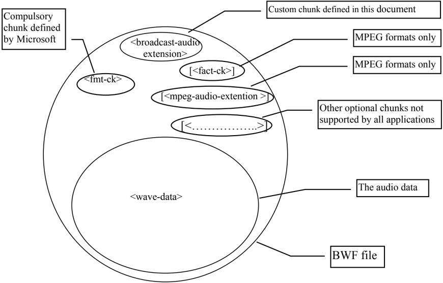

## Specification of the Broadcast Wave Format (BWF)

## A format for audio data files in broadcasting

Version 2.0

1

Geneva May 2011

* Page intentionally left blank. This document is paginated for two sided printing

## Summary

The Broadcast Wave Format (BWF) is a file format for audio data. It can be used for the seamless exchange  of  audio  material  between  different  broadcast  environments  and  between  equipment based on different computer platforms.

As well as the audio data, a BWF file contains the minimum information - or metadata - which is considered necessary for all broadcast applications. The Broadcast Wave Format is based on the Microsoft  WAVE  audio  file  format,  to  which  the  EBU  has  added  a  'Broadcast  Audio  Extension' chunk.

## BWF Version 0

The specification of the Broadcast Wave Format for PCM audio data (now referred to as Version 0) was published in 1997 as EBU Tech 3285.

## BWF Version 1

Version 1 differs from Version 0 only in that 64 of the 254 reserved bytes in Version 0 are used to contain a SMPTE UMID [1].

## BWF Version 2

Version 2 is a substantial revision of Version 1 which incorporates loudness metadata (in accordance with EBU R 128 [2]) and which takes account of the publication of Supplements 1 - 6 and other relevant documentation. This version is fully compatible with Versions 0 and 1, but users who wish to ensure that their files meet the requirements of EBU Recommendation R 128 will need to ensure that their systems can read and write the loudness metadata.

## Conformance Notation

This document contains both normative text and informative text.

All  text  is  normative  except  for  that  in  the  Introduction,  any  section  explicitly  labelled  as 'Informative' or individual paragraphs which start with 'Note:'.

Normative  text  describes  indispensable  or  mandatory  elements.  It  contains  the  conformance keywords 'shall', 'should' or 'may', defined as follows:

'Shall' and 'shall not':

Indicate requirements to be followed strictly and from which no deviation is permitted in order to conform to the document.

'Should' and 'should not':

Indicate that, among several possibilities, one is recommended as particularly suitable, without mentioning or excluding others.

OR indicate that a certain course of action is preferred but not necessarily required.

OR indicate that (in the negative form) a certain possibility or course of action is deprecated but not prohibited.

'May' and 'need not':

Indicate a course of action permissible within the limits of the document.

Default identifies mandatory (in phrases containing 'shall') or recommended (in phrases containing 'should') presets that can, optionally, be overwritten by user action or supplemented with other options in advanced  applications. Mandatory  defaults must  be  supported. The  support of recommended defaults is preferred, but not necessarily required.

Informative text is potentially helpful to the user, but it is not indispensable and it does not affect the normative text. Informative text does not contain any conformance keywords.

A  conformant  implementation  is  one  which  includes  all  mandatory  provisions  ('shall')  and,  if implemented, all recommended provisions ('should') as described. A conformant implementation need not implement optional provisions ('may') and need not implement them as described.

## Contents

| 1.                                                                                                   | Introduction ......................................................................................                      | 7                                                                                                  |
|------------------------------------------------------------------------------------------------------|--------------------------------------------------------------------------------------------------------------------------|----------------------------------------------------------------------------------------------------|
| 1.1                                                                                                  | Version compatibility ................................................................................................   | 8                                                                                                  |
| 2.                                                                                                   | Broadcast Wave Format File                                                                                               | ................................................................... 9                              |
| 2.1                                                                                                  | Contents of a Broadcast Wave Format file                                                                                 | ....................................................................... 9                          |
| 2.2                                                                                                  | Existing Chunks defined as part of the RIFF standard                                                                     | .......................................................... 9                                       |
| 2.3                                                                                                  | Broadcast Audio Extension Chunk..................................................................................        | 9                                                                                                  |
| 2.4                                                                                                  | Treatment of Loudness Parameters                                                                                         | ..............................................................................12                   |
| 2.5                                                                                                  | Other information specific to applications......................................................................13       |                                                                                                    |
| 3.                                                                                                   | References.......................................................................................13                      |                                                                                                    |
| Appendix A: RIFF WAVE (.WAV) file format .........................................................15 | Appendix A: RIFF WAVE (.WAV) file format .........................................................15                     |                                                                                                    |
| A1.                                                                                                  | Waveform Audio File Format (WAVE)........................................................15                              |                                                                                                    |
| A1.1                                                                                                 | WAVE Format Chunk ................................................................................................15     |                                                                                                    |
| A1.2                                                                                                 | WAVE Format Categories...........................................................................................16      |                                                                                                    |
| A2.                                                                                                  | Pulse Code Modulation (PCM) Format .......................................................16                             |                                                                                                    |
| A2.1                                                                                                 | Data Packing for PCM WAVE Files.................................................................................17       |                                                                                                    |
| A2.2                                                                                                 | Data Format of the Samples .......................................................................................18     |                                                                                                    |
| A2.3                                                                                                 | Examples of PCM WAVE Files                                                                                               | ......................................................................................18           |
| A2.4                                                                                                 | Storage of WAVE Data ..............................................................................................19    |                                                                                                    |
| A2.5                                                                                                 | Fact Chunk............................................................................................................19 |                                                                                                    |
| A2.6                                                                                                 | Other optional Chunks..............................................................................................19    |                                                                                                    |
| A3.                                                                                                  | Other WAVE Types..............................................................................19                         |                                                                                                    |
| A3.1                                                                                                 | General information                                                                                                      | ................................................................................................19 |
| A3.2                                                                                                 | Fact Chunk............................................................................................................19 |                                                                                                    |
| A3.3                                                                                                 | WAVE Format Extension                                                                                                    | ............................................................................................20     |

* Page intentionally left blank. This document is paginated for two sided printing

## Specification of the Broadcast Wave Format (BWF)

## A format for audio data files in broadcasting

| EBU Committee   |   First Issued | Revised    | Re-issued   |
|-----------------|----------------|------------|-------------|
| TC              |           1997 | 2001, 2011 |             |

Keywords: Broadcast Wave File, BWF, RIFF WAV, Metadata, loudness

## 1. Introduction

The Broadcast Wave Format (BWF) is based on the Microsoft WAVE audio file format, which is a type  of  file  specified  in  the  Microsoft  'Resource  Interchange  File  Format',  RIFF  [3].  WAVE  files specifically  contain  audio  data.  The  basic  building  block  of  RIFF  files  is  a  chunk  which  contains specific  information,  an  identification  field  and  a  size  field.  A  RIFF  file  consists  of  a  number  of chunks.

For the BWF, some restrictions are applied to the original WAVE format. In addition, the BWF file includes a &lt;Broadcast Audio Extension&gt; chunk. This illustrated in Figure 1, below.

Figure 1: Broadcast Wave Format file



This  document  contains  the  specification  of  Version  2  of  the  broadcast  audio  extension  chunk, which is used in all BWF files. In addition, information on the PCM Wave and RIFF formats and how RIFF can be extended to other types of audio data may be found in Appendix A .

Detailed specifications of the extension of the BWF to other types of audio data and of the other chunks which the EBU has ratified are published in Supplements to this document; the References section provides a guide.

In particular, the EBU has ratified the Multi-channel Broadcast Wave Format, MBWF, which specifies the means for enhancing the RF64 wave format with BWF metadata. This development allows the use of larger files (file sizes greater than 4 Gbyte) and accommodates wave files with more than two channels [4].

In addition, the Audio Engineering Society has ratified the 'Cart Chunk' for audio-delivery systems as AES46 [5].

## 1.1 Version compatibility

Version 0 of the BWF was published in 1997.

Version 1 , published in July, 2001, differs from Version 0 only in that 64 of the 254 reserved bytes in Version 0 are used to contain a SMPTE UMID and the &lt;Version&gt; field is changed accordingly.

Version  1  is  backwards  compatible  with  Version  0.  This  means  that  software  designed  to read Version 0 files will interpret Version 1 files correctly except that it will ignore the UMID field.

The change is also forwards compatible. This means that Version 1 software will be able to read Version 0 files correctly. Ideally, Version 1 software needs to read the &lt;Version&gt; field to determine if a UMID is present. However if the Version number is not read, software will read all zeros in the UMID field in a Version 0 file. This will not be a valid UMID and will be ignored. It was replaced by Version 2 in May, 2011.

Version 2 differs from Version 1 only in that 10 of the 190 reserved bytes in Version 1 are used to carry information about the file's loudness and the &lt;Version&gt; field is changed accordingly.

Version 2 is backwards compatible with Versions 1 and 0. This means that software designed to read Version 1 and Version 0 files will interpret the files correctly except that Version 0 software will ignore the UMID and loudness information which may be present and Version 1 software  will  ignore  the  loudness  information.  Therefore,  users  of  such  devices  will  lose metadata unless special precautions are taken. In addition, early BWF-aware devices will be unable to cope with the larger RF64 and MBWF files and may not recognise any of the chunks which have been defined since 2001.

The change is also forwards compatible. This means that Version 2 software will be able to read Version 0 and Version 1 files correctly. Software needs to read the &lt;Version&gt; field to determine if a UMID and loudness metadata are present.

## 2. Broadcast Wave Format File

## 2.1 Contents of a Broadcast Wave Format file

A Broadcast Wave Format file shall start with the mandatory Microsoft RIFF 'WAVE' header and at least the following chunks:

```
<WAVE-form>  -> RIFF( 'WAVE' <broadcast_audio_extension>  //information on the audio sequence <fmt-ck> //Format of the audio signal: PCM/MPEG [<fact-ck>] //Fact chunk is required for MPEG formats only [<mpeg_audio_extension>] //MPEG Audio Extension chunk is required for MPEG formats only <wave-data> ) //sound data
```

Any additional chunks that are present in the file and which are not specified in this document and its Supplements, in EBU Tech 3306 or in AES46 are to be considered private. Applications are not required to interpret or make use of these chunks. Thus, the integrity of the data contained in any chunks not specified in the documents or chunks listed is not guaranteed. However, BWF-compliant applications shall pass these chunks.

## 2.2 Existing Chunks defined as part of the RIFF standard

The RIFF standard is defined in documents issued by the Microsoft Corporation [3]. This application uses a number of chunks which are already defined. These chunks are:

```
fmt-ck fact-ck
```

The descriptions of these chunks are given for information in Appendix A.

## 2.3 Broadcast Audio Extension Chunk

Extra  parameters  needed  for  exchange  of  material  between  broadcasters  shall  be  added  in  a specific 'Broadcast Audio Extension' chunk, defined as follows:

```
broadcast_audio_extension typedef struct { DWORD ckID; /* (broadcastextension)ckID=bext. */ DWORD ckSize; /* size of extension chunk */ BYTE ckData[ckSize]; /* data of the chunk */ } typedef struct broadcast_audio_extension { CHAR Description[256]; /* ASCII : «Description of the sound sequence» */ CHAR Originator[32]; /* ASCII : «Name of the originator» */ CHAR OriginatorReference[32]; /* ASCII : «Reference of the originator» */ CHAR OriginationDate[10]; /* ASCII : «yyyy:mm:dd» */
```

## Broadcast Wave Format Specification

```
CHAR OriginationTime[8]; /* ASCII : «hh:mm:ss» */ DWORD TimeReferenceLow; /* First sample count since midnight, low word */ DWORD TimeReferenceHigh; /* First sample count since midnight, high word */ WORD Version; /* Version of the BWF; unsigned binary number */ BYTE UMID_0 /* Binary byte 0 of SMPTE UMID */ .... BYTE UMID_63 /* Binary byte 63 of SMPTE UMID */ WORD LoudnessValue; /* WORD : «Integrated Loudness Value of the file in LUFS (multiplied by 100) » */ WORD LoudnessRange; /* WORD : «Loudness Range of the file in LU (multiplied by 100) » */ WORD MaxTruePeakLevel; /* WORD : «Maximum True Peak Level of the file expressed as dBTP (multiplied by 100) » */ WORD MaxMomentaryLoudness; /* WORD : «Highest value of the Momentary Loudness Level of the file in LUFS (multiplied by 100) » */ WORD MaxShortTermLoudness; /* WORD : «Highest value of the Short-Term Loudness Level of the file in LUFS (multiplied by 100) » */ BYTE Reserved[180]; /* 180 bytes, reserved for future use, set to 'NULL' */ CHAR CodingHistory[]; /* ASCII : « History coding » */ } BROADCAST_EXT
```

| Field               | Description                                                                                                                                                                                                                                                                                                                                                                                                  |
|---------------------|--------------------------------------------------------------------------------------------------------------------------------------------------------------------------------------------------------------------------------------------------------------------------------------------------------------------------------------------------------------------------------------------------------------|
| Description         | ASCII string (maximum 256 characters) containing a free description of the sequence. To help applications which display only a short description, it is recommended that a resume of the description is contained in the first 64 characters and the last 192 characters are used for details. If the length of the string is less than 256 characters the last one shall followed by a null character (00). |
| Originator          | ASCII string (maximum 32 characters) containing the name of the originator/ producer of the audio file. If the length of the string is less than 32 characters the field shall be ended by a null character.                                                                                                                                                                                                 |
| OriginatorReference | ASCII string (maximum 32 characters) containing an unambiguous reference allocated by the originating organisation. If the length of the string is less than 32 characters the field shall be terminated by a null character.                                                                                                                                                                                |
| OriginationDate     | 10 ASCII characters containing the date of creation of the audio sequence. The format shall be « ',year',-,'month,'-',day,'» with 4 characters for the year and 2 characters per other item.                                                                                                                                                                                                                 |

OriginationTime

Year is defined from 0000 to 9999 Month is defined from 1 to 12 Day is defined from 1 to 28, 29, 30 or 31

The separator between the items can be anything but it is recommended that one of the following characters be used:

'-'  hyphen  '\_'  underscore  ':'  colon  ' '  space  '.'  stop

8 ASCII characters containing the time of creation of the audio sequence. The format shall be « 'hour'-'minute'-'second'» with 2 characters per item.

Hour is defined from 0 to 23. Minute and second are defined from 0 to 59.

The separator between the items can be anything but it is recommended that one of the following characters be used:

'-'  hyphen  '\_'  underscore  ':'  colon  ' '  space  '.'  stop

| TimeReference        | These fields shall contain the time-code of the sequence. It is a 64-bit value which contains the first sample count since midnight. The number of samples per second depends on the sample frequency which is defined in the field <nSamplesPerSec> from the <format chunk>.   |
|----------------------|---------------------------------------------------------------------------------------------------------------------------------------------------------------------------------------------------------------------------------------------------------------------------------|
| Version              | An unsigned binary number giving the version of the BWF. This number is particularly relevant for the carriage of the UMID and loudness information. For Version 1 it shall be set to 0001h and for Version 2 it shall be set to 0002h.                                         |
| UMID                 | 64 bytes containing a UMID (Unique Material Identifier) to standard SMPTE 330M [1]. If only a 32 byte "basic UMID" is used, the last 32 bytes should be set to zero. (The length of the UMID is given internally.)                                                              |
| LoudnessValue        | A 16-bit signed integer, equal to round (100x the Integrated Loudness Value of the file in LUFS).                                                                                                                                                                               |
| LoudnessRange        | A 16-bit signed integer, equal to round (100x the Loudness Range of the file in LU).                                                                                                                                                                                            |
| MaxTruePeakLevel     | A 16-bit signed integer, equal to round (100x the Maximum True Peak Value of the file in dBTP).                                                                                                                                                                                 |
| MaxMomentaryLoudness | A 16-bit signed integer, equal to round (100x the highest value of the Momentary Loudness Level of the file in LUFS).                                                                                                                                                           |
| MaxShortTermLoudness | A 16-bit signed integer, equal to round (100x the highest value of the Short-term Loudness Level of the file in LUFS).                                                                                                                                                          |
| Reserved             | 180 bytes reserved for extension. If the Version field is set to 0001h or 0002h, these 180 bytes shall be set to a NULL (zero) value.                                                                                                                                           |

## CodingHistory

Unrestricted ASCII characters containing a collection of strings terminated by CR/LF. Each string shall contain a description of a coding process applied to the audio data. Each new coding application shall add a new string with the appropriate information.

This information shall contain the type of sound (PCM or MPEG) with its specific parameters :

PCM : mode (mono, stereo), size of the sample (8, 16 bits) and sample frequency,

MPEG : sample frequency, bit rate, layer (I or II) and the mode (mono, stereo, joint stereo or dual channel),

It is recommended that the manufacturers of the coders provide an ASCII string for use in the coding history.

Note:

The EBU has defined a format for coding history which will simplify the interpretation of the information provided in this field. See EBU Recommendation R 98 [9].

Note: The  EBU  has  defined  a  format  for  BWF  files  which  have  more  than  two  audio channels, the MBWF. See EBU Tech 3306 [4].

## 2.4 Treatment of Loudness Parameters

The loudness parameters are represented by integers, but they preserve a precision of two decimal places by being multiplied by 100 before being rounded. The rounding function which shall be used is defined as follows:

```
integer representation = integer part of (x + sgn(x) • 0.5)
```

where x is the value to be represented, multiplied by 100

and where sgn() is the signum operator. sgn(x) = -1 if x &lt; 0, 0 if x = 0, 1 if x &gt; 0.

This rounding method is commonly referred to as 'round to nearest, ties away from zero' because where the fractional part of the number is 5 (midway between integers), the rounding is up for positive numbers and down for negative numbers.

## Examples

Negative numbers:

|   Float value | Calculation                                         | Value carried in BWF (decimal/ hexadecimal)   |
|---------------|-----------------------------------------------------|-----------------------------------------------|
|       -22.644 | integer[(-22.644 x 100) + sgn(-22.644 x 100) · 0.5] | -2264/ F728h                                  |
|       -22.645 | integer[(-22.645 x 100) + sgn(-22.645 x 100) · 0.5] | -2265/ F727h                                  |
|       -22.646 | integer[(-22.646 x 100) + sgn(-22.646 x 100) · 0.5] | -2265/ F727h                                  |

Positive numbers:

|   Float value | Calculation                                       | Value carried in BWF (decimal/ hexadecimal)   |
|---------------|---------------------------------------------------|-----------------------------------------------|
|        12.764 | integer[(12.764 x 100) + sgn(12.764 x 100) · 0.5] | 1276/ 04FCh                                   |
|        12.765 | integer[(12.765 x 100) + sgn(12.765 x 100) · 0.5] | 1277/ 04FDh                                   |
|        12.766 | integer[(12.766 x 100) + sgn(12.766 x 100) · 0.5] | 1277/ 04FDh                                   |

If any of the loudness parameters are not being used then their 16-bit integer values shall be set to 7FFFh, which is a value outside the range of the parameter values.

For  LoudnessValue,  MaxTruePeakLevel,  MaxMomentaryLoudness  and  MaxShortTermLoudness,  the range of valid values is D8F1h to FFFFh (corresponding to the floating-point equivalent values of -99.99 to -0.01) and  0000h to 270Fh (0.00 to 99.99). The  most  significant bit of the 16-bit hexadecimal number is the sign bit; hence, values between 8000h and FFFFh represent negative numbers.

For LoudnessRange the range of valid values is 0000h to 270Fh (0.00 to 99.99).

Therefore, if 7FFFh occurs, it is known that that particular parameter must be ignored.

If any parameters are found to have values outside their valid ranges (not just 7FFFh) when reading the chunk then they shall be ignored too.

## 2.5 Other information specific to applications

The  EBU  has  defined  other  chunks  to  carry,  or  to  point  to  data  that  are  specific  to  certain applications, e.g. multi-channel audio, Dolby Metadata or any XML data. See the References section or the EBU technical website (http://tech.ebu.ch ) for details.

## 3. References

| [1]   | SMPTE ST 330:2004   | Television - Unique Material Identifier (UMID)                                                                                                                     |
|-------|---------------------|--------------------------------------------------------------------------------------------------------------------------------------------------------------------|
| [2]   | EBU R 128           | Loudness normalisation and permitted maximum level of audio signals                                                                                                |
| [3]   | MS RIFF             | Microsoft Resource Interchange File Format, RIFF - part of the Multimedia Registration Kit, rev 3.0: http://support.microsoft.com/kb/q120253/                      |
| [4]   | EBU Tech 3306       | MBWF / RF64 : An Extended File Format for Audio                                                                                                                    |
| [5]   | AES46               | AES standard for network and file transfer of audio - Audio-file transfer and exchange - Radio traffic audio delivery extension to the broadcast- WAVE-file format |
| [6]   | EBU R 99            | 'Unique' Source Identifier (USID) for use in the OriginatorReference field of the Broadcast Wave Format                                                            |
| [7]   | EBU Tech 3341       | Loudness Metering: 'EBU Mode' metering to supplement Loudness normalisation in accordance with EBU R 128                                                           |
| [8]   | EBU Tech 3342       | Loudness Range: A descriptor to supplement Loudness normalisation in accordance with EBU R 128                                                                     |
| [9]   | EBU R 98            | Format for CodingHistory field in Broadcast Wave Format files, BWF                                                                                                 |

## Further reading

EBU R 85:

Use of the Broadcast Wave Format for the Exchange of Audio Data Files

EBU R 111:

Multichannel Use of the BWF Audio File Format (MBWF)

EBU Tech 3285 Supplement 1:

MPEG Audio

EBU Tech 3285 Supplement 2:

Capturing Report (includes Quality and Cue-sheet data)

EBU Tech 3285 Supplement 3:

Peak-Envelope Chunk

EBU Tech 3285 Supplement 4:

Link Chunk

EBU Tech 3285 Supplement 5:

XML Data Chunk

EBU Tech 3285 Supplement 6:

Dolby Metadata Chunk

EBU Tech 3343:

Practical Guidelines for Production and Implementation in accordance with EBU R 128

EBU Tech 3344:

Practical Guidelines for Distribution of Programmes in accordance with EBU R 128

## Appendix A: RIFF WAVE (.WAV) file format

The information in this appendix is taken from the specification documents of Microsoft RIFF file format. Minor amendments have been made for clarity. It is included for information only .

For full information, consult the latest version of the Microsoft Multimedia Registration Kit [3].

[EBU Note: EBU explanatory notes are shown in italics between square brackets]

## A1. Waveform Audio File Format (WAVE)

The  WAVE  form  is  defined  as  follows.  Programs  must  expect  (and  ignore)  any  unknown  chunks encountered, as with all RIFF forms. However, &lt; fmt-ck &gt; must always occur before &lt; wave-data &gt;, and both of these chunks are mandatory in a WAVE file.

```
<WAVE-form> -> RIFF( 'WAVE' <fmt-ck> // Format [<fact-ck>] // Fact chunk [<other-ck>] // Other optional chunks <wave-data>   ) // Wave data
```

The WAVE chunks are described in the following sections.

## A1.1  WAVE Format Chunk

The WAVE format chunk &lt;fmt-ck&gt; specifies the format of the &lt;wave-data&gt;. The &lt;fmt-ck&gt; is defined as follows:

```
<fmt-ck> -> fmt( <common-fields> <format-specific-fields> ) <common-fields> -> struct{ WORD wFormatTag; // Format category WORD nChannels; // Number of channels DWORD nSamplesPerSec; // Sampling rate DWORD nAvgBytesPerSec;// For buffer estimation WORD nBlockAlign; // Data block size }
```

The fields in the &lt;common-fields&gt; portion of the chunk are as follows:

| Field           | Description                                                                                                                                                                                                  |
|-----------------|--------------------------------------------------------------------------------------------------------------------------------------------------------------------------------------------------------------|
| wFormatTag      | A number indicating the WAVE format category of the file. The content of the <format-specific-fields> portion of the 'fmt' chunk, and the interpretation of the waveform data, depend on this value.         |
| nchannels       | The number of channels represented in the waveform data: 1 for mono or 2 for stereo. [EBU Note: The EBU has defined the Multi-channel Broadcast Wave Format [4] where more than two channels of audio are    |
| nSamplesPerSec  | The sampling rate (in sample per second) at which each channel should be played.                                                                                                                             |
| nAvgBytesPerSec | The average number of bytes per second at which the waveform data should be transferred. Playback software can estimate the buffer size using this value.                                                    |
| nBlockAlign     | The block alignment (in bytes) of the waveform data. Playback software needs to process a multiple of <nBlockAlign> bytes of data at a time, so the value of <nBlockAlign> can be used for buffer alignment. |

The  &lt;format-specific-fields&gt;  consist  of  zero  or  more  bytes  of  parameters.  The  parameters  that occur  depend  on  the  WAVE  format  category,  as  described  below.  Playback  software  should  be written to  allow  for  (and  ignore)  any  unknown  &lt;format-specific-fields&gt;  parameters  that  occur  at the end of this field.

## A1.2  WAVE Format Categories

The format category of a WAVE file is specified by the value of the &lt;wFormatTag&gt; field of the 'fmt' chunk. The representation of data in &lt;wave-data&gt;, and the content of the &lt;format-specific-fields&gt; of the 'fmt' chunk, depend on the format category.

Among the currently-defined open, non-proprietary WAVE format categories are:

| wFormatTag       | Value   | Format Category                              |
|------------------|---------|----------------------------------------------|
| WAVE_FORMAT_PCM  | (0001h) | Microsoft Pulse Code Modulation (PCM) format |
| WAVE_FORMAT_MPEG | (0050h) | MPEG-1 Audio (audio only)                    |

- [EBU Note: Although  other  WAVE  formats  are  registered  with  Microsoft,  only  the  above formats are at present used with the BWF. Details of the PCM WAVE format are given  in  the  following  section.  General  information  on  other  WAVE  formats  is given in section 3. Details of the MPEG WAVE format are given in Supplement 1 to this  document  and  details  of  the  Broadcast  Wave  Format  extension  to  multichannel audio are given in EBU Tech 3306. Other WAVE formats may be defined in future Supplements.]

## A2. Pulse Code Modulation (PCM) Format

If the &lt;wFormatTag&gt; field of the &lt;fmt-ck&gt; is set to WAVE\_FORMAT\_PCM, then the waveform data consists of samples represented in pulse code modulation (PCM) format. For PCM waveform data,

the &lt;format-specific-fields&gt; is defined as follows:

```
<PCM-format-specific> -> struct{ WORD nBitsPerSample; // Sample size }
```

The &lt;nBitsPerSample&gt; field specifies the number of bits of data used to represent each sample of each channel. If there are multiple channels, the sample size is the same for each channel.

For  PCM  data,  the  &lt;nAvgBytesPerSec&gt;  field  of  the  'fmt'  chunk  should  be  equal  to  the  following formula rounded up to the next whole number:

```
nChannels x nSamplesPerSecond x nBitsPerSample 8
```

The  &lt;nBlockAlign&gt;  field  should  be  equal  to  the  following  formula,  rounded  to  the  next  whole number:

```
nChannels x nBitsPerSample 8
```

[EBU Note: The above formulae do not always give the correct answer. Strictly speaking, the number  of  bytes  per  sample  (nBitsPerSample/8)  should  be  rounded  first.  Then this integer should be multiplied by &lt;nChannels&gt; (which is always an integer) to give &lt;nBlockAlign&gt;. This in turn should be multiplied by &lt;nSamplesPerSecond&gt; to give &lt;nAvgBytesPerSec&gt;].

## A2.1  Data Packing for PCM WAVE Files

In a single-channel WAVE file, samples are stored consecutively. For stereo WAVE files, channel 0 represents  the  left  channel,  and  channel  1  represents  the  right  channel.  The  speaker  position mapping  for  a  BWF  file  with  more  than  two  channels  is  defined  in  EBU  Tech 3306.  In  multiplechannel WAVE files, samples are interleaved.

The following diagrams show the data packing for 8-bit mono and stereo WAVE files:

Data Packing for 8-Bit Mono PCM

| Sample 1   | Sample 2   | Sample 3   | Sample 4   |
|------------|------------|------------|------------|
| Channel 0  | Channel 0  | Channel 0  | Channel 0  |

Data Packing for 8-Bit Stereo PCM

| Sample 1         | Sample 1          | Sample 2         | Sample 2          |
|------------------|-------------------|------------------|-------------------|
| Channel 0 (left) | Channel 1 (right) | Channel 0 (left) | Channel 1 (right) |

The following diagrams show the data packing for 16-bit mono and stereo WAVE files:

Data Packing for 16-Bit Mono PCM

| Sample 1                 | Sample 1                  | Sample 2                 | Sample 2                  |
|--------------------------|---------------------------|--------------------------|---------------------------|
| Channel 0 low-order byte | Channel 0 high-order byte | Channel 0 low-order byte | Channel 0 high-order byte |

Data Packing for 16-Bit Stereo PCM

| Sample 1         | Sample 1         | Sample 1          | Sample 1          |
|------------------|------------------|-------------------|-------------------|
| Channel 0 (left) | Channel 0 (left) | Channel 1 (right) | Channel 1 (right) |
| low-order byte   | high-order byte  | low-order byte    | high-order byte   |

## A2.2  Data Format of the Samples

Each sample is contained in an integer i . The size of i is the smallest number of bytes required to contain the specified sample size. The least significant byte is stored first. The bits that represent the sample amplitude are stored in the most significant bits of i , and the remaining bits are set to zero.

For  example,  if  the  sample  size  (recorded  in  &lt;nBitsPerSample&gt;)  is  12  bits,  then  each  sample  is stored in a two-byte integer. The least significant four bits of the first (least significant) byte is set to zero. The data format and maximum and minimum values for PCM waveform samples of various sizes are as follows:

| Sample Size       | Data Format      | Maximum Value               | Minimum Value            |
|-------------------|------------------|-----------------------------|--------------------------|
| One to eight bits | Unsigned integer | 255 (FFh)                   | 0                        |
| Nine or more bits | Signed integer i | Largest positive value of i | Most negative value of i |

For example, the maximum, minimum, and midpoint values for 8-bit and 16-bit PCM waveform data are as follows:

| Format     | Maximum Value   | Minimum Value   | Midpoint Value   |
|------------|-----------------|-----------------|------------------|
| 8-bit PCM  | 255 (FFh)       | 0               | 128 (80h)        |
| 16-bit PCM | 32767 (7FFFh)   | -32768 (-8000h) | 0                |

## A2.3  Examples of PCM WAVE Files

Example of a PCM WAVE file with 11.025 kHz sampling rate, mono, 8 bits per sample:

```
RIFF( 'WAVE' fmt(1, 1, 11025, 11025, 1, 8) data( <wave-data> ) )
```

Example of a PCM WAVE file with 22.05 kHz sampling rate, stereo, 8 bits per sample:

```
RIFF( 'WAVE' fmt(1, 2, 22050, 44100, 2, 8) data( <wave-data> ) )
```

Example of a PCM WAVE file with 44.1 kHz sampling rate, mono, 20 bits per sample:

```
RIFF( 'WAVE' INFO(INAM('O Canada'Z) )
```

```
fmt(1, 1, 44100, 132300, 3, 20) data( <wave-data> ) )
```

## A2.4  Storage of WAVE Data

The &lt;wave-data&gt; contains the waveform data. It is defined as follows:

```
<wave-data> ->  { <data-ck> } <data-ck>  -> data( <wave-data> )
```

## A2.5  Fact Chunk

The &lt;fact-ck&gt; fact chunk stores important information about the contents of the WAVE file. This chunk is defined as follows:

```
<fact-ck> -> fact( <dwFileSize:DWORD> ) // Number of samples
```

The chunk is not required for PCM files.

The  'fact'  chunk  will  be  expanded  to  include  any  other  information  required  by  future  WAVE formats. Added fields will appear following the &lt;dwFileSize&gt; field. Applications can use the chunk size field to determine which fields are present.

## A2.6  Other optional Chunks

A number of other chunks are specified for use in the WAVE format. Details of these chunks are given in the specification of the WAVE format and any updates to it.

[EBU Note: The  WAVE  format  can  support  other  optional  chunks  which  can  be  included  in WAVE files to carry specific information. As stated in section 2.1, those chunks that  are  present  in  a  Broadcast  Wave  Format  file  and  which  are  not  specified either in this document, Tech 3306, their Supplements or in AES46 are considered to be private chunks and will be ignored by applications which cannot interpret them.]

## A3. Other WAVE Types

[EBU Note:

the  following  information  has  been  extracted  from  the  Microsoft  Multimedia Registration Kit [3]. It outlines the necessary extensions of the basic WAVE file (used for PCM audio) to cover other types of WAVE format.]

## A3.1  General information

All  newly  defined  WAVE  types  must  contain  both  a  &lt; fact  chunk &gt;  and  an  extended  wave  format description within the &lt; fmt-ck &gt; format chunk. RIFF WAVE files of type WAVE\_FORMAT\_PCM need not have the extra chunk nor the extended wave format description.

## A3.2  Fact Chunk

This  chunk  stores  file-dependent  information  about  the  contents  of  the  WAVE  file.  It  currently

specifies the length of the file in samples.

[EBU Note: See Section A2.5]

## A3.3  WAVE Format Extension

The extended wave format structure added to the &lt; fmt-ck &gt; is used to define all non-PCM format wave data, and is described as follows. The general extended waveform format structure is used for all non-PCM formats.

```
typedef struct waveformat_extended_tag { WORD wFormatTag; /* format type */ WORD nChannels; /* number of channels (i.e. mono, stereo...) */ DWORD nSamplesPerSec; /* sample rate */ DWORD nAvgBytesPerSec;  /* for buffer estimation */ WORD nBlockAlign; /* block size of data */ WORD wBitsPerSample; /* Number of bits per sample of mono data */ WORD cbSize; /* The count in bytes of the extra size */ } WAVEFORMATEX;
```

Field

Notes

wFormatTag

Defines the type of WAVE file.

nChannels

Number of channels in the wave, 1 for mono, 2 for stereo

nSamplesPerSec

Frequency of the sample rate of the wave file. This should be 48000 or 44100 etc. This rate is also used by the sample size entry in the fact chunk to determine the length in time of the data.

nAvgBytesPerSec

Average data rate. Playback software can estimate the buffer size using the &lt; nAvgBytesPerSec &gt; value.

nBlockAlign

The block alignment (in bytes) of the data in &lt; data-ck &gt;. Playback software needs to process a multiple of &lt; nBlockAlign &gt; bytes of data at a time, so that the value of &lt; nBlockAlign &gt; can be used for buffer alignment.

wBitsPerSample

This is the number of bits per sample per channel data. Each channel is assumed to have the same sample resolution. If this field is not needed, then it should be set to zero.

cbSize

The size in bytes of the extra information in the WAVE format header not including the size of the WAVEFORMATEX structure.

[EBU Note: the fields following the &lt;cbSize&gt; field contain specific information needed for the WAVE format defined in the field &lt;wFormatTag&gt;. Any WAVE formats that can be used  in  the  BWF  are  specified  in  individual  Supplements  to  this  document, published by the EBU.]