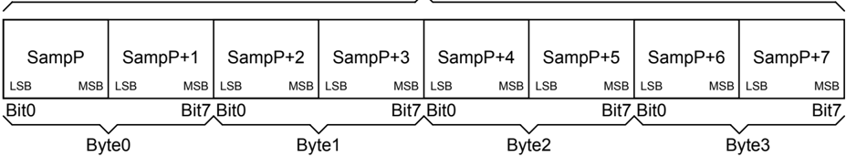
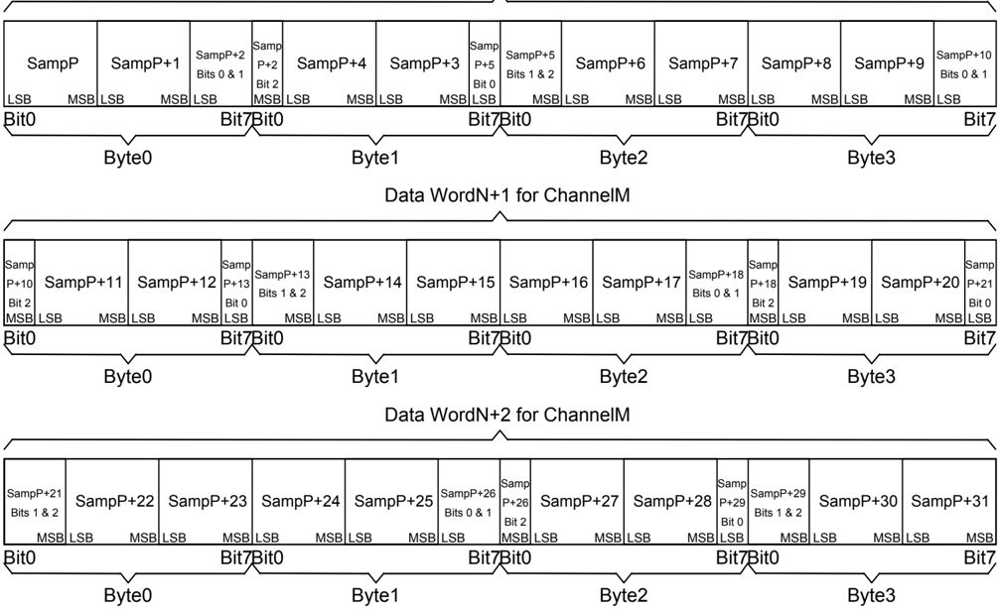

## Standards Update

## New Multimedia Data Types and Data Techniques

April 15, 1994

Revision: 3.0

Information in this document is subject to change without notice and does not represent a commitment on the part of Microsoft Corporation.  The software described in this document is furnished under license agreement or nondisclosure agreement.  The software may be used or copied only in the accordance with the terms of the agreement.  It is against the law to copy the software on any medium except as specifically allowed in the license or nondisclosure agreement.

No part of this document may be reproduced or transmitted in any form or by any means, electronic or mechanical, including photocopying and recording, for any purpose without the express written permission of Microsoft Corporation.

This standards update is for informational purposes only.  MICROSOFT MAKES NO WARRANTIES, EXPRESSED OR IMPLIED IN THIS STANDARDS UPDATE.

Microsoft, MS, MS-DOS, XENIX and the Microsoft logo are registered trademarks and Windows is a trademark of Microsoft Corporation.  Other trade names mentioned herein are trademarks of their respective manufacturers.

Copyright  1992, 1993, 1994  Microsoft Corporation.  All Rights Reserved.

## Table of Contents

| OVERVIEW...............................................................................................................................................            | 4                                                                                                                                                            |
|--------------------------------------------------------------------------------------------------------------------------------------------------------------------|--------------------------------------------------------------------------------------------------------------------------------------------------------------|
| WHERETO LOOK FOR INFORMATION ............................................................................................................                          | 4                                                                                                                                                            |
| VERSIONS OF THIS DOCUMENT......................................................................................................................                    | 4                                                                                                                                                            |
| NEWRIFF CHUNKS................................................................................................................................                     | 5                                                                                                                                                            |
| DISPLAY CHUNK                                                                                                                                                      | ........................................................................................................................................... 5                |
| JUNK(FILLER) CHUNK ................................................................................................................................                | 5                                                                                                                                                            |
| PAD(FILLER) CHUNK...................................................................................................................................               | 6                                                                                                                                                            |
| NEW NFO LIST CHUNKS                                                                                                                                                | ............................................................................................................................... 6                            |
| NEWFORMS.............................................................................................................................................              | 7                                                                                                                                                            |
| AVI............................................................................................................................................................... | 7                                                                                                                                                            |
| CPPO............................................................................................................................................................   | 7                                                                                                                                                            |
| ACON                                                                                                                                                               | .......................................................................................................................................................... 9 |
| NEWWAVERIFF CHUNKS.................................................................................................................                                | 12                                                                                                                                                           |
| FACT CHUNK...............................................................................................................................................          | 12                                                                                                                                                           |
| CUE POINTS CHUNK....................................................................................................................................               | 12                                                                                                                                                           |
| PLAYLIST CHUNK........................................................................................................................................             | 13                                                                                                                                                           |
| ASSOCIATED DATA CHUNK.........................................................................................................................                     | 14                                                                                                                                                           |
| INST (INSTRUMENT) CHUNK........................................................................................................................                    | 16                                                                                                                                                           |
| SMPL (SAMPLE) CHUNK...............................................................................................................................                 | 16                                                                                                                                                           |
| NEWWAVETYPES...............................................................................................................................                        | 19                                                                                                                                                           |
| DEFINED WFORMATTAGS ...........................................................................................................................                    | 20                                                                                                                                                           |
| UNKNOWN WAVE TYPE ..............................................................................................................................                   | 21                                                                                                                                                           |
| MICROSOFT ADPCM..................................................................................................................................                  | 22                                                                                                                                                           |
| ADPCM Algorithm.................................................................................................................................                   | 24                                                                                                                                                           |
| CVSDWAVE TYPE.....................................................................................................................................                 | 27                                                                                                                                                           |
| CCITT STANDARD COMPANDED WAVE TYPES ..........................................................................................                                     | 28                                                                                                                                                           |
| OKIADPCMWAVE TYPES........................................................................................................................                         | 29                                                                                                                                                           |
| IMAADPCMWAVE TYPE.........................................................................................................................                         | 30                                                                                                                                                           |
| DVIADPCMWAVE TYPE                                                                                                                                                  | ......................................................................................................................... 30                                 |
| DVI ADPCM Algorithm                                                                                                                                                | ......................................................................................................................... 33                                 |
| DSPSOLUTIONS FORMERLY DIGISPEECH WAVE TYPES..............................................................................                                          | 38                                                                                                                                                           |
| YAMAHA ADPCM.....................................................................................................................................                  | 39                                                                                                                                                           |
| SONARC  COMPRESSION                                                                                                                                               | ........................................................................................................................... 40                               |
| CREATIVE LABS ADPCM...........................................................................................................................                     | 41                                                                                                                                                           |
| DSPGROUP WAVE TYPE                                                                                                                                                 | ............................................................................................................................ 42                              |
| ECHO SPEECH WAVE TYPE                                                                                                                                              | 43                                                                                                                                                           |
| ......................................................................................................................... AUDIOFILEWAVE TYPE AF36                  | ................................................................................................................ 44                                          |
| AUDIO PROCESSING TECHNOLOGY WAVE TYPE .........................................................................................                                    | 45                                                                                                                                                           |
| AUDIOFILEWAVE TYPE AF10 ................................................................................................................                           | 46                                                                                                                                                           |
| DOLBY LABS AC-2WAVE TYPE .................................................................................................................                         | 47                                                                                                                                                           |
| SIERRA ADPCM.........................................................................................................................................              |                                                                                                                                                              |
| VIDEOLOGIC WAVE TYPES                                                                                                                                              | 48 ......................................................................................................................... 49                              |
| CCITT G.723 ADPCM...............................................................................................................................                   | 50                                                                                                                                                           |
| DIALOGIC OKI ADPCM.............................................................................................................................                    | 51                                                                                                                                                           |
| CONTROL RESOURCES LIMITED VQLPC....................................................................................................                                | 52                                                                                                                                                           |
| CONTROL RESOURCES LIMITED CR10                                                                                                                                     | ........................................................................................................ 53                                                  |

| G.721WAVEFORMAT HEADER ................................................................................................................                      |   54 |
|--------------------------------------------------------------------------------------------------------------------------------------------------------------|------|
| ADPCME WAVEFORMAT HEADER.........................................................................................................                            |   55 |
| GSM610WAVE TYPE.................................................................................................................................             |   56 |
| DSPSOLUTIONS REALWAVE TYPE ..........................................................................................................                        |   56 |
| DSPSOLUTIONS ADPCMWAVE TYPE ......................................................................................................                           |   57 |
| MPEG-1 AUDIO (AUDIO-ONLY) .................................................................................................................                  |   58 |
| CREATIVE LABS, INC. FASTSPEECH 8 &10.................................................................................................                        |   65 |
| FUJITSU FMTOWNS SNDWAVE TYPE.......................................................................................................                          |   66 |
| OLIVETTI GSM...........................................................................................................................................      |   66 |
| OLIVETTI ADPCM......................................................................................................................................         |   67 |
| OLIVETTI CELP..........................................................................................................................................      |   68 |
| OLIVETTI OPR............................................................................................................................................     |   68 |
| RIFF CLIPBOARD FORMATS.............................................................................................................                          |   71 |
| CF_RIFF..................................................................................................................................................... |   71 |
| CF_WAVE.................................................................................................................................................     |   71 |
| ENCODING LANGUAGE OF TEXT ...................................................................................................                                |   72 |
| COUNTRY CODES ........................................................................................................................................       |   72 |
| LANGUAGE AND DIALECT CODES ...............................................................................................................                   |   73 |

## Overview

This standards update presents new and updated information for dealing with multimedia data under Microsoft Windows.  This document is also available as part of the Multimedia Developer Registration Kit.  The MDRK is used to register multimedia data and ids as well as new MCI command sets..  This document is the result of companies requesting and registering new data types.  This document builds on the standard RIFF documentation that is contained in:

1. The Multimedia Development Kit (MDK) 1.0 Programmer's Reference
2. The Windows 3.1 Software Development Kit (SDK)'s Multimedia Programmer's Reference
3. The Multimedia Programmer's Reference book from Microsoft Press
4. Video for Windows 1.1 SDK ProgrammerGLYPH&lt;146&gt;s Guide

The RIFF file format is a standard published as a joint design document by IBM and Microsoft.  This standards document is Multimedia Programming Interface and Data Specifications 1.0 published in August 1991.  The first draft of this document was issued in November, 1990.  This IBM/Microsoft document is available from the sources listed below.

This standards update assumes that the reader has read the concepts defined in these documents.

New RIFF file forms and chunks are defined in this document.  The new RIFF forms and chunks defined here have been registered with Microsoft.  If you want to register your own RIFF forms and chunks, fill out and return the Multimedia Developer Registration Kit included in this kit.

In addition, techniques for dealing with multimedia data in the system, such as clipboard data, are defined in this document.

## Where to Look for Information

All constants and structures defined in this document are contained in MMREG.H, which is included in this kit.

Current versions of this document as well as other technical update and technical notes and sample code are available from the sources listed in the Multimedia Document Overview , included in this kit.

## Versions of this Document

This document is continually being updated and expanded.  Eventually the information presented in this document will be placed in the standard reference for the multimedia IDs standards from Microsoft, such as the Multimedia Programmer's Reference from MS-Press.

When refering to standards defined in this document, please refer to the data and version number printed on the cover page.

Please refer to the document Microsoft Multimedia Document Overview , which is included in this kit, for lists of other documents and sample code.

| Version   | Date              | Who             | Comment                    |
|-----------|-------------------|-----------------|----------------------------|
| 1.0       |                   | Matt Saettler   | Original release           |
| 2.1.0     | June 22, 1993     | Heidi Breslauer | Updated info               |
| 2.1.1     | August 25, 1993   | Heidi Breslauer | Updated info               |
| 2.1.3     | September 5, 1993 | Heidi Breslauer | Updates and corrections    |
| 3.0       | April 5, 1994     | Heidi Breslauer | Updates and reorganization |

## New RIFF Chunks

These new chunks have been defined for use in any RIFF form.

## Display Chunk

Added:  05/01/92

Author:  Microsoft

A DISP chunk contains easily rendered and displayable objects associated with an instance of a more complex object in a RIFF form (e.g. sound file, AVI movie).

A DISP chunk is defined as follows:

```
<DISP_ck> → DISP( <type> <data> )
```

&lt;type&gt; is a DWORD (32 bit unsigned quantity in Intel format) that identifies &lt;data&gt; as one of the standard Windows clipboard formats ( CF\_METAFILE, CF\_DIB, CF\_TEXT , etc.) as defined in windows.h .

The DISP chunk should be used as a direct child of the RIFF chunk so that any RIFF aware application can find it.  There can be multiple DISP chunks with each containing different types of displayable data, but all representative of the same object.  The DISP chunks should be stored in the file in order of preference (just as in the clipboard).

The DISP chunk is especially beneficial when representing OLE data within an application.  For example, when pasting a wave file into Excel, the creating application can use the DISP chunk to associate an icon and a text description to represent the embedded wave file.  This text should be short so that it can be easily displayed in menu bars and under icons.

Note: do not use a CF\_TEXT for a description of the data.  Bibliographic data chunks will be added to support the standard MARC (Machine Readable Cataloging) data.

## JUNK (Filler) Chunk

Added:  05/01/92

Author:  IBM, Microsoft

A JUNK chunk represents , filler or outdated information. It contains no relevant data; it is a space filler of arbitrary size. The JUNK chunk is defined as follows:

```
<JUNK chunk> ➠ JUNK( <filler> ) where <filler> contains random data.
```

## PAD (Filler) Chunk

Added:  07/15/92 Author:  Microsoft

A PAD chunk represents padding. It contains no relevant data; it is a space filler of arbitrary size. When duplicating the file, the copier should maintain the padding of the PAD chunk.  Specifically, if the PAD chunk makes the next chunk align on a 2K boundary in the physical file, then this alignment should be preserved even if the size of the PAD chunk must change.  The PAD chunk is defined as follows:

&lt;PAD chunk&gt; ➠ PAD( &lt;filler&gt; ) where &lt;filler&gt; contains random data.

## New NFO list Chunks

For complete AVI file documentation, see the Multimedia Developer Reference, part of the Microsoft Windows SDK.

These chunks were added for Video for Windows 1.1, mid 1993:

- ISMP SMPTE time code of digitization start point expressed as a NULL terminated text string "HH:MM:SS.FF".  If performing MCI capture in AVICAP, this chunk will be automatically set based on the MCI start time.
- IDIT "Digitization Time"  Specifies the time and date that digitization commenced.  The digitization time is contained in an ASCII string which contains exactly 26 characters and is in the format "Wed Jan 02 02:03:55 1990\n\0".  The ctime(), asctime(), functions can be used to create strings in this format.   This chunk is automatically added to the capture file based on the current system time at the moment capture is initiated.

## New Forms

## AVI

The RIFF AVI file format is defined in the Video for Windows SDK.

## CPPO

Added:  12/16/92

Author:  APPS Software International 4417 North Saddlebag Trail Scottsdale, AZ 85251

## Definition

CPPO RIFF Form Definition (C) Copyright APPS Software International 1992 Revision 1.0

This document provides a new RIFF specification used to provide an object persistance/archival feature for Windows applications doped with C++.  This RIFF form preserves not only the content of objects but also all the linkages between objects, providing a mechanism for loading and unloading an entire memory image.

<!-- formula-not-decoded -->

<!-- formula-not-decoded -->

1.  an object referent (sub-chunk type 'objr').
2.  an object instance (sub-chunk type 'obji').

'objr' chunks do not create a new instance of an object, but instead create a reference/pointer to the original instance of the specified object.  Each object is numbered in the order that it appears in the file. The special object number zero represents a NULL pointer, thus the first object in the file is given the number 1.

<!-- formula-not-decoded -->

&lt;object-instance&gt; --&gt; &lt;class-descr&gt; &lt;member-list&gt;

The &lt;class-descr&gt; reduces file size by specifying the class name only once.  The first 'clsi' in the file is given the number 1.

```
<class-descr> --> clsr ( <class-number:WORD> ) |    // previously defined class clsi ( <class-name:ZSTR> )        // new class definition
```

The remainder of the &lt;object-instance&gt; definition is its member list.  A member list is a sequence of primitive data elements and/or object instances/references.

```
<member-list> --> LIST ( 'mbr' <member-ck> ... )
```

Each class is responsible for parsing its members from the RIFF file. It may choose to specify primitive data as a single 'byte' sub-chunk, or as a sequence of more specific chunks.  Each nonprimitive member must, however, be in the &lt;object-ck&gt; format.

## Example

```
<member-ck> --> <primitive-ck> |                    // primitive data type <object-ck>                         // object definition <primitive-ck> --> char ( <CHAR> ... ) | byte ( <BYTE> ... ) | int ( <INT> ... ) | word ( <WORD> ... ) | long ( <LONG> ... ) | dwrd ( <DWORD> ... ) | flt ( <FLOAT> ... ) | dbl ( <DOUBLE> ... ) | str ( <ZSTR> ... ) CPPO RIFF Form Example (C) Copyright APPS Software International 1992 Revision 1.0 This example stores an 'OrdCollect' object containing two 'String' objects and a NULL pointer. RIFF ( 'CPPO' LIST ( 'INFO' INAM ( "Generic C++ Image"Z ) ICOP ( "(C) Copyright APPS Software Int'l 1992"Z ) ICRD ( "1992-12-10"Z ) ) LIST ( 'obj' obji ( clsi ( "String"Z ) LIST ( 'mbr' str ( "This is the first"Z ) ) ) obji ( clsr ( 1 ) LIST ( 'mbr' str ( "This is the second"Z ) ) ) obji ( clsi ( "OrdCollect"Z ) LIST ( 'mbr' word ( 2 ) objr ( 1 ) objr ( 0 ) objr ( 2 ) ) ) ) )
```

## ACON

```
Added:  4/13/93 Author:  Microsoft
```

## Windows NT Animated Cursor RIFF Files

For Windows NT, an animated cursor is stored in RIFF a file with a form type of 'ACON'.  The subcunks of this form of RIFF file are the 'LIST', 'anih', 'rate', and 'seq ' chunks.  There are two LIST chunks: the LIST chunk with type 'INFO' contains textual informative details about the animated cursor, the LIST chunk with a type of 'fram' contains 'icon' subchunks.  The anih chunk describes the rest of the subchunks in the file.  The 'rate' chunk tells how long each step of the animation is to be displayed on the screen. The 'seq ' chunk maps the animation steps into actual icon pictures stored in the .ani file.  The 'icon' subchunks in the 'fram' LIST are the actual frames of the cursor animation.

The following is a RIFF grammar (as defined in the Microsoft Windows Multimedia Programmer's Reference) that describes the Windows NT animated cursors:

```
RIFF( 'ACON' [LIST( 'INFO' <info_data> )] [<DISP_ck>] anih( <ani_header> ) [rate( <rate_info> )] ['seq '( <sequence_info> )] LIST( 'fram' icon( <icon_file> ) ... ) )
```

| Where         | Means:                                                                                                                                                                                                                                                                                                                                                                     |
|---------------|----------------------------------------------------------------------------------------------------------------------------------------------------------------------------------------------------------------------------------------------------------------------------------------------------------------------------------------------------------------------------|
| info_data     | Optional information subchunks as defined in the Microsoft Windows Multimedia Programmer's Reference.                                                                                                                                                                                                                                                                      |
| DISP_ck       | An optional Display Chunk as defined in the Multimedia Data Standards Update                                                                                                                                                                                                                                                                                               |
| ani_header    | An animated cursor header (see ANIHEADER struct). The ANIHEADER structure describes the size of the animated cursor, and must come before the 'rate', 'seq ', or any 'icon' chunks.                                                                                                                                                                                        |
| rate_info     | A list of JIF's (one for each step) that indicate the time that each step should remain on the screen. If this chunk is missing, then the default rate value specified in the ANIHEADER is used. A JIF is nothing more than a DWORD that holds the display time value in jiffies. One jiffy equals 1/60th of a second.                                                     |
| sequence_info | A list of indices into the 'fram' LIST of icons. Each index points to the icon that is to be displayed for that step of the animated cursor. The indices are 0 based. If this chunk is missing, then the icons are played in the order they occur in the file. To save space, it is common for the same icon to be referenced by different elements of the sequence list.9 |
| icon_file     | An embedded .CUR file as generated by the WindowsNT IMAGEDIT program. There are usually multiple icon subchunks in the file. Each icon represents a frame of the animated cursor. If present, the seq chunk determines the order in which the frames are displayed on the screen.                                                                                          |

Structure Definitions:

```
typedef DWORD JIF; /* Number of jiffies that a frame * will remain on the screen */ typedef struct _ANIHEADER {     /* anih */ DWORD cbSizeof; /* Num. bytes in aniheader (incl. cbSizeof) */ DWORD cFrames; /* Number of unique icons in the ani. cursor*/ DWORD cSteps; DWORD cx, cy; /* reserved, must be 0 */ DWORD cBitCount, cPlanes; /* reserved, must be 0 */ JIF   jifRate; /* default rate if rate chunk not present */ DWORD fl; /* flags, see AF_* */ } ANIHEADER, *PANIHEADER;
```

```
/* Number of blts before the animation cycles */ #define AF_ICON     0x0001L   /* Windows format icon/cursor animation */ Example The following is a partial hex-dump of animated cursor file: banana.ani:
```

```
00000000 52 49 46 46 78 2e 00 00 41 43 4F 4E 4c 49 53 54 RIFFx...ACONLIST 00000010 4a 00 00 00 49 4e 46 4f 49 4e 41 4d 0f 00 00 00 J...INFOINAM.... 00000020 50 65 65 6c 69 6e 67 20 42 61 6e 61 6e 61 00 00 Peeling Banana.. 00000030 49 41 52 54 26 00 00 00 4d 69 63 72 6f 73 6f 66 IART&...Microsof 00000040 74 20 43 6f 72 70 6f 72 61 74 69 6f 6e 2c 20 43 t Corporation, C 00000050 6f 70 79 72 69 67 68 74 20 31 39 39 33 00 61 6e opyright 1993.an 00000060 69 68 24 00 00 00 24 00 00 00 0f 00 00 00 10 00 ih$...$......... 00000070 00 00 00 00 00 00 00 00 00 00 00 00 00 00 00 00 ................ 00000080 00 00 0f 00 00 00 03 00 00 00 72 61 74 65 40 00 ..........rate@. 00000090 00 00 0f 00 00 00 0f 00 00 00 0f 00 00 00 0f 00 ................ 000000a0 00 00 0f 00 00 00 0f 00 00 00 0f 00 00 00 0f 00 ................ 000000b0 00 00 0f 00 00 00 0f 00 00 00 0f 00 00 00 1e 00 ................ 000000c0 00 00 14 00 00 00 14 00 00 00 32 00 00 00 1e 00 ..........2..... 000000d0 00 00 73 65 71 20 40 00 00 00 00 00 00 00 01 00 ..seq @......... 000000e0 00 00 02 00 00 00 03 00 00 00 04 00 00 00 05 00 ................ 000000f0 00 00 06 00 00 00 07 00 00 00 08 00 00 00 09 00 ................ 00000100 00 00 0a 00 00 00 0b 00 00 00 0c 00 00 00 0d 00 ................ 00000110 00 00 0e 00 00 00 00 00 00 00 4c 49 53 54 5e 2d ..........LIST^00000120 00 00 66 72 61 6d 69 63 6f 6e fe 02 00 00 00 00 ..framicon...... 00000130 02 00 01 00 20 20 00 00 10 00 10 00 e8 02 00 00 .... .......... 00000140 16 00 00 00 28 00 00 00 20 00 00 00 40 00 00 00 ....(... ...@... 00000150 01 00 04 00 00 00 00 00 80 02 00 00 00 00 00 00 ................ 00000160 00 00 00 00 00 00 00 00 00 00 00 00 00 00 00 00 ................ 00000170 00 00 80 00 00 80 00 00 00 80 80 00 80 00 00 00 ................ 00000180 80 00 80 00 80 80 00 00 80 80 80 00 c0 c0 c0 00 ................ 00000190 00 00 ff 00 00 ff 00 00 00 ff ff 00 ff 00 00 00 ................ 000001a0 ff 00 ff 00 ff ff 00 00 ff ff ff 00 00 00 00 00 ................ 000001b0 00 00 00 00 00 00 00 00 00 00 00 00 00 00 00 00 ................ 000001c0 00 00 00 00 00 00 00 00 00 00 00 00 00 00 00 00 ................ 000001d0 00 00 00 00 00 00 00 00 00 00 00 00 00 00 00 00 ................ 000001e0 00 00 00 00 00 03 33 00 00 00 00 00 00 00 00 00 ......3......... 000001f0 00 00 00 00 03 3b ff 00 00 00 00 00 00 00 00 00 .....;.......... 00000200 00 00 00 00 3b bf fb 30 00 00 00 00 00 00 00 00 ....;..0........ 00000210 00 00 00 03 bb ff b3 00 00 00 00 00 00 00 00 00 ................ 00000220 00 00 00 3b bf fb 30 00 00 00 00 00 00 00 00 00 ...;..0......... 00000230 00 00 03 bb ff b8 00 00 00 00 00 00 00 00 00 00 ................ 00000240 00 00 03 bf fb 83 00 00 00 00 00 00 00 00 00 00 ................ 00000250 00 00 3b bf bb 80 00 00 00 00 00 00 00 00 00 00 ..;............. 00000260 00 00 3b ff b8 30 00 00 00 00 00 00 00 00 00 00 ..;..0.......... 00000270 00 03 bb fb b8 00 00 00 00 00 00 00 00 00 00 00 ................ 00000280 00 03 bf fb b3 00 00 00 00 00 00 00 00 00 00 00 ................ 00000290 00 03 bf bb 83 00 00 00 00 00 00 00 00 00 00 00 ................ 000002a0 00 03 bf bb 80 00 00 00 00 00 00 00 00 00 00 00 ................ 000002b0 00 03 bf bb 30 00 00 00 00 00 00 00 00 00 00 00 ....0........... 000002c0 00 03 bf bb 30 00 00 00 00 00 00 00 00 00 00 00 ....0........... 000002d0 00 03 bf bb 30 00 00 00 00 00 00 00 00 00 00 00 ....0........... 000002e0 00 03 bf bb 30 00 00 00 00 00 00 00 00 00 00 00 ....0........... 000002f0 00 03 bf bb 30 00 00 00 00 00 00 00 00 00 00 00 ....0........... 00000300 00 00 3f fb 30 00 00 00 00 00 00 00 00 00 00 00 ..?.0........... 00000310 00 00 3b fb 30 00 00 00 00 00 00 00 00 00 00 00 ..;.0...........
```

00000320 00 00 03 ff 30 00 00 00 00 00 00 00 00 00 00 00 ....0........... 00000330 00 00 03 bf 30 00 00 00 00 00 00 00 00 00 00 00 ....0........... 00000340 00 00 00 3f 80 00 00 00 00 00 00 00 00 00 00 00 ...?............ 00000350 00 00 00 03 00 00 00 00 00 00 00 00 00 00 00 00 ................ 00000360 00 00 00 00 33 00 00 00 00 00 00 00 00 00 00 00 ....3........... 00000370 00 00 00 00 03 30 00 00 00 00 00 00 00 00 00 00 .....0.......... 00000380 00 00 00 00 00 30 00 00 00 00 00 00 00 00 00 00 .....0.......... 00000390 00 00 00 00 00 00 00 00 00 00 00 00 00 00 00 00 ................ 000003a0 00 00 00 00 00 00 00 00 00 00 00 00 ff ff ff ff ................ 000003b0 ff ff ff ff ff ff ff ff ff ff e0 ff ff ff 80 ff ................ 000003c0 ff ff 00 ff ff fe 01 ff ff fc 03 ff ff f8 07 ff ................ 000003d0 ff f8 07 ff ff f0 0f ff ff f0 0f ff ff e0 1f ff ................ 000003e0 ff e0 1f ff ff e0 1f ff ff e0 3f ff ff e0 3f ff ..........?...?. 000003f0 ff e0 3f ff ff e0 3f ff ff e0 3f ff ff e0 3f ff ..?...?...?...?. 00000400 ff f0 3f ff ff f0 3f ff ff f8 3f ff ff f8 3f ff ..?...?...?...?. 00000410 ff fc 3f ff ff fe 3f ff ff ff 1f ff ff ff 8f ff ..?...?......... 00000420 ff ff cf ff ff ff ff ff ff ff ff ff 69 63 6f 6e ............icon 00000430 fe 02 00 00 00 00 02 00 01 00 20 20 00 00 10 00 .......... .... 00000440 10 00 e8 02 00 00 16 00 00 00 28 00 00 00 20 00 ..........(... . 00000450 00 00 40 00 00 00 01 00 04 00 00 00 00 00 80 02 ..@............. 00000460 00 00 00 00 00 00 00 00 00 00 00 00 00 00 00 00 ................ 00000470 00 00 00 00 00 00 00 00 80 00 00 80 00 00 00 80 ................ 00000480 80 00 80 00 00 00 80 00 80 00 80 80 00 00 80 80 ................ 00000490 80 00 c0 c0 c0 00 00 00 ff 00 00 ff 00 00 00 ff ................ 000004a0 ff 00 ff 00 00 00 ff 00 ff 00 ff ff 00 00 ff ff ................ 000004b0 ff 00 00 00 00 00 00 00 00 00 00 00 00 00 00 00 ................ 000004c0 00 00 00 00 00 00 00 00 00 00 00 00 00 00 00 00 ................ 000004d0 00 00 00 00 00 00 00 00 00 00 00 00 00 00 00 00 ................ 000004e0 00 00 00 00 00 00 00 00 00 00 00 03 33 00 00 00 ............3... 000004f0 00 00 00 00 00 00 00 00 00 00 03 3b ff 00 00 00 ...........;.... 00000500 00 00 00 00 00 00 00 00 00 00 3b bf fb 30 00 00 ..........;..0.. 00000510 00 00 00 00 00 00 00 00 00 03 bb ff b3 00 00 00 ................ 00000520 00 00 00 00 00 00 00 00 00 3b bf fb 30 00 00 00 .........;..0... 00000530 00 00 00 00 00 00 00 00 03 bb ff b8 00 00 00 00 ................ 00000540 00 00 00 00 00 00 00 00 03 bf fb 83 00 00 00 00 ................ ... (more embedded icon files) ... 00002e40 f8 00 00 7f fc 00 00 ff fe 00 21 ff ff e0 7f ff ..........!..... 00002e50 ff e1 ff ff ff f3 ff ff ff ff ff ff ff ff ff ff ................ 00002e60 ff ff ff ff ff ff ff ff ff ff ff ff ff ff ff ff ................ 00002e70 ff ff ff ff ff ff ff ff ff ff ff ff ff ff ff ff ................

## New WAVE RIFF Chunks

Added:  05/01/92

Author:  Microsoft, IBM

Most of the information in this section comes directly from the IBM/Microsoft RIFF standard document.

The WAVE form is defined as follows. Programs must expect (and ignore) any unknown chunks encountered, as with all RIFF forms. However, &lt;'fmt'-ck&gt; must always occur before &lt;wave-data&gt; , and both of these chunks are mandatory in a WAVE file.

&lt;WAVE-form&gt;

➠

RIFF( 'WAVE'

```
<'fmt'-ck> // Format [<fact-ck>] // Fact chunk [<cue-ck>] // Cue points [<playlist-ck>] // Playlist [<assoc-data-list>] // Associated data list <wave-data> ) // Wave data
```

The WAVE chunks are described in the following sections.

## Fact Chunk

The &lt;fact-ck&gt; stores file dependent information about the contents of the WAVE file. This chunk is defined as follows:

```
<fact-ck> →
```

fact( &lt;dwSampleLength:DWORD&gt; )

&lt; dwSampleLength &gt; represents the length of the data in samples.  The &lt; nSamplesPerSec &gt; field from the wave format header is used in conjunction with the &lt; dwSampleLength &gt; field to determine the length of the data in seconds.

The fact chunk is required for all new WAVE formats. The chunk is not required for the standard WAVE\_FORMAT\_PCM files.

The fact chunk will be expanded to include any other information required by future WAVE formats. Added fields will appear following the &lt;dwSampleLength&gt; field. Applications can use the chunk size field to determine which fields are present.

## Cue Points Chunk

The &lt; cue-ck &gt; cue-points chunk identifies a series of positions in the waveform data stream. The &lt;cueck&gt; is defined as follows:

&lt;cue-ck&gt; ➠ cue( &lt;dwCuePoints:DWORD&gt; // Count of cue points &lt;cue-point&gt;... ) // Cue-point table &lt;cue-point&gt; ➠ struct { DWORD  dwName; DWORD  dwPosition; FOURCC fccChunk; DWORD  dwChunkStart; DWORD  dwBlockStart; DWORD  dwSampleOffset; }

The &lt; cue-point &gt; fields are as follows:

| Field          | Description                                                                                                                                                                                                     |
|----------------|-----------------------------------------------------------------------------------------------------------------------------------------------------------------------------------------------------------------|
| dwName         | Specifies the cue point name. Each <cue-point> record must have a unique dwName field.                                                                                                                          |
| dwPosition     | Specifies the sample position of the cue point. This is the sequential sample number within the play order. See GLYPH<147>Playlist Chunk,GLYPH<148> later in this document, for a discussion of the play order. |
| fccChunk       | Specifies the name or chunk ID of the chunk containing the cue point.                                                                                                                                           |
| dwChunkStart   | Specifies the position of the start of the data chunk containing the cue point. This should be zero if there is only one chunk containing data (as is currently always the case).                               |
| dwBlockStart   | Specifies the position of the start of the block containing the position. This is the byte offset from the start of the data section of the chunk, not the chunk's FOURCC.                                      |
| dwSampleOffset | Specifies the sample offset of the cue point relative to the start of the block.                                                                                                                                |

## Examples of File Position Values

The following table describes the &lt;cue-point&gt; field values for a WAVE file containing a single GLYPH&lt;145&gt; data GLYPH&lt;146&gt; chunk:

| Cue Point Location                           | Field                                             | Value                                                                                                                                                                                                                                                         |
|----------------------------------------------|---------------------------------------------------|---------------------------------------------------------------------------------------------------------------------------------------------------------------------------------------------------------------------------------------------------------------|
| Within PCM data                              | fccChunk dwChunkStart dwBlockStart dwSampleOffset | FOURCC value GLYPH<145> data GLYPH<146>. Zero value. File position of the sample (nBlockAlign aligned bytes) relative to the start of the data section of the GLYPH<145> data GLYPH<146> chunk (not the FOURCC). Sample position of the cue point relative to |
| In all other GLYPH<145>dataGLYPH<146> chunks | fccChunk dwChunkStart dwBlockStart                | the start of the GLYPH<145> data GLYPH<146> chunk. FOURCC value GLYPH<145> data GLYPH<146>. Zero value. File position of the enclosing block relative to                                                                                                      |

## Playlist Chunk

The &lt;playlist-ck&gt; playlist chunk specifies a play order for a series of cue points. The &lt;playlist-ck&gt; is defined as follows:

&lt;playlist-ck&gt; ➠

plst(

&lt;dwSegments:DWORD&gt;  // Count of play

segments

&lt;play-segment&gt;... )

// Play-segment table

&lt;play-segment&gt; ➠

struct {

DWORD dwName;

DWORD dwLength;

DWORD dwLoops;

}

The &lt; play-segment &gt; fields are as follows:

| Field    | Description                                                                                                  |
|----------|--------------------------------------------------------------------------------------------------------------|
| dwName   | Specifies the cue point name. This value must match one of the names listed in the <cue-ck> cue-point table. |
| dwLength | Specifies the length of the section in samples.                                                              |
| dwLoops  | Specifies the number of times to play the section.                                                           |

## Associated Data Chunk

The &lt;assoc-data-list&gt; associated data list provides the ability to attach information like labels to sections of the waveform data stream. The &lt;assoc-data-list&gt; is defined as follows:

| <assoc-data-list> ➠      | LIST(   | 'adtl'   |                | <labl-ck>                                                                                            |
|--------------------------|---------|----------|----------------|------------------------------------------------------------------------------------------------------|
| // Label                 |         |          |                | <note-ck>                                                                                            |
| // Note                  |         |          |                | <ltxt-ck> }                                                                                          |
| // Text with data length |         |          |                |                                                                                                      |
| <labl-ck> ➠              |         | labl(    | <dwName:DWORD> | <data:ZSTR> )                                                                                        |
| <note-ck> ➠              |         | note(    | <dwName:DWORD> | <data:ZSTR> )                                                                                        |
| <ltxt-ck> ➠              |         | ltxt(    | <dwName:DWORD> |                                                                                                      |
| <dwSampleLength:DWORD>   |         |          |                |                                                                                                      |
|                          |         |          |                | <dwPurpose:DWORD> <wCountry:WORD> <wLanguage:WORD> <wDialect:WORD> <wCodePage:WORD> <data:BYTE>... ) |

## Label and Note Information

The GLYPH&lt;145&gt; labl GLYPH&lt;146&gt; and GLYPH&lt;145&gt; note GLYPH&lt;146&gt; chunks have similar fields. The GLYPH&lt;145&gt; labl GLYPH&lt;146&gt; chunk contains a label, or title, to associate with a cue point. The GLYPH&lt;145&gt; note GLYPH&lt;146&gt; chunk contains comment text for a cue point. The fields are as follows:

| Field   | Description                                                                                                                                                       |
|---------|-------------------------------------------------------------------------------------------------------------------------------------------------------------------|
| dwName  | Specifies the cue point name. This value must match one of the names listed in the < cue-ck > cue-point table.                                                    |
| data    | Specifies a NULL-terminated string containing a text label (for the GLYPH<145> labl GLYPH<146> chunk) or comment text (for the GLYPH<145> note GLYPH<146> chunk). |

## Text with Data Length Information

The GLYPH&lt;147&gt; ltxt GLYPH&lt;148&gt; chunk contains text that is associated with a data segment of specific length. The chunk fields are as follows:

| Field                          | Description                                                                                                                                                                                                                                                          |
|--------------------------------|----------------------------------------------------------------------------------------------------------------------------------------------------------------------------------------------------------------------------------------------------------------------|
| dwName                         | Specifies the cue point name. This value must match one of the names listed in the < cue-ck > cue-point table.                                                                                                                                                       |
| dwSampleLength dwPurpose       | Specifies the number of samples in the segment of waveform data. Specifies the type or purpose of the text. For example, < dwPurpose > can specify a FOURCC code like GLYPH<145>scrpGLYPH<146> for script text or GLYPH<145> capt GLYPH<146> for close-caption text. |
| wCountry                       | Specifies the country code for the text. See GLYPH<147>Country CodesGLYPH<148> for a current list of country codes.                                                                                                                                                  |
| wLanguage , wDialect wCodePage | Specify the language and dialect codes for the text. See GLYPH<147>Language and Dialect CodesGLYPH<148> for a current list of language and dialect codes. Specifies the code page for the text.                                                                      |

## inst (Instrument) Chunk

Added:  12/29/92

Author:  IBM

Defined for: WAVE form

The WAVE form is NEARLY the perfect file format for storing a sampled sound synthesizer's samples.  Bits per sample, sample rate, number of channels, and complex looping can be specified with current WAVE subchunks, but a sample's pitch and its desired volume relative to other samples cannot.  The optional instrument subchunk defined below fills in these needed parameters:

|&lt;instrument-ck&gt;| ➠ inst(

- &lt;bUnshiftedNote:BYTE&gt;

- &lt;chFineTune:CHAR&gt;

- &lt;chGain:CHAR&gt;

- &lt;bLowNote:BYTE&gt;

- &lt;bHighNote:BYTE&gt;

- &lt;bLowVelocity:BYTE&gt;

- &lt;bHighVelocity:BYTE&gt; )

| bUnshiftedNote                 | the MIDI note number that corresponds to the unshifted pitch of the sample. Valid values range from 0 to 127.                                                                                                                |
|--------------------------------|------------------------------------------------------------------------------------------------------------------------------------------------------------------------------------------------------------------------------|
| chFineTune                     | the pitch shift adjustment in cents (or 100ths of a semitone) needed to hit bUnshiftedNote value exactly. chFineTune can be used to compensate for tuning errors in the sampling process. Valid values range from -50 to 50. |
| chGain                         | the suggested volume setting for the sample in decibels. A value of zero decibels suggests no change in the volume. A value of -6 decibels suggests reducing the amplitude of the sample by two.                             |
| bLowNote and bHigh Note        | the suggested usable MIDI note number range of the sample. Valid values range from 0 to 127.                                                                                                                                 |
| bLowVelocity and bHighVelocity | the suggested usable MIDI velocity range of the sample. Valid values range from 0 to 127.                                                                                                                                    |

## smpl (Sample) Chunk

Added:  11/09/93

Author:  Digidesign, Sonic Foundary, Turtle Beach

Defined for: WAVE form

The &lt;sample-ck&gt; sampled instrument chunk describes the minimum necessary information needed to allow a sampling keyboard to use a WAVE file as an instrument. Samplers which require more information can save their extended information in the sampler specific data section. The &lt;sample-ck&gt; is defined as follows:

|&lt;sample-ck&gt;| ➠ smpl(

- &lt;dwManufacturer:DWORD&gt;

- &lt;dwProduct:DWORD&gt;

- &lt;dwSamplePeriod:DWORD&gt;

- &lt;dwMIDIUnityNote:DWORD&gt;

- &lt;dwMIDIPitchFraction:DWORD&gt;

- &lt;dwSMPTEFormat:DWORD&gt;

- &lt;dwSMPTEOffset:DWORD&gt;

- &lt;cSampleLoops:DWORD&gt;

- &lt;cbSamplerData:DWORD&gt;

```
<sample-loop(s)> <sampler-specific-data> ) <sample-loop> struct { DWORD dwIdentifier; DWORD dwType; DWORD dwStart; DWORD dwEnd; DWORD dwFraction; DWORD dwPlayCount; }
```

The &lt;sample-ck&gt; chunk:

| dwManufacturer       | Specifies the MMAManufacturer code for the intended target device. The high byte indicates the number of low order bytes (1 or 3) that are valid for the manufacturer code. For example, this value will be 0x01000013 for Digidesign (the MMAManufacturer code is one byte, 0x13); whereas 0x03000041 identifies Microsoft (the MMAManufacturer code is three bytes, 0x00 0x00 0x41). If the sample is not intended for a specific manufacturer, then this field should be set to zero.   |
|----------------------|--------------------------------------------------------------------------------------------------------------------------------------------------------------------------------------------------------------------------------------------------------------------------------------------------------------------------------------------------------------------------------------------------------------------------------------------------------------------------------------------|
| dwProduct            | Specifies the Product code of the intended target device for the dwManufacturer. If the sample is not intended for a specific manufacturer's product, then this field should be set to zero.                                                                                                                                                                                                                                                                                               |
| dwSamplePeriod       | Specifies the period of one sample in nanoseconds (normally 1/nSamplesPerSec from the WAVEFORMAT structure for the RIFF WAVE file--however, this field allows fine tuning). For example, 44.1 kHz would be specified as 22675 (0x00005893).                                                                                                                                                                                                                                                |
| dwMIDIUnityNote      | Specifies the MIDI note which will replay the sample at original pitch. This value ranges from 0 to 127 (a value of 60 represents Middle C as defined by the MMA).                                                                                                                                                                                                                                                                                                                         |
| dwMIDIPitchFractio n | Specifies the fraction of a semitone up from the specified dwMIDIUnityNote. A value of 0x80000000 is 1/2 semitone (50 cents); a value of 0x00000000 represents no fine tuning between semitones.                                                                                                                                                                                                                                                                                           |
| dwSMPTEFormat        | Specifies the SMPTE time format used in the dwSMPTEOffset field. Possible values are (unrecognized formats should be ignored): 0 - specifies no SMPTE offset (dwSMPTEOffset should also be zero) 24 - specifies 24 frames per second 25 - specifies 25 frames per second 29 - specifies 30 frames per second with frame dropping ('30 drop') 30 - specifies 30 frames per second                                                                                                           |
| dwSMPTEOffset        | Specifies a time offset for the sample if it is to be syncronized or calibrated according to a start time other than 0. The format of this value is 0xhhmmssff. hh is a signed Hours value [-23..23]. mmis an unsigned Minutes value [0..59]. ss is unsigned Seconds value [0..59]. ff is an unsigned value [0..(<dwSMPTEFormat> - 1)].                                                                                                                                                    |
| cSampleLoops         | Specifies the number (count) of <sample-loop> records that are contained in the <sample-ck> chunk. The <sample-loop> records are stored immediately following the cbSamplerData field.                                                                                                                                                                                                                                                                                                     |
| cbSamplerData        | Specifies the size in bytes of the optional <sampler-specific-data>. Sampler specific data is stored imediately following the <sample-loop> records. The cbSamplerData field will be zero if no extended sampler specific information is stored in the <sample-ck> chunk.                                                                                                                                                                                                                  |

The &lt;sample-loop&gt; structure:

| dwIdentifier   | Identifies the unique 'name' of the loop. This field may correspond with a name stored in the <cue-ck> chunk. The name data is stored in the <assoc- data-list> chunk.                                      |
|----------------|-------------------------------------------------------------------------------------------------------------------------------------------------------------------------------------------------------------|
| dwType         | Specifies the loop type: 0 - Loop forward (normal) 1 - Alternating loop (forward/backward) 2 - Loop backward 3-31 - reserved for future standard types 32-? - sampler specific types (manufacturer defined) |
| dwStart        | Specifies the startpoint of the loop in samples.                                                                                                                                                            |
| dwEnd          | Specifies the endpoint of the loop in samples (this sample will also be played).                                                                                                                            |
| dwFraction     | Allows fine-tuning for loop fractional areas between samples. Values range from 0x00000000 to 0xFFFFFFFF. A value of 0x80000000 represents 1/2 of a sample length.                                          |
| dwPlayCount    | Specifies the number of times to play the loop. A value of 0 specifies an infinite sustain loop.                                                                                                            |

## New WAVE Types

The necessary type, structure and constant defintions are in mmreg.h .

All newly defined WAVE types must contain both a fact chunk and an extended wave format description within the 'fmt' chunk. RIFF WAVE files of type WAVE\_FORMAT\_PCM need not have the extra chunk nor the extended wave format description.

## Fact Chunk

This chunk stores file dependent information about the contents of the WAVE file. It currently specifies the length of the file in samples.

## WAVEFORMATEX

The extended wave format structure is used to defined all non-PCM format wave data, and is described as follows in the include file mmreg.h :

```
/* general extended waveform format structure */ /* Use this for all NON PCM formats */ /* (information common to all formats) */ typedef struct waveformat_extended_tag { WORD    wFormatTag;        /* format type */ WORD    nChannels;         /* number of channels (i.e. mono, stereo...) */ DWORD   nSamplesPerSec;    /* sample rate */ DWORD   nAvgBytesPerSec;   /* for buffer estimation */ WORD    nBlockAlign;       /* block size of data */ WORD    wBitsPerSample;    /* Number of bits per sample of mono data */ WORD    cbSize; /* The count in bytes of the extra size */} WAVEFORMATEX;
```

| wFormatTag      | Defines the type of WAVE file.                                                                                                                                                                                                                                 |
|-----------------|----------------------------------------------------------------------------------------------------------------------------------------------------------------------------------------------------------------------------------------------------------------|
| nChannels       | Number of channels in the wave, 1 for mono, 2 for stereo                                                                                                                                                                                                       |
| nSamplesPerSec  | Frequency of the sample rate of the wave file. This should be 11025, 22050, or 44100. Other sample rates are allowed, but not encouraged. This rate is also used by the sample size entry in the fact chunk to determine the length in time of the data.       |
| nAvgBytesPerSec | Average data rate.                                                                                                                                                                                                                                             |
|                 | Playback software can estimate the buffer size using the < nAvgBytesPerSec > value.                                                                                                                                                                            |
| nBlockAlign     | The block alignment (in bytes) of the data in < data - ck >.                                                                                                                                                                                                   |
|                 | Playback software needs to process a multiple of < nBlockAlign > bytes of data at a time, so that the value of < nBlockAlign > can be used for buffer alignment.                                                                                               |
| wBitsPerSample  | This is the number of bits per sample per channel data. Each channel is assumed to have the same sample resolution. If this field is not needed, then it should be set to zero.                                                                                |
| cbSize          | The size in bytes of the extra information in the WAVE format header not including the size of the WAVEFORMATEX structure.. As an example, in the IMA ADPCM format cbSize is calculated as sizeof(IMAADPCMWAVEFORMAT) - sizeof(WAVEFORMATEX) which yeilds two. |

## Defined wFormatTags

| Expr1                          |                                 | WAVE form Registration No - Hex   | Expr2                               |
|--------------------------------|---------------------------------|-----------------------------------|-------------------------------------|
| #define WAVE_FORMAT_G723_ADPCM |                                 | 0x0014 /*                         | Antex Electronics Corporation */    |
| #define                        | WAVE_FORMAT_ANTEX_ADPCME        | 0x0033                            | /* Antex Electronics Corporation */ |
| #define WAVE_FORMAT_G721_ADPCM |                                 | 0x0040                            | /* Antex Electronics Corporation */ |
| #define WAVE_FORMAT_APTX       |                                 | 0x0025                            | /* Audio Processing Technology */   |
| #define                        | WAVE_FORMAT_AUDIOFILE_AF36      | 0x0024                            | /* Audiofile, Inc. */               |
| #define                        | WAVE_FORMAT_AUDIOFILE_AF10      | 0x0026                            | /* Audiofile, Inc. */               |
| #define                        | WAVE_FORMAT_CONTROL_RES_VQLPC   | 0x0034                            | /* Control Resources Limited */     |
| #define                        | WAVE_FORMAT_CONTROL_RES_CR10    | 0x0037                            | /* Control Resources Limited */     |
| #define                        | WAVE_FORMAT_CREATIVE_ADPCM      | 0x0200                            | /* Creative Labs, Inc */            |
| #define WAVE_FORMAT_DOLBY_AC2  |                                 | 0x0030                            | /* Dolby Laboratories */            |
| #define                        | WAVE_FORMAT_DSPGROUP_TRUESPEECH | 0x0022                            | /* DSP Group, Inc */                |
| #define WAVE_FORMAT_DIGISTD    |                                 | 0x0015                            | /* DSP Solutions, Inc. */           |
| #define WAVE_FORMAT_DIGIFIX    |                                 | 0x0016                            | /* DSP Solutions, Inc. */           |
| #define WAVE_FORMAT_DIGIREAL   |                                 | 0x0035                            | /* DSP Solutions, Inc. */           |
| #define WAVE_FORMAT_DIGIADPCM  |                                 | 0x0036                            | /* DSP Solutions, Inc. */           |
| #define WAVE_FORMAT_ECHOSC1    |                                 | 0x0023                            | /* Echo Speech Corporation */       |
| #define                        | WAVE_FORMAT_FM_TOWNS_SND        | 0x0300                            | /* Fujitsu Corp. */                 |
| #define WAVE_FORMAT_IBM_CVSD   |                                 | 0x0005                            | /* IBM Corporation */               |
| #define WAVE_FORMAT_OLIGSM     |                                 | 0x1000                            | /* Ing C. Olivetti &C., S.p.A. */   |
| #define WAVE_FORMAT_OLIADPCM   |                                 | 0x1001                            | /* Ing C. Olivetti &C., S.p.A. */   |
| #define WAVE_FORMAT_OLICELP    |                                 | 0x1002                            | /* Ing C. Olivetti &C., S.p.A. */   |
| #define WAVE_FORMAT_OLISBC     |                                 | 0x1003                            | /* Ing C. Olivetti &C., S.p.A. */   |
| #define WAVE_FORMAT_OLIOPR     |                                 | 0x1004                            | /* Ing C. Olivetti &C., S.p.A. */   |
| #define WAVE_FORMAT_IMA_ADPCM  |                                 | (WAVE_FORM_DVI_ADPCM)             | /* Intel Corporation */             |
| #define WAVE_FORMAT_DVI_ADPCM  |                                 | 0x0011                            | /* Intel Corporation */             |
| #define WAVE_FORMAT_UNKNOWN    |                                 | 0x0000                            | /* Microsoft Corporation */         |
| #define WAVE_FORMAT_PCM        |                                 | 0x0001                            | /* Microsoft Corporation */         |
| #define WAVE_FORMAT_ADPCM      |                                 | 0x0002                            | /* Microsoft Corporation */         |
| #define WAVE_FORMAT_ALAW       |                                 | 0x0006                            | /* Microsoft Corporation */         |
| #define WAVE_FORMAT_MULAW      |                                 | 0x0007                            | /* Microsoft Corporation */         |
| #define WAVE_FORMAT_GSM610     |                                 | 0x0031                            | /* Microsoft Corporation */         |
| #define WAVE_FORMAT_MPEG       |                                 | 0x0050                            | /* Microsoft Corporation */         |
| #define                        | WAVE_FORMAT_NMS_VBXADPCM        | 0x0038                            | /* Natural MicroSystems */          |
| #define WAVE_FORMAT_OKI_ADPCM  |                                 | 0x0010                            | /* OKI */                           |
| #define                        | WAVE_FORMAT_SIERRA_ADPCM        | 0x0013                            | /* Sierra Semiconductor Corp */     |
| #define WAVE_FORMAT_SONARC     |                                 | 0x0021                            | /* Speech Compression */            |
| #define                        | WAVE_FORMAT_MEDIASPACE_ADPCM    | 0x0012                            | /* Videologic */                    |
| #define                        | WAVE_FORMAT_YAMAHA_ADPCM        | 0x0020                            | /* Yamaha Corporation of America */ |

## Unknown Wave Type

Added:  05/01/92

Author:  Microsoft

## Fact Chunk

This chunk is required for all WAVE formats other than WAVE\_FORMAT\_PCM.  It stores file dependent information about the contents of the WAVE data. It currently specifies the time length of the data in samples.

## WAVE Format Header

Changed as of September 5, 1993: This wave format will not be defined. For development purposes, DO NOT USE 0x0000. Instead, USE 0xffff until an ID has been obtained.

#define

WAVE\_FORMAT\_UNKNOWN

(0x0000)

| wFormatTag      | This must be set to WAVE_FORMAT_UNKNOWN.                                                                                                                         |
|-----------------|------------------------------------------------------------------------------------------------------------------------------------------------------------------|
| nChannels       | Number of channels in the wave.(1 for mono)                                                                                                                      |
| nSamplesPerSec  | Frequency the of the sample rate of wave file.                                                                                                                   |
| nAvgBytesPerSec | Average data rate.                                                                                                                                               |
|                 | Playback software can estimate the buffer size using the < nAvgBytesPerSec > value.                                                                              |
| nBlockAlign     | Block Alignment of the data.                                                                                                                                     |
|                 | Playback software needs to process a multiple of < nBlockAlign > bytes of data at a time, so that the value of < nBlockAlign > can be used for buffer alignment. |
| wBitsPerSample  | This is the number of bits per sample of data.                                                                                                                   |
| cbSize          | The size in bytes of the extra information in the extended WAVE 'fmt' header.                                                                                    |

## Microsoft ADPCM

```
Added 05/01/92 Author:  Microsoft
```

## Fact Chunk

This chunk is required for all WAVE formats other than WAVE\_FORMAT\_PCM.  It stores file dependent information about the contents of the WAVE data. It currently specifies the time length of the data in samples.

## WAVE Format Header

```
#define WAVE_FORMAT_ADPCM (0x0002) typedef struct adpcmcoef_tag { int iCoef1; int iCoef2; } ADPCMCOEFSET; typedef struct adpcmwaveformat_tag { WAVEFORMATEX wfxx; WORD wSamplesPerBlock; WORD wNumCoef; ADPCMCOEFSET aCoeff[wNumCoef]; } ADPCMWAVEFORMAT;
```

| wFormatTag       | This must be set to WAVE_FORMAT_ADPCM.                                                                                                                           | This must be set to WAVE_FORMAT_ADPCM.                                                                                                                           |
|------------------|------------------------------------------------------------------------------------------------------------------------------------------------------------------|------------------------------------------------------------------------------------------------------------------------------------------------------------------|
| nChannels        | Number of channels in the wave, 1 for mono, 2 for stereo.                                                                                                        | Number of channels in the wave, 1 for mono, 2 for stereo.                                                                                                        |
| nSamplesPerSec   | Frequency of the sample rate of the wave file. This should be 11025, 22050, or 44100. Other sample rates are allowed, but not encouraged.                        | Frequency of the sample rate of the wave file. This should be 11025, 22050, or 44100. Other sample rates are allowed, but not encouraged.                        |
| nAvgBytesPerSec  | Average data rate. ((nSamplesperSec / nSamplesPerBlock) * nBlockAlign).                                                                                          | Average data rate. ((nSamplesperSec / nSamplesPerBlock) * nBlockAlign).                                                                                          |
|                  | Playback software can estimate the buffer size using the <nAvgBytesPerSec> value.                                                                                | Playback software can estimate the buffer size using the <nAvgBytesPerSec> value.                                                                                |
| nBlockAlign      | The block alignment (in bytes) of the data in <data-ck>.                                                                                                         | The block alignment (in bytes) of the data in <data-ck>.                                                                                                         |
|                  | nSamplesPerSec x Channels                                                                                                                                        | nBlockAlign                                                                                                                                                      |
|                  | 8k                                                                                                                                                               | 256                                                                                                                                                              |
|                  | 11k                                                                                                                                                              | 256                                                                                                                                                              |
|                  | 22k                                                                                                                                                              | 512                                                                                                                                                              |
|                  | 44k                                                                                                                                                              | 1024                                                                                                                                                             |
|                  | Playback software needs to process a multiple of < nBlockAlign > bytes of data at a time, so that the value of < nBlockAlign > can be used for buffer alignment. | Playback software needs to process a multiple of < nBlockAlign > bytes of data at a time, so that the value of < nBlockAlign > can be used for buffer alignment. |
| wBitsPerSample   | This is the number of bits per sample of ADPCM. Currently only 4 bits per                                                                                        | This is the number of bits per sample of ADPCM. Currently only 4 bits per                                                                                        |
| cbSize           | The size in bytes of the extended information after the WAVEFORMATEX structure.                                                                                  | The size in bytes of the extended information after the WAVEFORMATEX structure.                                                                                  |
|                  | For the standard WAVE_FORMAT_ADPCM using the standard seven coefficient pairs, this is 32. If extra coefficients are added, then this value will increase.       | For the standard WAVE_FORMAT_ADPCM using the standard seven coefficient pairs, this is 32. If extra coefficients are added, then this value will increase.       |
| nSamplesPerBlock | Count of number of samples per block.                                                                                                                            | Count of number of samples per block.                                                                                                                            |
|                  | (((nBlockAlign - (7 * nChannels)) * 8) / (wBitsPerSample * nChannels)) + 2.                                                                                      | (((nBlockAlign - (7 * nChannels)) * 8) / (wBitsPerSample * nChannels)) + 2.                                                                                      |
| nNumCoef         | Count of the number of coefficient sets defined in aCoef.                                                                                                        | Count of the number of coefficient sets defined in aCoef.                                                                                                        |

Note: 8.8 signed values can be divided by 256 to obtain the integer portion of the value.

| aCoeff   | These are the coefficients used by the wave to play. They may be interpreted as fixed point 8.8 signed values. Currently there are 7 preset coefficient sets. They must appear in the following order.               | These are the coefficients used by the wave to play. They may be interpreted as fixed point 8.8 signed values. Currently there are 7 preset coefficient sets. They must appear in the following order.               | These are the coefficients used by the wave to play. They may be interpreted as fixed point 8.8 signed values. Currently there are 7 preset coefficient sets. They must appear in the following order.               | These are the coefficients used by the wave to play. They may be interpreted as fixed point 8.8 signed values. Currently there are 7 preset coefficient sets. They must appear in the following order.               |
|----------|----------------------------------------------------------------------------------------------------------------------------------------------------------------------------------------------------------------------|----------------------------------------------------------------------------------------------------------------------------------------------------------------------------------------------------------------------|----------------------------------------------------------------------------------------------------------------------------------------------------------------------------------------------------------------------|----------------------------------------------------------------------------------------------------------------------------------------------------------------------------------------------------------------------|
|          | Coef Set                                                                                                                                                                                                             | Coef1                                                                                                                                                                                                                | Coef2                                                                                                                                                                                                                |                                                                                                                                                                                                                      |
|          | 0                                                                                                                                                                                                                    | 256                                                                                                                                                                                                                  | 0                                                                                                                                                                                                                    |                                                                                                                                                                                                                      |
|          | 1                                                                                                                                                                                                                    | 512                                                                                                                                                                                                                  | -256                                                                                                                                                                                                                 |                                                                                                                                                                                                                      |
|          | 2                                                                                                                                                                                                                    | 0                                                                                                                                                                                                                    | 0                                                                                                                                                                                                                    |                                                                                                                                                                                                                      |
|          | 3                                                                                                                                                                                                                    | 192                                                                                                                                                                                                                  | 64                                                                                                                                                                                                                   |                                                                                                                                                                                                                      |
|          | 4                                                                                                                                                                                                                    | 240                                                                                                                                                                                                                  | 0                                                                                                                                                                                                                    |                                                                                                                                                                                                                      |
|          | 5                                                                                                                                                                                                                    | 460                                                                                                                                                                                                                  | -208                                                                                                                                                                                                                 |                                                                                                                                                                                                                      |
|          | 6                                                                                                                                                                                                                    | 392                                                                                                                                                                                                                  | -232                                                                                                                                                                                                                 |                                                                                                                                                                                                                      |
|          | Note that if even only 1 coefficient set was used to encode the file then all coefficient sets are still included. More coefficients may be added by the encoding software, but the first 7 must always be the same. | Note that if even only 1 coefficient set was used to encode the file then all coefficient sets are still included. More coefficients may be added by the encoding software, but the first 7 must always be the same. | Note that if even only 1 coefficient set was used to encode the file then all coefficient sets are still included. More coefficients may be added by the encoding software, but the first 7 must always be the same. | Note that if even only 1 coefficient set was used to encode the file then all coefficient sets are still included. More coefficients may be added by the encoding software, but the first 7 must always be the same. |

## Block

The block has three parts, the header, data, and padding. The three together are &lt; nBlockAlign &gt; bytes.

```
typedef struct adpcmblockheader_tag { BYTE bPredictor[nChannels]; int iDelta[nChannels]; int iSamp1[nChannels]; int iSamp2[nChannels]; } ADPCMBLOCKHEADER;
```

| Field      | Description                                                                                                                   |
|------------|-------------------------------------------------------------------------------------------------------------------------------|
| bPredictor | Index into the aCoef array to define the predictor used to encode this block.                                                 |
| iDelta     | Initial Delta value to use.                                                                                                   |
| iSamp1     | The second sample value of the block. When decoding this will be used as the previous sample to start decoding with.          |
| iSamp2     | The first sample value of the block. When decoding this will be used as the previous' previous sample to start decoding with. |

## Data

```
The data is a bit string parsed in groups of (wBitsPerSample * nChannels). For the case of  Mono Voice ADPCM (wBitsPerSample = 4, nChannels = 1) we have: <Byte1> <Byte2>...<ByteN> ...<Byte((nSamplesPerBlock-2)/2)> where <ByteN> has <High Order Bit ... Low OrderBit> or < (Sample 2N + 2) (Sample 2N + 3)> <ByteN> = ((4 bit error delta for sample (2 * N) + 2) << 4) | (4 bit error delta for sample (2 * N) + 3) sample
```

```
For the case of  Stereo Voice ADPCM (wBitsPerSample = 4, nChannels = 2) we have: <Byte1> <Byte2>...<ByteN> ...<Byte(nSamplesPerBlock-2)> where <ByteN> has <High Order Bit ... Low OrderBit> or < (Left Channel of Sample N + 2) (Right Channel of Sample N + 2)> <ByteN> = ((4 bit error delta for left channel of N + 2) << 4) | (4 bit error delta for right channel of sample N + 2)
```

## Padding

```
Bit Padding is used to round off the block to an exact byte length. The size of the padding (in bits): ((nBlockAlign -(7 * nChannels)) * 8) -(((nSamplesPerBlock -2) * nChannels) * wBitsPerSample)
```

The padding does not store any data and should be made zero.

## ADPCM Algorithm

Each channel of the ADPCM file can be encoded/decoded independently.  However this should not destroy phase and amplitude information since each channel will track  the original.   Since the channels are encoded/decoded independently, this document is written as if only one channel is being decoded.   Since the channels are interleaved, multiple channels may be encoded/decoded  in parallel using independent local storage and temporaries.

Note that the process for encoding/decoding one block  is  independent from the process for the next block.  Therefore the process is described for one block only, and may be repeated for other blocks. While some optimizations may relate the process for one block to another, in theory they are still independent.

Note that in the description below the number designation appended to iSamp (i.e. iSamp1 and iSamp2) refers to the placement of the sample in relation to the current one being decoded.  Thus when you are decoding sample N, iSamp1 would be sample N - 1 and iSamp2 would be sample N - 2.  Coef1 is the coefficient for iSamp1 and Coef2 is the coefficient for iSamp2.  This numbering is identical to that used in the block and format descriptions above.

A sample application will be provided to convert a RIFF waveform file to and from ADPCM and PCM formats.

## Decoding

First the predictor coefficients are determined by using the bPredictor field of  block header. This value is an index into the aCoef array in the file header.

bPredictor = GETBYTE

```
The initial iDelta is also taken from the block header. iDelta = GETWORD
```

Then the first two samples are taken from block header.  (They are stored as 16 bit PCM data as iSamp1 and iSamp2.  iSamp2 is the first sample of the block, iSamp1 is the second sample.) iSamp1= GETINT iSamp2 = GETINT

After taking this initial data from the block header, the process of decoding the rest of the block may begin.  It can be done in the following manner:

```
While there are more samples in the block to decode: Predict the next sample from the previous two samples. lPredSamp =  ((iSamp1 * iCoef1) + (iSamp2 *iCoef2)) / FIXED_POINT_COEF_BASE Get the 4 bit signed error delta. (iErrorDelta = GETNIBBLE)
```

Add the 'error in prediction' to the predicted next sample and prevent over/underflow errors.

(lNewSamp =  lPredSample + (iDelta * iErrorDelta)

if lNewSample too large, make it the maximum allowable size.

if lNewSample too small, make it the minimum allowable size.

Output the new sample.

OUTPUT( lNewSamp )

Adjust the quantization step size used to calculate the 'error in prediction'.

iDelta = iDelta * AdaptionTable[ iErrorDelta] / FIXED\_POINT\_ADAPTION\_BASE if iDelta too small, make it the minimum allowable size.

Update the record of previous samples.

iSamp2 = iSamp1;

iSamp1 = lNewSample.

## Encoding

For each block, the encoding process can be done through the following steps. (for each channel)

Determine the predictor to use for the block.

Determine the initial iDelta for the block. Write out the block header. Encode and write out the data.

The predictor to use for each block can be determined in many ways.

1. A static predictor for all files.
2. The block can be encoded with each possible predictor.  Then the predictor that gave the least error can be chosen.  The least error can be determined from:
1. Sum of squares of differences. (from compressed/decompressed to original data)
2. The least average absolute difference.
3. The least average iDelta
3. The predictor that has the smallest initial iDelta can be chosen.  (This is an approximation of method 2.3)
4. Statistics from either the previous or current block.  (e.g. a linear combination of  the first 5 samples of a block that corresponds to the average predicted error.)

The starting iDelta for each block can also be determined in a couple of ways.

1. One way is to always start off with the same initial iDelta.
2. Another way is to use the iDelta from the end of the previous block.  (Note that for the first block an initial value must then be chosen.)
3. The initial iDelta may also be determined from the first few samples of the block. (iDelta generally fluctuates around the value that makes the absolute value of the encoded output about half  maximum absolute value of the encoded output. (for 4 bit error deltas the maximum absolute value is 8.  This means the initial iDelta should be set so that the first output is around 4.)
4. Finally the initial iDelta for this block may be determined from the last few samples of the last block.  (Note that for the first block an initial value must then be chosen.)

Note that different choices for predictor and initial iDelta will result in different audio quality.

Once the predictor and starting quantization values are chosen, the block header may be written out.

First the choice of predictor is written out. (For each channel.)

Then the initial iDelta (quantization scale) is written out. (For each channel.)

Then the 16 bit PCM value of the second sample is written out. (iSamp1) (For each channel.)

Finally the 16 bit PCM value of the first sample is written out.  (iSamp2) (For each channel.)

Then the rest of the block may be encoded. (Note that the first encoded value will be for the 3rd sample in the block since the first two are contained in the header.)

```
While there are more samples in the block to decode: Predict the next sample from the previous two samples. lPredSamp =  ((iSamp1 * iCoef1) + (iSamp2 *iCoef2)) / FIXED_POINT_COEF_BASE The 4 bit signed error delta is produced and overflow/underflow is prevented.. iErrorDelta =  (Sample(n) - lPredSamp) / iDelta if iErrorDelta is too large, make it the maximum allowable size. if iErrorDelta is too small, make it the minimum allowable size. Then the nibble iErrorDelta is written out. PutNIBBLE( iErrorDelta ) Add the 'error in prediction' to the predicted next sample and prevent over/underflow errors. (lNewSamp =  lPredSample + (iDelta * iErrorDelta) if lNewSample too large, make it the maximum allowable size. if lNewSample too small, make it the minimum allowable size. Adjust the quantization step size used to calculate the 'error in prediction'. iDelta = iDelta * AdaptionTable[ iErrorDelta] / FIXED_POINT_ADAPTION_BASE if iDelta too small, make it the minimum allowable size. Update the record of previous samples. iSamp2 = iSamp1; iSamp1 = lNewSample.
```

## Sample C Code

Sample C Code is contained in the file msadpcm.c, which is available with this document in electronic form and separately.  See the Overview section for how to obtain this sample code.

## CVSD Wave Type

Added 07/21/92

Author:  DSP Solutions, formerly Digispeech

## Fact Chunk

This chunk is required for all WAVE formats other than WAVE\_FORMAT\_PCM.  It stores file dependent information about the contents of the WAVE data. It currently specifies the time length of the data in samples.

## WAVE Format Header

## #define

WAVE\_FORMAT\_IBM\_CVSD

(0x0005)

| wFormatTag      | This must be set to WAVE_FORMAT_IBM_CVSD                                                                                                                         |
|-----------------|------------------------------------------------------------------------------------------------------------------------------------------------------------------|
| nChannels       | Number of channels in the wave, 1 for mono, 2 for stereo...                                                                                                      |
| nSamplesPerSec  | Frequency the source was sampled at. See chart below.                                                                                                            |
| nAvgBytesPerSec | Average data rate. See chart below. (One of 1800, 2400, 3000, 3600, 4200, or 4800)                                                                               |
|                 | Playback software can estimate the buffer size using the < nAvgBytesPerSec > value.                                                                              |
| nBlockAlign     | Set to 2048 to provide efficient caching of file from CD-ROM.                                                                                                    |
|                 | Playback software needs to process a multiple of < nBlockAlign > bytes of data at a time, so that the value of < nBlockAlign > can be used for buffer alignment. |
| wBitsPerSample  | This is the number of bits per sample of data. This is always 1 for CVSD.                                                                                        |
| cbSize          | The size in bytes of the rest of the wave format header. This is zero for CVSD.                                                                                  |

The Digispeech CVSD compression format is compatible with the IBM PS/2 Speech Adapter, which uses a Motorola MC3418 for CVSD modulation.  The Motorola chip uses only one algorithm which can work at variable sampling clock rates.  The CVSD algorithm compresses each input audio sample to 1 bit.  An acceptable quality of sound is achieved using high sampling rates.  The Digispeech DS201 adapter supports six CVSD sampling frequencies, which are being used by most software using the IBM PS/2 Speech Adapter:

| Sample Rate   | Bytes/Second   |
|---------------|----------------|
| 14,400Hz      | 1800 Bytes     |
| 19,200Hz      | 2400 Bytes     |
| 24,000Hz      | 3000 Bytes     |
| 28,800Hz      | 3600 Bytes     |
| 33,600Hz      | 4200 Bytes     |
| 38,400Hz      | 4800 Bytes     |

The CVSD format is a compression scheme which has been used by IBM and is supported by the IBM PS/2 Speech Adapter card.  Digispeech also has a card that uses this compression scheme.  It is not Digispeech's policy to disclose any of these algorithms to any third party vendor.

## CCITT Standard Companded Wave Types

Added:  05/22/92

Author:  Microsoft, DSP Solutions formerly  Digispeech, Vocaltec, Artisoft

## Fact Chunk

This chunk is required for all WAVE formats other than WAVE\_FORMAT\_PCM.  It stores file dependent information about the contents of the WAVE data. It currently specifies the time length of the data in samples.

## WAVE Format Header

| #define   | WAVE_FORMAT_ALAW   | (0x0006)   |
|-----------|--------------------|------------|
| #define   | WAVE_FORMAT_MULAW  | (0x0007)   |

| wFormatTag      | This must be set to one of WAVE_FORMAT_ALAW, WAVE_FORMAT_MULAW                                                                                                   |
|-----------------|------------------------------------------------------------------------------------------------------------------------------------------------------------------|
| nChannels       | Number of channels in the wave, 1 for mono, 2 for stereo...                                                                                                      |
| nSamplesPerSec  | Frequency of the wave file. (8000, 11025, 22050, 44100).                                                                                                         |
| nAvgBytesPerSec | Average data rate.                                                                                                                                               |
|                 | Playback software can estimate the buffer size using the < nAvgBytesPerSec > value.                                                                              |
| nBlockAlign     | Size of the blocks in bytes.                                                                                                                                     |
|                 | Playback software needs to process a multiple of < nBlockAlign > bytes of data at a time, so that the value of < nBlockAlign > can be used for buffer alignment. |
| wBitsPerSample  | This is the number of bits per sample of data. (This is 8 for all the companded formats.)                                                                        |
| cbSize          | The size in bytes of the extra information in the extended WAVE 'fmt' header. This should be zero.                                                               |

See the CCITT G.711 specification for details of the data format.

This is a CCITT (International Telegraph and Telephone Consultative Committee) specification.  Their address is:

Palais des Nations

CH-1211 Geneva 10, Switzerland Phone: 22 7305111

## OKI ADPCM Wave Types

Added: 05/22/92

Author: DigiSpeech, Vocaltec, Wang

## Fact Chunk

This chunk is required for all WAVE formats other than WAVE\_FORMAT\_PCM.  It stores file dependent information about the contents of the WAVE data. It currently specifies the time length of the data in samples.

## WAVE Format Header

## #define

WAVE\_FORMAT\_OKI\_ADPCM

typedef struct oki\_adpcmwaveformat\_tag { WAVEFORMATEX wfx; WORD  wPole; } OKIADPCMWAVEFORMAT;

| wFormatTag      | This must be set to WAVE_FORMAT_OKI_ADPCM                                                                                                                        | This must be set to WAVE_FORMAT_OKI_ADPCM                                                                                                                        | This must be set to WAVE_FORMAT_OKI_ADPCM                                                                                                                        |
|-----------------|------------------------------------------------------------------------------------------------------------------------------------------------------------------|------------------------------------------------------------------------------------------------------------------------------------------------------------------|------------------------------------------------------------------------------------------------------------------------------------------------------------------|
| nChannels       | Number of channels in the wave, 1 for mono, 2 for stereo.                                                                                                        | Number of channels in the wave, 1 for mono, 2 for stereo.                                                                                                        | Number of channels in the wave, 1 for mono, 2 for stereo.                                                                                                        |
| nSamplesPerSec  | Frequency the sample rate of the wave file. (8000, 11025, 22050, 44100).                                                                                         | Frequency the sample rate of the wave file. (8000, 11025, 22050, 44100).                                                                                         | Frequency the sample rate of the wave file. (8000, 11025, 22050, 44100).                                                                                         |
| nAvgBytesPerSec | Average data rate.                                                                                                                                               | Average data rate.                                                                                                                                               | Average data rate.                                                                                                                                               |
|                 | Playback software can estimate the buffer size using the < nAvgBytesPerSec > value.                                                                              | Playback software can estimate the buffer size using the < nAvgBytesPerSec > value.                                                                              | Playback software can estimate the buffer size using the < nAvgBytesPerSec > value.                                                                              |
| nBlockAlign     | This is dependent upon the number of bits per sample.                                                                                                            | This is dependent upon the number of bits per sample.                                                                                                            | This is dependent upon the number of bits per sample.                                                                                                            |
|                 | wBitsPerSample                                                                                                                                                   | nChannels                                                                                                                                                        | nBlockAlign                                                                                                                                                      |
|                 | 3                                                                                                                                                                | 1                                                                                                                                                                | 3                                                                                                                                                                |
|                 | 3                                                                                                                                                                | 2                                                                                                                                                                | 6                                                                                                                                                                |
|                 | 4                                                                                                                                                                | 1                                                                                                                                                                | 1                                                                                                                                                                |
|                 | 4                                                                                                                                                                | 2                                                                                                                                                                | 1                                                                                                                                                                |
|                 | Playback software needs to process a multiple of < nBlockAlign > bytes of data at a time, so that the value of < nBlockAlign > can be used for buffer alignment. | Playback software needs to process a multiple of < nBlockAlign > bytes of data at a time, so that the value of < nBlockAlign > can be used for buffer alignment. | Playback software needs to process a multiple of < nBlockAlign > bytes of data at a time, so that the value of < nBlockAlign > can be used for buffer alignment. |
| wBitsPerSample  | This is the number of bits per sample of data. (OKI can be 3 or 4)                                                                                               | This is the number of bits per sample of data. (OKI can be 3 or 4)                                                                                               | This is the number of bits per sample of data. (OKI can be 3 or 4)                                                                                               |
| cbSize          | The size in bytes of the extra information in the extended WAVE 'fmt' header. This should be 2.                                                                  | The size in bytes of the extra information in the extended WAVE 'fmt' header. This should be 2.                                                                  | The size in bytes of the extra information in the extended WAVE 'fmt' header. This should be 2.                                                                  |
| wPole           | High frequency emphasis value                                                                                                                                    | High frequency emphasis value                                                                                                                                    | High frequency emphasis value                                                                                                                                    |

This format is created and read by the OKI APDCM chip set.  This chip set is used by a number of card manufacturers.

(0x0010)

## IMA ADPCM Wave Type

The IMA ADPCM and the DVI ADPCM are identical. Please see the following section on the DVI ADPCM Wave Type for a full description.

#define

WAVE\_FORMAT\_IMA\_ADPCM

(0x0011)

## DVI ADPCM Wave Type

Added: 12/16/92

Author: Intel

Please note that DVI ADPCM Wave Type is Identical to IMA ADPCM Wave Type.

## Fact Chunk

This chunk is required for all WAVE formats other than WAVE\_FORMAT\_PCM.  It stores file dependent information about the contents of the WAVE data. It currently specifies the time length of the data in samples.

## WAVE Format Header

## #define

WAVE\_FORMAT\_DVI\_ADPCM

(0x0011)

typedef struct dvi\_adpcmwaveformat\_tag {

WAVEFORMATEX

wfx;

WORD

wSamplesPerBlock;

## } DVIADPCMWAVEFORMAT;

| wFormatTag       | This must be set to WAVE_FORMAT_DVI_ADPCM.                                                                                                                                                                                                                                                                                                                                                                                                                                                                                                                                                                   |
|------------------|--------------------------------------------------------------------------------------------------------------------------------------------------------------------------------------------------------------------------------------------------------------------------------------------------------------------------------------------------------------------------------------------------------------------------------------------------------------------------------------------------------------------------------------------------------------------------------------------------------------|
| nChannels        | Number of channels in the wave, 1 for mono, 2 for stereo...                                                                                                                                                                                                                                                                                                                                                                                                                                                                                                                                                  |
| nSamplesPerSec   | Sample rate of the WAVE file. This should be 8000, 11025, 22050 or 44100. Other sample rates are allowed.                                                                                                                                                                                                                                                                                                                                                                                                                                                                                                    |
| nAvgBytesPerSec  | Total average data rate.                                                                                                                                                                                                                                                                                                                                                                                                                                                                                                                                                                                     |
|                  | Playback software can estimate the buffer size for a selected amount of time by using the < nAvgBytesPerSec > value.                                                                                                                                                                                                                                                                                                                                                                                                                                                                                         |
| nBlockAlign      | This is dependent upon the number of bits per sample.                                                                                                                                                                                                                                                                                                                                                                                                                                                                                                                                                        |
|                  | wBitsPerSample nBlockAlign                                                                                                                                                                                                                                                                                                                                                                                                                                                                                                                                                                                   |
|                  | 3 (( N * 3 ) + 1 ) * 4 * nChannels                                                                                                                                                                                                                                                                                                                                                                                                                                                                                                                                                                           |
|                  | 4 ( N + 1) * 4 * nChannels                                                                                                                                                                                                                                                                                                                                                                                                                                                                                                                                                                                   |
|                  | Where N = 0, 1, 2, 3 . . . The recommended block size for coding is 256 * < nChannels > bytes* min(1, ( <nSamplesPerSecond>/ 11 kHz)) Smaller values cause the block header to become a more significant storage overhead. But, it is up to the implementation of the coding portion of the algorithm to decide the optimal value for < nBlockAlign > within the given constraints (see above). The decoding portion of the algorithm must be able to handle any valid block size. Playback software needs to process a multiple of < nBlockAlign > bytes of data at a time, so the value of < nBlockAlign > |
| wBitsPerSample   | This is the number of bits per sample of data. DVI ADPCM supports 3 or 4 bits per sample.                                                                                                                                                                                                                                                                                                                                                                                                                                                                                                                    |
| cbSize           | The size in bytes of the extra information in the extended WAVE 'fmt' header. This should be 2.                                                                                                                                                                                                                                                                                                                                                                                                                                                                                                              |
| wSamplesPerBlock | Count of the number of samples per channel per Block.                                                                                                                                                                                                                                                                                                                                                                                                                                                                                                                                                        |

| wSamplesPerBlock nBlockAlign nChannels wBitsPerSample nChannels = - + (( ( * ))* * 4 8 1   |
|--------------------------------------------------------------------------------------------|

## Block

The block is defined to be &lt; nBlockAlign &gt; bytes in length.  For DVI ADPCM this must be a multiple of 4 bytes since all information in the block is divided on 32 bit word boundaries.

The block has two parts, the header and the data.  The two together are &lt; nBlockAlign &gt; bytes in length. The following diagram shows the Header and Data parts of one block.

| Header               | Header      | Header              | Header               | Data                | Data                | Data                      | Data                      | Data                | Data   |      |
|----------------------|-------------|---------------------|----------------------|---------------------|---------------------|---------------------------|---------------------------|---------------------|--------|------|
| Word Channel1 Header | Word Header | Channel2 . . .      | Word ChannelM Header | Word0 Channel1 Data | Word0 Channel2 Data |                           | Word0 ChannelM Data       | Word1 Channel1 Data |        |      |
| Data                 | Data        | Data                | Data                 | Data                | Data                | Data                      | Data                      | Data                | Data   | Data |
| Word1 Channel2 Data  |             | Word1 ChannelM Data | . . . . . . . .      | . . . . . .         | WordN Channel1 Data | WordN Channel2 Data . . . | WordN Channel2 Data . . . | WordN ChannelM Data |        |      |

## Where:

<!-- formula-not-decoded -->

## Header

This is a C structure that defines the DVI ADPCM block header.

typedef struct dvi\_adpcmblockheader\_tag {

int         iSamp0;

BYTE        bStepTableIndex;

BYTE        bReserved;

} DVI\_ADPCMBLOCKHEADER;

| Field           | Description                                                                                                          |
|-----------------|----------------------------------------------------------------------------------------------------------------------|
| iSamp0          | The first sample value of the block. When decoding, this will be used as the previous sample to start decoding with. |
| bStepTableIndex | The current index into the step table array. (0 - 88)                                                                |
| bReserved       | This byte is reserved for future use.                                                                                |

A block contains an array of &lt; nChannels &gt; header structures as defined above.  This diagram gives a byte level description of the contents of each header word.

## Header Word

| Samp0 Absolute LoByte   | Samp0 HiByte Absolute   | Step Table Index   | Reserved   |
|-------------------------|-------------------------|--------------------|------------|
| Byte0                   | Byte1                   | Byte2              | Byte3      |

## Data

The data words are interpreted differently depending on the number of bits per sample selected. For 4 bit DVI ADPCM (where &lt; wBitsPerSample &gt; is equal to four) each data word contains eight sample codes as shown in the following diagram.

## Data WordN



| SampP   | SampP   | SampP+1   | SampP+1   | SampP+3 SampP+2   | SampP+3 SampP+2   |      |      | SampP+4   | SampP+4   | SampP+6   |         | SampP+7   |
|---------|---------|-----------|-----------|-------------------|-------------------|------|------|-----------|-----------|-----------|---------|-----------|
| LSB     | MSB     | LSB       | MSB LSB   |                   | MSB LSB           | MSB  | LSB  | MSB       |           | MSB LSB   | MSB LSB | MSB       |
| Bit0    |         |           | Bit7 Bit0 |                   |                   | Bit7 | Bit0 |           |           | Bit0 Bit7 |         | Bit7      |
|         | Byte0   |           |           |                   | Byte1             |      |      | Byte2     |           |           | Byte3   |           |

## Where:

N = A data word for a given channel, in the range of 0 to

<!-- formula-not-decoded -->

<!-- formula-not-decoded -->

Sample 0 is always included in the block header for the channel.

Each Sample is 4 bits in length.  Each block contains a total of &lt; wSamplesPerBlock &gt; samples for each channel.

For 3 bit DVI ADPCM (where &lt; wBitsPerSample &gt; is equal to three) each data word contains 10.667 sample codes.  It takes three words to hold an integral number of sample codes at 3 bits per code.  So for

3 bit DVI ADPCM, the number of data words is required to be a multiple of three words (12 bytes).

These three words contain 32 sample codes as shown in the following diagram.

Data WordN for ChannelM



## Where:

```
M = One of the channels, in the range of 1 to < nChannels > N = The first data word in a group of three data words for channelM, in the range of 0 to < nBlockAlign > / ( 4 * < nChannels > ) - < nChannels > - 1 P = ( ( N / 3 ) * 32 ) + 1
```

Sample 0 is always included in the block header for the channel.

Each Sample is 3 bits in length.  Each block contains a total of &lt; wSamplesPerBlock &gt; samples for each channel.

## DVI ADPCM Algorithm

Each channel of the DVI ADPCM file can be encoded/decoded independently.  Since the channels are encoded/decoded independently, this document is written as if only one channel is being decoded.  Since the channels are interleaved, multiple channels may be encoded/decoded in parallel using independent local storage and temporaries.

Note that the process for encoding/decoding one block is independent from the process for the next block.  Therefore the process is described for one block only, and may be repeated for other blocks.

The processes for encoding and decoding is discussed below.

## Tables

The DVI ADPCM algorithm relies on two tables to encode and decode audio samples.  These are the step table and the index table.  The contents of these tables are fixed for this algorithm.  The 3 and 4 bit versions of the DVI ADPCM algorithm use the same step table, which is:

```
const int   StepTab[ 89 ]  = { 7,     8,     9,    10,    11,    12,    13,    14, 16,    17,    19,    21,    23,    25,    28,    31, 34,    37,    41,    45,    50,    55,    60,    66, 73,    80,    88,    97,   107,   118,   130,   143, 157,   173,   190,   209,   230,   253,   279,   307, 337,   371,   408,   449,   494,   544,   598,   658, 724,   796,   876,   963,  1060,  1166,  1282,  1411, 1552,  1707,  1878,  2066,  2272,  2499,  2749,  3024, 3327,  3660,  4026,  4428,  4871,  5358,  5894,  6484, 7132,  7845,  8630,  9493, 10442, 11487, 12635, 13899, 15289, 16818, 18500, 20350, 22385, 24623, 27086, 29794, 32767 }
```

But, the index table is different for the different bit rates.  For the 4 bit DVI ADPCM the contents of index table is:

```
const int   IndexTab[ 16 ] = { -1, -1, -1, -1, 2, 4, 6, 8, -1, -1, -1, -1, 2, 4, 6, 8 };
```

For 3 bit DVI ADPCM the contents of the index table is:

```
const int   IndexTab[ 8 ] = { -1, -1, 1, 2, -1, -1, 1, 2 };
```

## Decoding

This section describes the algorithm used for decoding the 4 bit DVI ADPCM.  This procedure must be followed for each block for each channel.

```
Get the first sample, Samp0 , from the block header Set the initial step table index, Index , from the block header Output the first sample, Samp0 Set the previous Sample value: SampX-1 = Samp0 While there are still samples to decode Get the next sample code, SampX Code Calculate the new sample: Calculate the difference: Diff = 0 if ( SampX Code & 4 ) Diff = Diff + StepTab [ Index ] if ( SampX Code & 2 ) Diff = Diff + ( StepTab [ Index ] >> 1 ) if ( SampX Code & 1 ) Diff = Diff + ( StepTab [ Index ] >> 2 ) Diff = Diff + ( StepTab [ Index ] >> 3 ) Check the sign bit: if ( SampX Code & 8 ) Diff = -Diff SampX = SampX-1 + Diff
```

```
Check for overflow and underflow errors: if SampX too large, make it the maximum allowable size (32767) if SampX too small, make it the minimum allowable size (-32768) Output the new sample, SampX Adjust the step table index: Index = Index + IndexTab [ SampX Code ] Check for step table index overflow and underflow: if Index too large, make it the maximum allowable size (88) if Index too small, make it the minimum allowable size (0) Save the previous Sample value: SampX-1 = SampX
```

This section describes the algorithm used for decoding the 3 bit DVI ADPCM.  This procedure must be followed for each block for each channel.

```
Get the first sample, Samp0 , from the block header Set the initial step table index, Index , from the block header Output the first sample, Samp0 Set the previous Sample value: SampX-1 = Samp0 While there are still samples to decode Get the next sample code, SampX Code Calculate the new sample: Calculate the difference: Diff = 0 if ( SampX Code & 2 ) Diff = Diff + StepTab [ Index ] if ( SampX Code & 1 ) Diff = Diff + ( StepTab [ Index ] >> 1 ) Diff = Diff + ( StepTab [ Index ] >> 2 ) Check the sign bit: if ( SampX Code & 4 ) Diff = -Diff SampX = SampX-1 + Diff Check for overflow and underflow errors: if SampX too large, make it the maximum allowable size (32767) if SampX too small, make it the minimum allowable size (-32768) Output the new sample, SampX Adjust the step table index: Index = Index + IndexTab [ SampX Code ] Check for step table index overflow and underflow: if Index too large, make it the maximum allowable size (88) if Index too small, make it the minimum allowable size (0) Save the previous Sample value: SampX-1 = SampX
```

## Encoding

This section describes the algorithm used for encoding the 4 bit DVI ADPCM.  This procedure must be followed for each block for each channel.

For the first block only, clear the initial step table index:

```
Index = 0 Samp0
```

Get the first sample,

```
Create the block header: Write the first sample, Samp0 , to the header Write the initial step table index, Index , to the header Set the previously predicted sample value: PredSamp = Samp0 While there are still samples to encode, and we're not at the end of the block Get the next sample to encode, SampX Calculate the new sample code: Diff = SampX -PredSamp Set the sign bit: if ( Diff < 0 ) SampX Code = 8 Diff = -Diff else SampX Code = 0 Set the rest of the code: if ( Diff >= StepTab [ Index ] ) SampX Code = SampX Code | 4 Diff = Diff -StepTab [ Index ] if ( Diff >= ( StepTab [ Index ] >> 1 ) SampX Code = SampX Code | 2 Diff = Diff - ( StepTab [ Index ] >> 1 ) if ( Diff >= ( StepTab [ Index ] >> 2 ) SampX Code = SampX Code | 1 Save the sample code, SampX Code in the block Predict the current sample based on the sample code: Calculate the difference: Diff = 0 if ( SampX Code & 4 ) Diff = Diff + StepTab [ Index ] if ( SampX Code & 2 ) Diff = Diff + ( StepTab [ Index ] >> 1 ) if ( SampX Code & 1 ) Diff = Diff + ( StepTab [ Index ] >> 2 ) Diff = Diff + ( StepTab [ Index ] >> 3 ) Check the sign bit: if ( SampX Code & 8 ) Diff = -Diff SampX = SampX-1 + Diff Check for overflow and underflow errors: if PredSamp too large, make it the maximum allowable size (32767) if PredSamp too small, make it the minimum allowable size (-32768) Adjust the step table index: Index = Index + IndexTab [ SampX Code ] Check for step table index overflow and underflow: if Index too large, make it the maximum allowable size (88) if Index too small, make it the minimum allowable size (0)
```

This section describes the algorithm used for encoding the 3 bit DVI ADPCM.  This procedure must be followed for each block for each channel.

For the first block only, clear the initial step table index:

```
Index = 0 Samp0
```

Get the first sample,

```
Create the block header: Write the first sample, Samp0 , to the header Write the initial step table index, Index , to the header Set the previously predicted sample value: PredSamp = Samp0 While there are still samples to encode, and we're not at the end of the block Get the next sample to encode, SampX Calculate the new sample code: Diff = SampX -PredSamp Set the sign bit: if ( Diff < 0 ) SampX Code = 4 Diff = -Diff else SampX Code = 0 Set the rest of the code: if ( Diff >= StepTab [ Index ] ) SampX Code = SampX Code | 2 Diff = Diff -StepTab [ Index ] if ( Diff >= ( StepTab [ Index ] >> 1 ) SampX Code = SampX Code | 1 Save the sample code, SampX Code in the block Predict the current sample based on the sample code: Calculate the difference: Diff = 0 if ( SampX Code & 2 ) Diff = Diff + StepTab [ Index ] if ( SampX Code & 1 ) Diff = Diff + ( StepTab [ Index ] >> 1 ) Diff = Diff + ( StepTab [ Index ] >> 2 ) Check the sign bit: if ( SampX Code & 4 ) Diff = -Diff SampX = SampX-1 + Diff Check for overflow and underflow errors: if PredSamp too large, make it the maximum allowable size (32767) if PredSamp too small, make it the minimum allowable size (-32768) Adjust the step table index: Index = Index + IndexTab [ SampX Code ] Check for step table index overflow and underflow: if Index too large, make it the maximum allowable size (88)
```

- if Index too small, make it the minimum allowable size (0)

## DSP Solutions formerly Digispeech Wave Types

Added:  05/22/92

Author:  Digispeech

## Fact Chunk

This chunk is required for all WAVE formats other than WAVE\_FORMAT\_PCM.  It stores file dependent information about the contents of the WAVE data. It currently specifies the time length of the data in samples.

## WAVE Format Header

| #define   | WAVE_FORMAT_DIGISTD   | (0x0015)   |
|-----------|-----------------------|------------|
| #define   | WAVE_FORMAT_DIGIFIX   | (0x0016)   |

| wFormatTag      | This must be set to either WAVE_FORMAT_DIGISTD or WAVE_FORMAT_DIGIFIX.                                                                                       |
|-----------------|--------------------------------------------------------------------------------------------------------------------------------------------------------------|
| nChannels       | Number of channels in the wave. (1 for mono)                                                                                                                 |
| nSamplesPerSec  | Frequency the sample rate of the wave file. (8000). This value is also used by the fact chunk to determine the length in time units of the date.             |
| nAvgBytesPerSec | Average data rate. (1100 for DIGISTD or 1625 for DigiFix)                                                                                                    |
|                 | Playback software can estimate the buffer size using the <nAvgBytesPerSec> value.                                                                            |
| nBlockAlign     | Block Alignment of 2 for DIGISTD and 26 for DigiFix.                                                                                                         |
|                 | Playback software needs to process a multiple of <nBlockAlign> bytes of data at a time, so that the value of <nBlockAlign> can be used for buffer alignment. |
| wBitsPerSample  | This is the number of bits per sample of data.                                                                                                               |
| cbSize          | The size in bytes of the extra information in the extended WAVE 'fmt' header. This should be zero.                                                           |

The definition of the data contained in the Digistd and DigiFix formats are considered proprietary information of Digispeech.  They can be contacted at:

DSP Solutions, Inc. 2464 Embarcadero Way Palo Alto, CA 94303

The DIGISTD is a format used in a compression technique developed by Digispeech, Inc. DIGISTD format provides good speech quality with average rate of about 1100 bytes/second. The blocks (or buffers) in this format cannot be cyclically repeated.

The DigiFix is a format used in a compression technique developed by Digispeech, Inc.  DigiFix format provides good speech quality (similar to DIGISTD) with average rate of exactly 1625 bytes/second.  This format uses blocks of 26 bytes long.

## Yamaha  ADPCM

Added

09/25/92

Author:  Yamaha

## Fact Chunk

This chunk is required for all WAVE formats other than WAVE\_FORMAT\_PCM.  It stores file dependent information about the contents of the WAVE data. It currently specifies the time length of the data in samples.

WAVE Format Header

#define

WAVE\_FORMAT\_YAMAHA\_ADPCM

(0x0020)

| wFormatTag      | This must be set to WAVE_FORMAT_YAMAHA_ADPCM.                                                                                                  | This must be set to WAVE_FORMAT_YAMAHA_ADPCM.                                                                                                  | This must be set to WAVE_FORMAT_YAMAHA_ADPCM.                                                                                                  |
|-----------------|------------------------------------------------------------------------------------------------------------------------------------------------|------------------------------------------------------------------------------------------------------------------------------------------------|------------------------------------------------------------------------------------------------------------------------------------------------|
| nChannels       | Number of channels in the wave, 1 for mono, 2 for stereo.                                                                                      | Number of channels in the wave, 1 for mono, 2 for stereo.                                                                                      | Number of channels in the wave, 1 for mono, 2 for stereo.                                                                                      |
| nSamplesPerSec  | Frequency of the sample rate of the wave file. This should be 5125, 7350, 9600, 11025, 22050, or 44100 Hz. Other sample rates are not allowed. | Frequency of the sample rate of the wave file. This should be 5125, 7350, 9600, 11025, 22050, or 44100 Hz. Other sample rates are not allowed. | Frequency of the sample rate of the wave file. This should be 5125, 7350, 9600, 11025, 22050, or 44100 Hz. Other sample rates are not allowed. |
| nAvgBytesPerSec | Average data rate..                                                                                                                            | Average data rate..                                                                                                                            | Average data rate..                                                                                                                            |
|                 | Playback software can estimate the buffer size using the <nAvgBytesPerSec> value.                                                              | Playback software can estimate the buffer size using the <nAvgBytesPerSec> value.                                                              | Playback software can estimate the buffer size using the <nAvgBytesPerSec> value.                                                              |
|                 | This is dependent upon the number of bits per sample.                                                                                          | This is dependent upon the number of bits per sample.                                                                                          | This is dependent upon the number of bits per sample.                                                                                          |
| nBlockAlign     |                                                                                                                                                |                                                                                                                                                |                                                                                                                                                |
|                 | wBitsPerSample                                                                                                                                 | nBlockAlign                                                                                                                                    |                                                                                                                                                |
|                 | 4                                                                                                                                              | 1                                                                                                                                              |                                                                                                                                                |
|                 | 4                                                                                                                                              | 1                                                                                                                                              |                                                                                                                                                |
| wBitsPerSample  | This is the number of bits per sample of YADPCM. Currently only 4 bits per sample is defined. Other values are reserved.                       | This is the number of bits per sample of YADPCM. Currently only 4 bits per sample is defined. Other values are reserved.                       | This is the number of bits per sample of YADPCM. Currently only 4 bits per sample is defined. Other values are reserved.                       |
| cbSize          | The size in bytes of the extra information in the extended WAVE 'fmt' header. This should be zero.                                             | The size in bytes of the extra information in the extended WAVE 'fmt' header. This should be zero.                                             | The size in bytes of the extra information in the extended WAVE 'fmt' header. This should be zero.                                             |

This format is created and read by  Yamaha chip included in the Gold Sound Standard (GSS) that is implemented in a number of manufacturers boards.  The algorithm and conversion routines are published in the source code provided in YADPCM.C with this technote.

## Sonarc  Compression

```
Added 10/21/92 Author:  Sound Compression
```

Sound Compression has developed a new compression algorithm which, unlike ADPCM, is capable of lossless compression of digitized audio files to a degree far greater (50-60%) than that achievable with the other compressors, PKZIP and LHarc.  "Lossy" compression is possible with even higher ratios. Information about the algorithm is available form the address below.

## Fact Chunk

This chunk is required for all WAVE formats other than WAVE\_FORMAT\_PCM.  It stores file dependent information about the contents of the WAVE data. It currently specifies the time length of the data in samples.

## WAVE Format Header

```
typedef struct sonarcwaveformat_tag { WAVEFORMATEX wfx; WORD wCompType; } SONARCWAVEFORMAT
```

## #define WAVE\_FORMAT\_SONARC

| wFormatTag      | This must be set to WAVE_FORMAT_SONARC.                                                                                                                      |
|-----------------|--------------------------------------------------------------------------------------------------------------------------------------------------------------|
| nChannels       | Number of channels in the wave, 1 for mono, 2 for stereo.                                                                                                    |
| nSamplesPerSec  | Frequency of the sample rate of the wave file. This should be 11025, 22050, or 44100 Hz. Other sample rates are not allowed.                                 |
| nAvgBytesPerSec | Average data rate.                                                                                                                                           |
|                 | Playback software can estimate the buffer size using the <nAvgBytesPerSec> value.                                                                            |
| nBlockAlign     | The valid values have not been defined.                                                                                                                      |
|                 | Playback software needs to process a multiple of <nBlockAlign> bytes of data at a time, so that the value of <nBlockAlign> can be used for buffer alignment. |
| wBitsPerSample  | This is the number of bits per sample of SONARC.                                                                                                             |
| cbSize          | The size in bytes of the extra information in the extended WAVE 'fmt' header. This should be 2.                                                              |
| wCompType       | This value is not yet defined..                                                                                                                              |

"Sonarc" is a trademark of Speech Compression.

To get information on this format please contact:

```
Speech Compression 1682 Langley Ave. Irvine, CA 92714 Telephone: 714-660-7727  Fax: 714-660-7155
```

(0x0021)

## Creative Labs ADPCM

Added

10/01/92

Author:  Creative Labs

Createive has defined a new ADPCM compression scheme, and this new scheme will be implemented on their H/W and will be able to support compression and decompression real-time. They do not provide a description of this algorithm.  Information about the algorithm is available form the address below.

## Fact Chunk

This chunk is required for all WAVE formats other than WAVE\_FORMAT\_PCM.  It stores file dependent information about the contents of the WAVE data. It currently specifies the time length of the data in samples.

## WAVE Format Header

```
typedef struct creative_adpcmwaveformat_tag { WAVEFORMATEX wfx; WORD wRevision; } CREATIVEADPCMWAVEFORMAT
```

## #define WAVE\_FORMAT\_CREATIVE\_ADPCM (0x0200)

| wFormatTag      | This must be set to WAVE_FORMAT_CREATIVE_ADPCM.                                                                                                              | This must be set to WAVE_FORMAT_CREATIVE_ADPCM.                                                                                                              | This must be set to WAVE_FORMAT_CREATIVE_ADPCM.                                                                                                              |
|-----------------|--------------------------------------------------------------------------------------------------------------------------------------------------------------|--------------------------------------------------------------------------------------------------------------------------------------------------------------|--------------------------------------------------------------------------------------------------------------------------------------------------------------|
| nChannels       | Number of channels in the wave, 1 for mono, 2 for stereo.                                                                                                    | Number of channels in the wave, 1 for mono, 2 for stereo.                                                                                                    | Number of channels in the wave, 1 for mono, 2 for stereo.                                                                                                    |
| nSamplesPerSec  | Frequency of the sample rate of the wave file. This should be 8000, 11025, 22050, or 44100 Hz. Other sample rates are not allowed.                           | Frequency of the sample rate of the wave file. This should be 8000, 11025, 22050, or 44100 Hz. Other sample rates are not allowed.                           | Frequency of the sample rate of the wave file. This should be 8000, 11025, 22050, or 44100 Hz. Other sample rates are not allowed.                           |
| nAvgBytesPerSec | Average data rate..                                                                                                                                          | Average data rate..                                                                                                                                          | Average data rate..                                                                                                                                          |
|                 | Playback software can estimate the buffer size using the <nAvgBytesPerSec> value.                                                                            | Playback software can estimate the buffer size using the <nAvgBytesPerSec> value.                                                                            | Playback software can estimate the buffer size using the <nAvgBytesPerSec> value.                                                                            |
| nBlockAlign     | This is dependent upon the number of bits per sample.                                                                                                        | This is dependent upon the number of bits per sample.                                                                                                        | This is dependent upon the number of bits per sample.                                                                                                        |
|                 | wBitsPerSample                                                                                                                                               | nChannels                                                                                                                                                    | nBlockAlign                                                                                                                                                  |
|                 | 4                                                                                                                                                            | 1                                                                                                                                                            | 1                                                                                                                                                            |
|                 | 4                                                                                                                                                            | 2                                                                                                                                                            | 1                                                                                                                                                            |
|                 | Playback software needs to process a multiple of <nBlockAlign> bytes of data at a time, so that the value of <nBlockAlign> can be used for buffer alignment. | Playback software needs to process a multiple of <nBlockAlign> bytes of data at a time, so that the value of <nBlockAlign> can be used for buffer alignment. | Playback software needs to process a multiple of <nBlockAlign> bytes of data at a time, so that the value of <nBlockAlign> can be used for buffer alignment. |
| wBitsPerSample  | This is the number of bits per sample of CADPCM.                                                                                                             | This is the number of bits per sample of CADPCM.                                                                                                             | This is the number of bits per sample of CADPCM.                                                                                                             |
| cbSize          | The size in bytes of the extra information in the extended WAVE 'fmt' header. This should be 2.                                                              | The size in bytes of the extra information in the extended WAVE 'fmt' header. This should be 2.                                                              | The size in bytes of the extra information in the extended WAVE 'fmt' header. This should be 2.                                                              |
| wRevision       | Revision of algorithm. This should be one for the current definition.                                                                                        | Revision of algorithm. This should be one for the current definition.                                                                                        | Revision of algorithm. This should be one for the current definition.                                                                                        |

To get information on this format please contact:

```
Creative Developer Support 1901, McCarthy Blvd, Milpitas, CA 95035. Tel : 408-428 6644 Fax : 408-428 6655
```

## DSP Group Wave Type

Added:  01/04/93

Author:  Paul Beard, DSP Group

## Fact Chunk

This chunk is required for all WAVE formats other than WAVE\_FORMAT\_PCM. It stores file dependent information about the contents of the WAVE data. It currently specifies the length of the data in samples.

## WAVE Format Header

## #define WAVE\_FORMAT\_DSPGROUP\_TRUESPEECH

## (0x0022)

| wFormatTag       | This must be set to WAVE_FORMAT_DSPGROUP_TRUESPEECH.                                                                                                         |
|------------------|--------------------------------------------------------------------------------------------------------------------------------------------------------------|
| nChannels        | Number of channels in the wave, 1 for mono.                                                                                                                  |
| nSamplesPerSec   | Frequency of the sample rate of the wave file. This should be 8000                                                                                           |
| nAvgBytesPerSec  | Average data rate.. (1067)                                                                                                                                   |
|                  | Playback software can estimate the buffer size using the <nAvgBytesPerSec> value.                                                                            |
| nBlockAlign      | This is the block alignment of the data in bytes. (32).                                                                                                      |
|                  | Playback software needs to process a multiple of <nBlockAlign> bytes of data at a time, so that the value of <nBlockAlign> can be used for buffer alignment. |
| wBitsPerSample   | This is the number of bits per sample of TRUESPEECH. Not used; set to zero.                                                                                  |
| cbExtraSize      | The size in bytes of the extra information in the extended WAVE 'fmt' header. This should be 32.                                                             |
| wRevision        | Revision no (1,...)                                                                                                                                          |
| nSamplesPerBlock | Number of samples per block. 240                                                                                                                             |

The definition of the data contained in the TRUESPEECH format is considered proprietary information of DSP Group Inc. They can be contacted at:

DSP Group Inc., 4050 Moorpark Ave., San Jose CA. 95117 (408) 985 0722

TRUESPEECH is a format used in a compression technique developed by DSP Group Inc. TRUESPEECH format provides high quality telephony bandwidth voice vocoding with a rate of 1067 bytes per second. This format uses blocks of 32 bytes long.

## Echo Speech Wave Type

Added:  01/21/93

Author:  Echo Speech Corporation

## Fact Chunk

This chunk is required for all WAVE formats other than WAVE\_FORMAT\_PCM. It stores file dependent information about the contents of the WAVE data. It currently specifies the length of the data in samples.

## WAVE Format Header

#define

WAVE\_FORMAT\_ECHOSC1

(0x0023)

| wFormatTag      | This must be set to WAVE_FORMAT_ECHOSC1.                                                                                                                     |
|-----------------|--------------------------------------------------------------------------------------------------------------------------------------------------------------|
| nChannels       | Number of channels in the wave, always 1 for mono.                                                                                                           |
| nSamplesPerSec  | Frequency of the sample rate of the wave file. This should be 11025                                                                                          |
| nAvgBytesPerSec | Average data rate.. (450)                                                                                                                                    |
|                 | Playback software can estimate the buffer size using the <nAvgBytesPerSec> value.                                                                            |
| nBlockAlign     | This is the block alignment of the data in bytes. (6).                                                                                                       |
|                 | Playback software needs to process a multiple of <nBlockAlign> bytes of data at a time, so that the value of <nBlockAlign> can be used for buffer alignment. |
| wBitsPerSample  | This is the number of bits per sample. Not used; set to zero.                                                                                                |
| cbSize          | The size in bytes of the extra information in the extended WAVE 'fmt' header. This should be 0.                                                              |

The definition of the data contained in the ECHO SC-1 format is considered proprietary information of Echo Speech Corporation. They can be contacted at:

Echo Speech Corporation 6460 Via Real Carpinteria, CA. 93013 805 684-4593

ECHO SC-1 is a format used in a compression technique developed by Echo Speech Corporation. ECHO SC-1 format provides excellent speech quality with an average data rate of exactly 450 bytes/second. This format uses blocks 6 bytes long.

ECHO is a registered trademark of Echo Speech Corporation.

## AUDIOFILE Wave Type AF36

Added:  April 29, 1993

Author:  AudioFile

## Fact Chunk

This chunk is required for all WAVE formats other than WAVE\_FORMAT\_PCM. It stores file dependent information about the contents of the WAVE data. It currently specifies the length of the data in samples.

## WAVE Format Header

#define

WAVE\_FORMAT\_AUDIOFILE\_AF36

(0x0024)

| wFormatTag      | This must be set to WAVE_FORMAT_AUDIOFILE_AF36                                                                                                                   |
|-----------------|------------------------------------------------------------------------------------------------------------------------------------------------------------------|
| nChannels       | Number of channels in the wave.(1 for mono)                                                                                                                      |
| nSamplesPerSec  | Frequency the of the sample rate of wave file.                                                                                                                   |
| nAvgBytesPerSec | Average data rate.                                                                                                                                               |
|                 | Playback software can estimate the buffer size using the < nAvgBytesPerSec > value.                                                                              |
| nBlockAlign     | Block Alignment of the data.                                                                                                                                     |
|                 | Playback software needs to process a multiple of < nBlockAlign > bytes of data at a time, so that the value of < nBlockAlign > can be used for buffer alignment. |
| wBitsPerSample  | This is the number of bits per sample of data.                                                                                                                   |
| cbSize          | The size in bytes of the extra information in the extended WAVE 'fmt' header.                                                                                    |

Audio File AF36 format provides very high compression for speech -based waveform audio. (Relative to 11 kHz, 16-bit PCM, a compression ratio of 36-to-1 is achieved with AF36.

For more information on AF36 and other AudioFile host-based and DSP based compression software contact: :

AudioFile, Inc. Four Militia Drive Lexington, MA, 02173 (617) 861-2996

Comment

Trademark info.

## Audio Processing Technology Wave Type

Added:  06/22/93

Author:  Calypso Software Limited

## Fact Chunk

This chunk is required for all WAVE formats other than WAVE\_FORMAT\_PCM. It stores file dependent information about the contents of the WAVE data. It currently specifies the length of the data in samples.

## WAVE Format Header

#define

WAVE\_FORMAT\_APTX

(0x0025)

| wFormatTag      | This must be set to WAVE_FORMAT_APTX.                                                                                                                                                                                                                                                                                                 |
|-----------------|---------------------------------------------------------------------------------------------------------------------------------------------------------------------------------------------------------------------------------------------------------------------------------------------------------------------------------------|
| nChannels       | Number of channels in the wave, always 1 for mono, 2 for stereo.                                                                                                                                                                                                                                                                      |
| nSamplesPerSec  | Frequency of the sample rate of the wave file. (8000, 11025, 22050, 44100, 48000)                                                                                                                                                                                                                                                     |
| nAvgBytesPerSec | Average data rate..= nChannels * nSamplesPerSec/2. (16bit audio)                                                                                                                                                                                                                                                                      |
|                 | Playback software can estimate the buffer size using the <nAvgBytesPerSec> value.                                                                                                                                                                                                                                                     |
| nBlockAlign     | Should be set to 2 (bytes) for mono data or 4 (bytes) for stereo. For mono data 4 sixteen bit samples will be compressed into 1 sixteen bit word For stereo data 4 sizteen bit left channel samples will be compressed into the first 16bit word and 4 sixteen bit right channel samples will be cmpressed into the next 16 bit word. |
|                 | Playback software needs to process a multiple of <nBlockAlign> bytes of data at a time, so that the value of <nBlockAlign> can be used for buffer alignment.                                                                                                                                                                          |
| wBitsPerSample  | This is the number of bits per sample. Not used; set to four.                                                                                                                                                                                                                                                                         |
| cbSize          | The size in bytes of the extra information in the extended WAVE 'fmt' header. This should be 0.(zero)                                                                                                                                                                                                                                 |

The definition of the data contained in the APTX format is considered proprietary information of Audio Processing Technology Limited. They can be contacted at:

Audio Processing Technology Limited Edgewater Road Belfast, Northern Ireland, BT3 9QJ Tel 44 232 371110 Fax 44 232 371137

This format is proprietary audio format using 4:1 compression i.c. 16 bits of audio are compressed to 4 bits. It is only encoded/decoded by dedicated hardware from MM\_APT

## AUDIOFILE Wave Type AF10

Added:  June 22, 1993

Author:  AudioFile

## Fact Chunk

This chunk is required for all WAVE formats other than WAVE\_FORMAT\_PCM. It stores file dependent information about the contents of the WAVE data. It currently specifies the length of the data in samples.

## WAVE Format Header

#define

WAVE\_FORMAT\_AUDIOFILE\_AF10

(0x0026)

| wFormatTag      | This must be set to WAVE_FORMAT_AUDIOFILE_AF10                                                                                                                   |
|-----------------|------------------------------------------------------------------------------------------------------------------------------------------------------------------|
| nChannels       | Number of channels in the wave.(1 for mono)                                                                                                                      |
| nSamplesPerSec  | Frequency the of the sample rate of wave file.                                                                                                                   |
| nAvgBytesPerSec | Average data rate.                                                                                                                                               |
|                 | Playback software can estimate the buffer size using the < nAvgBytesPerSec > value.                                                                              |
| nBlockAlign     | Block Alignment of the data.                                                                                                                                     |
|                 | Playback software needs to process a multiple of < nBlockAlign > bytes of data at a time, so that the value of < nBlockAlign > can be used for buffer alignment. |
| wBitsPerSample  | This is the number of bits per sample of data.                                                                                                                   |
| cbSize          | The size in bytes of the extra information in the extended WAVE 'fmt' header.                                                                                    |

For more information on AF36 and other AudioFile host-based and DSP based compression software contact: :

AudioFile, Inc. Four Militia Drive Lexington, MA, 02173 (617) 861-2996

## Dolby Labs AC-2 Wave Type

Added:  06/24/93

Author:  Dolby Laboratories, Inc.

## Fact Chunk

This chunk is required for all WAVE formats other than WAVE\_FORMAT\_PCM. It stores file dependent information about the contents of the WAVE data. It currently specifies the length of the data in samples.

## WAVE Format Header

## #define

## WAVE\_FORMAT\_DOLBY\_AC2 (0x0030)

| wFormatTag      | This must be set to WAVE_FORMAT_DOLBY_AC2                                                                                                                                                |
|-----------------|------------------------------------------------------------------------------------------------------------------------------------------------------------------------------------------|
| nChannels       | Number of channels, 1 for mono, 2 for stereo                                                                                                                                             |
| nSamplesPerSec  | Three sample rates allowed: 48000, 44100, 32000 samples per second                                                                                                                       |
| nAvgBytesPerSec | Average data rate. ((nSamplesperSec*nBlockAlign)/512                                                                                                                                     |
| nBlockAlign     | The block alignment (in bytes) of the dat in <data-ck>. Given in table                                                                                                                   |
| nSamplesPerSec  | nBlockAlign                                                                                                                                                                              |
| 48000           | nChannels*168                                                                                                                                                                            |
| 44100           | nChannels*184                                                                                                                                                                            |
| 32000           | nChannels*190                                                                                                                                                                            |
| wBitsPerSample  | Approximately 3 bits per sample                                                                                                                                                          |
| cbExtraSize     | 2 extra bytes of information in format header                                                                                                                                            |
| nAuxBitsCode    | Auxiliary bits code indicating number of Aux. bits per block. The amount of audio data bits is reduced by this number in the decoder, such that the overall block size remains constant. |
| nAuxBitsCode    | Number of Aux bits in block                                                                                                                                                              |
| 0               | 0                                                                                                                                                                                        |
| 1               | 8                                                                                                                                                                                        |
| 2               | 16                                                                                                                                                                                       |
| 3               | 32                                                                                                                                                                                       |

specific structure of the &lt;wave-data&gt; chunk is proprietary, and may be obtained from Dolby Laboratories. Also contact Dolby for methods of including &lt;assoc-data-list&gt; chunks.

```
Dolby Laboratories 100 Potrero Avenue San Francisco, CA   94103-4813 Tel 415-558-0200 /* Dolby's AC-2 wave format structure definition */ typedef struct dolbyac2waveformat_tag { WAVEFORMATEX wfx; WORD nAuxBitsCode; } DOLBYAC2WAVEFORMAT;
```

## Sierra ADPCM

```
Added 07/26/93 Author:
```

Sierra Semiconductor Corp.

Sierra Semiconductor has developed a compression scheme similar to the standard CCITT ADPCM.  This scheme has been implemented in Aria  -based sound boards and is capable of supporting compression and decompression in real-time.  A description of the algorithm is not available at this time.

## Fact Chunk

This chunk is required for all WAVE formats other than WAVE\_FORMAT\_PCM.  It stores file dependent information about the contents of the WAVE data.  It currently specifies the time length of the data in samples.

## WAVE Format Header

```
typedef struct sierra_adpcmwaveformat_tag { EXTWAVEFORMAT ewf; WORD wRevision; } SIERRAADPCMWAVEFORMAT;
```

## #define

## WAVE\_FORMAT\_SIERRA\_ADPCM (0x0013)

| wFormatTag      | This must be set to WAVE_FORMAT_SIERRA_ADPCM.                                                                                                                | This must be set to WAVE_FORMAT_SIERRA_ADPCM.                                                                                                                | This must be set to WAVE_FORMAT_SIERRA_ADPCM.                                                                                                                |
|-----------------|--------------------------------------------------------------------------------------------------------------------------------------------------------------|--------------------------------------------------------------------------------------------------------------------------------------------------------------|--------------------------------------------------------------------------------------------------------------------------------------------------------------|
| nChannels       | Number of channels in the wave, 1 for mono, 2 for stereo.                                                                                                    | Number of channels in the wave, 1 for mono, 2 for stereo.                                                                                                    | Number of channels in the wave, 1 for mono, 2 for stereo.                                                                                                    |
| nSamplesPerSec  | Frequency of the sample rate of the wave file. This should be 22050 Hz. Other sample rates are not currently allowed.                                        | Frequency of the sample rate of the wave file. This should be 22050 Hz. Other sample rates are not currently allowed.                                        | Frequency of the sample rate of the wave file. This should be 22050 Hz. Other sample rates are not currently allowed.                                        |
| nAvgBytesPerSec | Average data rate.                                                                                                                                           | Average data rate.                                                                                                                                           | Average data rate.                                                                                                                                           |
|                 | Playback software can estimate the buffer size using the <nAvgBytesPerSec> value.                                                                            | Playback software can estimate the buffer size using the <nAvgBytesPerSec> value.                                                                            | Playback software can estimate the buffer size using the <nAvgBytesPerSec> value.                                                                            |
| nBlockAlign     | This is dependent upon the number of bits per sample.                                                                                                        | This is dependent upon the number of bits per sample.                                                                                                        | This is dependent upon the number of bits per sample.                                                                                                        |
|                 | wBitsPerSample                                                                                                                                               | nChannels                                                                                                                                                    | nBlockAlign                                                                                                                                                  |
|                 | 4                                                                                                                                                            | 1                                                                                                                                                            | 1                                                                                                                                                            |
|                 | 4                                                                                                                                                            | 2                                                                                                                                                            | 1                                                                                                                                                            |
|                 | Playback software needs to process a multiple of <nBlockAlign> bytes of data at a time, so that the value of <nBlockAlign> can be used for buffer alignment. | Playback software needs to process a multiple of <nBlockAlign> bytes of data at a time, so that the value of <nBlockAlign> can be used for buffer alignment. | Playback software needs to process a multiple of <nBlockAlign> bytes of data at a time, so that the value of <nBlockAlign> can be used for buffer alignment. |
| wBitsPerSample  | This is the number of bits per sample of Sierra ADPCM. Currently, only 4 bits per sample is defined. Other values are reserved.                              | This is the number of bits per sample of Sierra ADPCM. Currently, only 4 bits per sample is defined. Other values are reserved.                              | This is the number of bits per sample of Sierra ADPCM. Currently, only 4 bits per sample is defined. Other values are reserved.                              |
| cbExtraSize     | The size in bytes of the extra information in the extended WAVE 'fmt' header. This should be 2.                                                              | The size in bytes of the extra information in the extended WAVE 'fmt' header. This should be 2.                                                              | The size in bytes of the extra information in the extended WAVE 'fmt' header. This should be 2.                                                              |
| wRevision       | Revision of algorithm. This should be 0x0100 for the current definition.                                                                                     | Revision of algorithm. This should be 0x0100 for the current definition.                                                                                     | Revision of algorithm. This should be 0x0100 for the current definition.                                                                                     |

## VideoLogic Wave Types

```
Added:  07/13/93 Author:  VideoLogic Fact Chunck Wave Format Header #define WAVE_FORMAT_MEDIASPACE_ADPCM (0x0012) // //  VideoLogic's MediaSpace ADPCM structure definitions // //      for WAVE_FORMAT_MEDIASPACE_ADPCM   (0x0012) // // typedef struct mediaspace_adpcmwaveformat_tag { WAVEFORMATEX wfx; WORD wRevision; } MEDIASPACEADPCMWAVEFORMAT; typedef MEDIASPACEADPCMWAVEFORMAT *PMEDIASPACEADPCMWAVEFORMAT; typedef MEDIASPACEADPCMWAVEFORMAT NEAR *NPMEDIASPACEADPCMWAVEFORMAT; typedef MEDIASPACEADPCMWAVEFORMAT FAR *LPMEDIASPACEADPCMWAVEFORMAT;
```

## CCITT G.723 ADPCM

Added:  08/25/93

Author:  Antex Electronics Corp.

The algorithm for G.721 header format is essentially the same as G723.

Fact Chunk

WAVE Format Header

## #define

WAVE\_FORMAT\_G723\_ADPCM

(0x0014)

| wFormatTag      | This must be set to WAVE_FORMAT_G.723_ADPCM                                                                                                                  | This must be set to WAVE_FORMAT_G.723_ADPCM                                                                                                                  | This must be set to WAVE_FORMAT_G.723_ADPCM                                                                                                                  |
|-----------------|--------------------------------------------------------------------------------------------------------------------------------------------------------------|--------------------------------------------------------------------------------------------------------------------------------------------------------------|--------------------------------------------------------------------------------------------------------------------------------------------------------------|
| nChannels       | Number of channels in the wave, 1 for mono, 2 for stereo                                                                                                     | Number of channels in the wave, 1 for mono, 2 for stereo                                                                                                     | Number of channels in the wave, 1 for mono, 2 for stereo                                                                                                     |
| nSamplesPerSec  | Frequency the sample rate of the wave file. (8000, 11025, 22050, 44100)                                                                                      | Frequency the sample rate of the wave file. (8000, 11025, 22050, 44100)                                                                                      | Frequency the sample rate of the wave file. (8000, 11025, 22050, 44100)                                                                                      |
| nAvgBytesPerSec | Average data rate                                                                                                                                            | Average data rate                                                                                                                                            | Average data rate                                                                                                                                            |
|                 | Playback software can estimate the buffer size using the <nAvgBytesPerSec> value.                                                                            | Playback software can estimate the buffer size using the <nAvgBytesPerSec> value.                                                                            | Playback software can estimate the buffer size using the <nAvgBytesPerSec> value.                                                                            |
| nBlockAlign     | This is dependent upon the number of bits per sample.                                                                                                        | This is dependent upon the number of bits per sample.                                                                                                        | This is dependent upon the number of bits per sample.                                                                                                        |
|                 | wBitsPerSample                                                                                                                                               | nChannels                                                                                                                                                    | nBlockAlign                                                                                                                                                  |
|                 | 3                                                                                                                                                            | 1                                                                                                                                                            | 48 + nAuxBlockSize                                                                                                                                           |
|                 | 3                                                                                                                                                            | 2                                                                                                                                                            | 96 + nAuxBlockSize                                                                                                                                           |
|                 | 5                                                                                                                                                            | 1                                                                                                                                                            | 80 + nAuxBlockSize                                                                                                                                           |
|                 | 5                                                                                                                                                            | 2                                                                                                                                                            | 160 + nAuxBlockSize                                                                                                                                          |
|                 | Playback software needs to process a multiple of <nBlockAlign> bytes of data at a time, so that the value of <nBlockAlign> can be used for buffer alignment. | Playback software needs to process a multiple of <nBlockAlign> bytes of data at a time, so that the value of <nBlockAlign> can be used for buffer alignment. | Playback software needs to process a multiple of <nBlockAlign> bytes of data at a time, so that the value of <nBlockAlign> can be used for buffer alignment. |
| wBitsPerSample  | This is the number of bits per sample of data. (G.723 can be 3 or 5)                                                                                         | This is the number of bits per sample of data. (G.723 can be 3 or 5)                                                                                         | This is the number of bits per sample of data. (G.723 can be 3 or 5)                                                                                         |
| cbExtraSize     | The size in bytes of the extra information in the extended WAVE 'fmt' header. This should be 2.                                                              | The size in bytes of the extra information in the extended WAVE 'fmt' header. This should be 2.                                                              | The size in bytes of the extra information in the extended WAVE 'fmt' header. This should be 2.                                                              |
| nAuxBlockSize   | This is the size in bytes of auxiliary data that is stored at the beginning of each data block. In most instances this should be set to 0.                   | This is the size in bytes of auxiliary data that is stored at the beginning of each data block. In most instances this should be set to 0.                   | This is the size in bytes of auxiliary data that is stored at the beginning of each data block. In most instances this should be set to 0.                   |

See the G.723 specification for algorithm details.

Data Format

Mono, 3 bits per sample

Grouped into 3 byte  sub-blocks containing 8 mono samples. The bit ordering for samples labeled A through H is:

<!-- formula-not-decoded -->

;where A2 is the MSB and A0 is the LSB of the first sample.

Stereo, 3 bits per sample

Grouped into 6 byte sub-blocks containing 8 stereo samples. The bit ordering for samples labeled A through H is:

&lt;AL2|AL1|AL0|AR2|AR1|AR0|BL2|BL1&gt; &lt;BL0|BR2|BR1|BR0|CL2|CL1|CL0|CR2&gt; Byte 1 Byte 2

- &lt;CR1|CR0|DL2|DL1|DL0|DR2|DR1|DR0&gt; &lt;EL2|EL1|EL0|ER2|ER1|ER0|FL2|FL1&gt; Byte 3 Byte 4
- &lt;FL0|FR2|FR1|FR0|GL2|GL1|GL0|GR2&gt; &lt;GR1|GR0|HL2|HL1|HL0|HR2|HR1|HR0&gt; Byte 5 Byte 6

;where AL2 is the MSB and AL0 is the LSB of the first left sample, and AR2 is the MSB and AR0 is the LSB of the first right sample

Mono, 5 bits per sample Grouped into 5 byte sub-blocks containing 8 mono samples. The bit ordering for samples labeled A through H is:

&lt;A4|A3|A2|A1|A0|B4|B3|B2&gt; &lt;B1|B0|C4|C3|C2|C1|C0|D4&gt; &lt;D3|D2|D1|D0|E4|E3|E2|E1&gt; Byte 1 Byte 2 Byte 3

- &lt;E0|F4|F3|F2|F1|F0|G4|G3&gt; &lt;G2|G1|G0|H4|H3|H2|H1|H0&gt; Byte 4 Byte 5

;where A4 is the MSB and A0 is the LSB of the first sample.

Stereo, 5 bits per sample

Grouped into 10 byte sub-blocks containing 8 stereo samples. The bit ordering for samples labeled A through H is:

- &lt;AL4|AL3|AL2|AL1|AL0|AR4|AR3|AR2&gt; &lt;AR1|AR0|BL4|BL3|BL2|BL1|BL0|BR4&gt; Byte 1 Byte 2
- &lt;BR3|BR2|BR1|BR0|CL4|CL3|CL2|CL1&gt; &lt;CL0|CR4|CR3|CR2|CR1|CR0|DL4|DL3&gt; Byte 3 Byte 4
- &lt;DL2|DL1|DL0|DR4|DR3|DR2|DR1|DR0&gt; &lt;EL4|EL3|EL2|EL1|EL0|ER4|ER3|ER2&gt; Byte 5 Byte 6
- &lt;ER1|ER0|FL4|FL3|FL2|FL1|FL0|FR4&gt; &lt;FR3|FR2|FR1|FR0|GL4|GL3|GL2|GL1&gt; Byte 7 Byte 8
- &lt;GL0|GR4|GR3|GR2|GR1|GR0|HL4|HL3&gt; &lt;HL2|HL1|HL0|HR4|HR3|HR2|HR1|HR0&gt; Byte 9 Byte 10

;where AL4 is the MSB and AL0 is the LSB of the first left sample, and AR4 is the MSB and AR0 is the LSB of the first right sample

## Dialogic OKI ADPCM

Added:  04/07/94 Author:  Dialogic

## Fact Chunk

This chunk is required for all WAVE formats other than WAVE\_FORMAT\_PCM.  It stores file dependent information about the contents of the WAVE data. It currently specifies the time length of the data in samples.

## WAVE Format Header

## #define WAVE\_FORMAT\_DIALOGIC\_OKI\_ADPCM (0x0203)

| wFormatTag      | This must be set to WAVE_FORMAT_DIALOGIC_OKI_ADPCM.                                                                                                              |
|-----------------|------------------------------------------------------------------------------------------------------------------------------------------------------------------|
| nChannels       | Number of channels in the wave. 1                                                                                                                                |
| nSamplesPerSec  | Frequency the of the sample rate of wave file. 6000, 8000,                                                                                                       |
| nAvgBytesPerSec | Average data rate. 3000, 4000                                                                                                                                    |
|                 | Playback software can estimate the buffer size using the < nAvgBytesPerSec > value.                                                                              |
| nBlockAlign     | Block Alignment of for the data. 1                                                                                                                               |
|                 | Playback software needs to process a multiple of < nBlockAlign > bytes of data at a time, so that the value of < nBlockAlign > can be used for buffer alignment. |
| wBitsPerSample  | This is the number of bits per sample of data. 4                                                                                                                 |
| cbSize          | The size in bytes of the extra information in the extended WAVE 'fmt' header. 0                                                                                  |

This format can be created and read by either OKI ADPCM chip set of by a firmware program.

## Control Resources Limited  VQLPC

Added:  04/05/94

Author:  Control Resources Limited

## Fact Chunk

This chunk is required for all WAVE formats other than WAVE\_FORMAT\_PCM.  It stores file dependent information about the contents of the WAVE data. It currently specifies the time length of the data in samples.

## WAVE Format Header

## #define WAVE\_FORMAT\_CONTROL\_RES\_VQLPC (0x0034)

| wFormatTag      | This must be set to WAVE_FORMAT_CONTROL_RES_VQLPC                                                                                                                |
|-----------------|------------------------------------------------------------------------------------------------------------------------------------------------------------------|
| nChannels       | Number of channels in the wave.(1 for mono)                                                                                                                      |
| nSamplesPerSec  | Frequency the of the sample rate of wave file. 8000                                                                                                              |
| nAvgBytesPerSec | Average data rate.394                                                                                                                                            |
|                 | Playback software can estimate the buffer size using the < nAvgBytesPerSec > value.                                                                              |
| nBlockAlign     | Block Alignment of the data in Bytes. 18                                                                                                                         |
|                 | Playback software needs to process a multiple of < nBlockAlign > bytes of data at a time, so that the value of < nBlockAlign > can be used for buffer alignment. |
| wBitsPerSample  | This is the number of bits per sample of data. 4                                                                                                                 |
| cbSize          | The size in bytes of the extra information in the extended WAVE 'fmt' header. 2                                                                                  |
| wCompType       | This value is reserved and should be set to 1                                                                                                                    |

VQLPC is trademarked of Control Resources Ltd.

## Control Resources Limited CR10

Added:  04/05/94

Author:  Control Resources Limited

## Fact Chunk

This chunk is required for all WAVE formats other than WAVE\_FORMAT\_PCM.  It stores file dependent information about the contents of the WAVE data. It currently specifies the time length of the data in samples.

## WAVE Format Header

## #define WAVE\_FORMAT\_CONTROL\_RES\_CR10 (0x0037)

| wFormatTag      | This must be set to WAVE_FORMAT_CONTROL_RES_CR10.                                                                                                                |
|-----------------|------------------------------------------------------------------------------------------------------------------------------------------------------------------|
| nChannels       | Number of channels in the wave.(1 for mono)                                                                                                                      |
| nSamplesPerSec  | Frequency the of the sample rate of wave file.                                                                                                                   |
| nAvgBytesPerSec | Average data rate.                                                                                                                                               |
|                 | Playback software can estimate the buffer size using the < nAvgBytesPerSec > value.                                                                              |
| nBlockAlign     | Block Alignment of the data.                                                                                                                                     |
|                 | Playback software needs to process a multiple of < nBlockAlign > bytes of data at a time, so that the value of < nBlockAlign > can be used for buffer alignment. |
| wBitsPerSample  | This is the number of bits per sample of data.                                                                                                                   |
| cbSize          | The size in bytes of the extra information in the extended WAVE 'fmt' header.                                                                                    |

data not available at time of printing.

## G.721 WAVE Format Header

Added:  08/25/93

Author:  Antex Electronics Corp.

The algorithm for G.721 header format is essentially the same as G723.

## Fact Chunk

## WAVE Format Header

## #define

WAVE\_FORMAT\_G721\_ADPCM

(0x0040)

| wFormatTag      | This must be set to WAVE_FORMAT_G721_ADPCM.                                                                                                                      | This must be set to WAVE_FORMAT_G721_ADPCM.                                                                                                                      |
|-----------------|------------------------------------------------------------------------------------------------------------------------------------------------------------------|------------------------------------------------------------------------------------------------------------------------------------------------------------------|
| nChannels       | Number of channels in the wave.(1 for mono, 2 for stereo)                                                                                                        | Number of channels in the wave.(1 for mono, 2 for stereo)                                                                                                        |
| nSamplesPerSec  | Frequency the of the sample rate of wave file.                                                                                                                   | Frequency the of the sample rate of wave file.                                                                                                                   |
| nAvgBytesPerSec | Average data rate.                                                                                                                                               | Average data rate.                                                                                                                                               |
|                 | Playback software can estimate the buffer size using the < nAvgBytesPerSec > value.                                                                              | Playback software can estimate the buffer size using the < nAvgBytesPerSec > value.                                                                              |
| nBlockAlign     | Block Alignment of the data.                                                                                                                                     | Block Alignment of the data.                                                                                                                                     |
|                 | nChannels                                                                                                                                                        | nBlockAlign                                                                                                                                                      |
|                 | 1                                                                                                                                                                | 64+nAuxBlockSize                                                                                                                                                 |
|                 | 2                                                                                                                                                                | 128+nAuxBlockSize                                                                                                                                                |
|                 | Playback software needs to process a multiple of < nBlockAlign > bytes of data at a time, so that the value of < nBlockAlign > can be used for buffer alignment. | Playback software needs to process a multiple of < nBlockAlign > bytes of data at a time, so that the value of < nBlockAlign > can be used for buffer alignment. |
| wBitsPerSample  | This is the number of bits per sample of data. This should be 4.                                                                                                 | This is the number of bits per sample of data. This should be 4.                                                                                                 |
| cbSize          | The size in bytes of the extra information in the extended WAVE 'fmt' header. This should be 2.                                                                  | The size in bytes of the extra information in the extended WAVE 'fmt' header. This should be 2.                                                                  |
| nAuxBlockSize   | This is the size in bytes of auxiliary data that is stored at the beginning of each data block. In most instances this should be set to 0.                       | This is the size in bytes of auxiliary data that is stored at the beginning of each data block. In most instances this should be set to 0.                       |

See the G.721 specification for algorithm details.

This is a CCITT (International Telegraph and Telephone Consultative Committee) specification.  Their address is:

Palais des Nations

CH-1211 Geneva 10, Switzerland

Phone: 22 7305111

## Data Format

Mono, 4 bits per sample

Grouped into 1 byte sub-blocks containing 2 mono samples. The bit ordering for samples labeled A and B is:

## &lt;A3|A2|A1|A0|B3|B2|B1|B0&gt;

;where A3 is the MSB and A0 is the LSB of the first sample and B3 is the MSB and B0 is the LSB of the second sample.

Stereo, 4 bits per sample

Grouped into 1 byte sub-blocks containing 1 stereo sample. The bit ordering for one stereo sample is:

## &lt;L3|L2|L1|L0|R3|R2|R1|R0&gt;

;where L3 is the MSB and L0 is the LSB of the left sample, and R3 is the MSB and R0 is the LSB of the right sample

## ADPCME  WAVE Format Header

Added:  10/23/93

Author:  Antex Electronics Corp.

## Fact Chunk

## WAVE Format Header

## #define

WAVE\_FORMAT\_ADPCME

(0x0033)

| wFormatTag      | This must be set to WAVE_FORMAT_ADPCME.                                             |
|-----------------|-------------------------------------------------------------------------------------|
| nChannels       | Number of channels in the wave.(1 for mono, 2 for stereo)                           |
| nSamplesPerSec  | Frequency the of the sample rate of wave file.                                      |
| nAvgBytesPerSec | Average data rate.                                                                  |
|                 | Playback software can estimate the buffer size using the < nAvgBytesPerSec > value. |
| nBlockAlign     | Block Alignment of the data, 1 for Mono, 2 for Stereo.                              |
| wBitsPerSample  | This is the number of bits per sample of data. This should be 4.                    |
| cbExtraSize     | 0                                                                                   |

## Data Format

Mono nibbles are labelled M and left and right samples labelled L and R.

Mono ADPCME

&lt;M0|M1&gt; &lt;M2|M3&gt; &lt;M4|M5&gt; &lt;M6|M7&gt;

byte 0

byte 1  byte 2  byte 3

Stereo ADPCME

&lt;L1|R1&gt; &lt;L0|R0&gt; &lt;L3|R3&gt; &lt;L2|R2&gt;

byte 0 byte 1  byte 2  byte 3

Note: Stereo nibble ordering is delibrately different from the mono order.

## GSM610 Wave Type

Added:  09/05/93

Author:  Microsoft

## Fact Chunk

## WAVE Format Header

## typedef struct gsm610waveformat\_tag {

WAVEFORMATEX

wfx;

WORD

wSamplesPerBlock;

} GSM610WAVEFORMAT;

typedef GSM610WAVEFORMAT *PGSM610WAVEFORMAT; typedef GSM610WAVEFORMAT NEAR *NPGSM610WAVEFORMAT; typedef GSM610WAVEFORMAT FAR *LPGSM610WAVEFORMAT;

#define

WAVE\_FORMAT\_GSM610

(0x0031)

| wFormatTag      | This must be set to WAVE_FORMAT_GSM610                                                                                                                           |
|-----------------|------------------------------------------------------------------------------------------------------------------------------------------------------------------|
| nChannels       | Number of channels in the wave.(1 for mono)                                                                                                                      |
| nSamplesPerSec  | Frequency the of the sample rate of wave file.                                                                                                                   |
| nAvgBytesPerSec | Average data rate.                                                                                                                                               |
|                 | Playback software can estimate the buffer size using the < nAvgBytesPerSec > value.                                                                              |
| nBlockAlign     | Block Alignment of the data.                                                                                                                                     |
|                 | Playback software needs to process a multiple of < nBlockAlign > bytes of data at a time, so that the value of < nBlockAlign > can be used for buffer alignment. |
| wBitsPerSample  | This is the number of bits per sample of data.                                                                                                                   |
| cbSize          | The size in bytes of the extra information in the extended WAVE 'fmt' header.                                                                                    |

## DSP Solutions REAL Wave Type

Added 02/03/94

Author: DSP Solutions (formerly Digispeech)

## Fact Chunk

This chunk is required for all WAVE formats other than WAVE\_FORMAT\_PCM. It stores file dependent information about the contents of the WAVE data. It currently specifies the time length of the data in samples.

## WAVE FORMAT HEADER

The extended wave format structure is used to defined all non-PCM format wave data, and is described as follows in the include file mmreg.h :

/* general extended waveform format structure */

/* Use this for all NON PCM formats */

/* (information common to all formats) */

```
typedef struct waveformat_extended_tag { WORD    wFormatTag;        /* format type */ WORD    nChannels;         /* number of channels (i.e. mono, stereo...) */ DWORD   nSamplesPerSec;    /* sample rate */ DWORD   nAvgBytesPerSec;   /* for buffer estimation */ WORD    nBlockAlign;       /* block size of data */ WORD    wBitsPerSample;    /* Number of bits per sample of mono data */ WORD    cbSize; /* The count in bytes of the extra size */} WAVEFORMATEX;
```

## #define WAVE\_FORMAT\_DIGIREAL

(0x0035)

| wFormatTag      | Must be set WAVE_FORMAT_DIGIREAL                                                                                                                                                                                                       |
|-----------------|----------------------------------------------------------------------------------------------------------------------------------------------------------------------------------------------------------------------------------------|
| nChannels       | Number of channels in the wave, 1 for mono.                                                                                                                                                                                            |
| nSamplesPerSec  | Frequency of the sample rate of the wave file. This should be 8000. Other sample rates are allowed, but not encouraged. This rate is also used by the sample size entry in the fact chunk to determine the length in time of the data. |
| nAvgBytesPerSec | Average data rate (1650).                                                                                                                                                                                                              |
|                 | Playback software can estimate the buffer size using the < nAvgBytesPerSec > value.                                                                                                                                                    |
| nBlockAlign     | The block alignment (in bytes) of the data in < data - ck > (13).                                                                                                                                                                      |
|                 | Playback software needs to process a multiple of < nBlockAlign > bytes of data at a time, so that the value of < nBlockAlign > can be used for buffer alignment.                                                                       |
| wBitsPerSample  | This is the number of bits per sample per sample of data. (2). Each channel is assumed to have the same sample resolution. If this field is not needed, then it should be set to zero.                                                 |
| cbSize          | The size in bytes of the extra information in the extended WAVE GLYPH<145>fmtGLYPH<146> header. This should be 0.                                                                                                                      |

## DSP Solutions ADPCM Wave Type

Added 02/03/94

Author: DSP Solutions (formerly Digispeech)

## Fact Chunk

This chunk is required for all WAVE formats other than WAVE\_FORMAT\_PCM. It stores file dependent information about the contents of the WAVE data. It currently specifies the time length of the data in samples.

## WAVEFORMATEX

The extended wave format structure is used to defined all non-PCM format wave data, and is described as follows in the include file mmreg.h :

```
/* general extended waveform format structure */ /* Use this for all NON PCM formats */ /* (information common to all formats) */ typedef struct waveformat_extended_tag { WORD    wFormatTag;        /* format type */ WORD    nChannels;         /* number of channels (i.e. mono, stereo...) */ DWORD   nSamplesPerSec;    /* sample rate */ DWORD   nAvgBytesPerSec;   /* for buffer estimation */
```

```
WORD    nBlockAlign;       /* block size of data */ WORD    wBitsPerSample;    /* Number of bits per sample of mono data */ WORD    cbSize; /* The count in bytes of the extra size */} WAVEFORMATEX;
```

## #define WAVE\_FORMAT\_DIGIADPCM

(0x0036)

| wFormatTag      | Must be set to WAVE_FORMAT_DIGIADPCM                                                                                                                             | Must be set to WAVE_FORMAT_DIGIADPCM                                                                                                                             | Must be set to WAVE_FORMAT_DIGIADPCM                                                                                                                             |
|-----------------|------------------------------------------------------------------------------------------------------------------------------------------------------------------|------------------------------------------------------------------------------------------------------------------------------------------------------------------|------------------------------------------------------------------------------------------------------------------------------------------------------------------|
| nChannels       | Number of channels in the wave, 1 for mono, 2 for stereo                                                                                                         | Number of channels in the wave, 1 for mono, 2 for stereo                                                                                                         | Number of channels in the wave, 1 for mono, 2 for stereo                                                                                                         |
| nSamplesPerSec  | Frequency of the sample rate of the wave file. This should be 11025, 22050, or 44100. Other sample rates are allowed.                                            | Frequency of the sample rate of the wave file. This should be 11025, 22050, or 44100. Other sample rates are allowed.                                            | Frequency of the sample rate of the wave file. This should be 11025, 22050, or 44100. Other sample rates are allowed.                                            |
| nAvgBytesPerSec | Average data rate.                                                                                                                                               | Average data rate.                                                                                                                                               | Average data rate.                                                                                                                                               |
|                 | Playback software can estimate the buffer size using the < nAvgBytesPerSec > value.                                                                              | Playback software can estimate the buffer size using the < nAvgBytesPerSec > value.                                                                              | Playback software can estimate the buffer size using the < nAvgBytesPerSec > value.                                                                              |
| nBlockAlign     | The block alignment (in bytes) of the data in < data - ck >.                                                                                                     | The block alignment (in bytes) of the data in < data - ck >.                                                                                                     | The block alignment (in bytes) of the data in < data - ck >.                                                                                                     |
|                 | Playback software needs to process a multiple of < nBlockAlign > bytes of data at a time, so that the value of < nBlockAlign > can be used for buffer alignment. | Playback software needs to process a multiple of < nBlockAlign > bytes of data at a time, so that the value of < nBlockAlign > can be used for buffer alignment. | Playback software needs to process a multiple of < nBlockAlign > bytes of data at a time, so that the value of < nBlockAlign > can be used for buffer alignment. |
|                 | wBitsPerSample                                                                                                                                                   | nChannels                                                                                                                                                        | nBlockAlign                                                                                                                                                      |
|                 | 3                                                                                                                                                                | 1                                                                                                                                                                | 3                                                                                                                                                                |
|                 | 3                                                                                                                                                                | 2                                                                                                                                                                | 6                                                                                                                                                                |
| wBitsPerSample  | This is the number of bits per sample per channel data. (3)                                                                                                      | This is the number of bits per sample per channel data. (3)                                                                                                      | This is the number of bits per sample per channel data. (3)                                                                                                      |
| cbSize          | The size in bytes of the extra information in the WAVE format. Should be                                                                                         | The size in bytes of the extra information in the WAVE format. Should be                                                                                         | The size in bytes of the extra information in the WAVE format. Should be                                                                                         |

## MPEG-1 Audio (Audio-only)

Added

18/01/93

Author:  Microsoft

## Fact Chunk

This chunk is required for all WAVE formats other than WAVE\_FORMAT\_PCM.  It stores file dependent information about the contents of the WAVE data. It currently specifies the time length of the data in samples.

## WAVE Format Header

## #define WAVE\_FORMAT\_MPEG

| typedef struct     | mpeg1waveformat_tag { WAVEFORMATEX wfx;   |
|--------------------|-------------------------------------------|
| WORD               | fwHeadLayer;                              |
| DWORD              | dwHeadBitrate;                            |
| WORD               | fwHeadMode;                               |
| WORD               | fwHeadModeExt;                            |
|                    | wHeadEmphasis;                            |
| WORD               |                                           |
| WORD               | fwHeadFlags;                              |
| DWORD              | dwPTSLow;                                 |
| DWORD              | dwPTSHigh;                                |
| } MPEG1WAVEFORMAT; |                                           |

| wFormatTag   | This must be set to WAVE_FORMAT_MPEG.                     |
|--------------|-----------------------------------------------------------|
| nChannels    | Number of channels in the wave, 1 for mono, 2 for stereo. |

(0x0050)

| nSamplesPerSec   | Sampling frequency (in Hz) of the wave file: 32000, 44100, or 48000. Note, however, that if the sampling frequency of the data is variable, then this field should be set to zero. It is strongly recommended that a fixed sampling frequency be used for desktop applications.                                                                                                                                                                                                                                                                                                                                                                                                                                                                                                                                                                                                                                                                                                                                                                                                                                 |
|------------------|-----------------------------------------------------------------------------------------------------------------------------------------------------------------------------------------------------------------------------------------------------------------------------------------------------------------------------------------------------------------------------------------------------------------------------------------------------------------------------------------------------------------------------------------------------------------------------------------------------------------------------------------------------------------------------------------------------------------------------------------------------------------------------------------------------------------------------------------------------------------------------------------------------------------------------------------------------------------------------------------------------------------------------------------------------------------------------------------------------------------|
| nAvgBytesPerSec  | Average data rate; this might not be a legal MPEG bit rate if variable bit rate coding under layer 3 is used.                                                                                                                                                                                                                                                                                                                                                                                                                                                                                                                                                                                                                                                                                                                                                                                                                                                                                                                                                                                                   |
| nBlockAlign      | The block alignment (in bytes) of the data in <data-ck>. For audio streams which have a fixed audio frame length, the block alignment is equal to the length of the frame. For streams in which the frame length varies, nBlockAlign should be set to 1.                                                                                                                                                                                                                                                                                                                                                                                                                                                                                                                                                                                                                                                                                                                                                                                                                                                        |
|                  | With a sampling frequency of 32 or 48 kHz, the size of an MPEG audio frame is a function of the bit rate. If an audio stream uses a constant bit rate, the size of the audio frames does not vary. Therefore, the following formulas apply: Layer 1: nBlockAlign = 4*(int)(12*BitRate/SamplingFreq) Layers 2 and 3: nBlockAlign = (int)(144*BitRate/SamplingFreq) Example 1: For layer 1, with a sampling frequency of 32000 Hz and a bit rate of 256 kbits/s, nBlockAlign = 384 bytes.                                                                                                                                                                                                                                                                                                                                                                                                                                                                                                                                                                                                                         |
|                  | If an audio stream contains frames with different bit rates, then the length of the frames varies within the stream. Variable frame lengths also occur when using a sampling frequency of 44.1 kHz: in order to maintain the data rate at the nominal value, the size of an MPEG audio frame is periodically increased by one "slot" (4 bytes in layer 1, 1 byte in layers 2 and 3) as compared to the formulas given above. In these two cases, the concept of block alignment is invalid. The value of nBlockAlign must therefore be set to 1, so that MPEG- aware applications can tell whether the data is block-aligned or not. Note that it is possible to construct an audio stream which has constant-length audio frames at 44.1 kHz by setting the padding_bit in each audio frame header to the same value (either 0 or 1). Note, however, that bit rate of the resulting stream will not correspond exactly to the nominal value in the frame header, and therefore some decoders may not be capable of decoding the stream correctly. In the interested of standardization and compatibility, this |
| wBitsPerSample   | Not used; set to zero.                                                                                                                                                                                                                                                                                                                                                                                                                                                                                                                                                                                                                                                                                                                                                                                                                                                                                                                                                                                                                                                                                          |
| cbSize           | The size in bytes of the extended information after the WAVEFORMATEX structure. For the standard WAVE_FORMAT_MPEG format, this is 22. If extra fields are added, this value will increase.                                                                                                                                                                                                                                                                                                                                                                                                                                                                                                                                                                                                                                                                                                                                                                                                                                                                                                                      |
| fwHeadLayer      | The MPEG audio layer, as defined by the following flags: ACM_MPEG_LAYER1 - layer 1. ACM_MPEG_LAYER2 - layer 2. ACM_MPEG_LAYER3 - layer 3. Some legal MPEG streams may contain frames of different layers. In this case, the above flags should be ORed together so that a driver may tell which layers are present in the stream.                                                                                                                                                                                                                                                                                                                                                                                                                                                                                                                                                                                                                                                                                                                                                                               |
| dwHeadBitrate    | The bit rate of the data, in bits per second. This value must be a standard bit rate according to the MPEG specification; not all bit rates are valid for all modes and layers. See Tables 1 and 2, below. Note that this field records the actual bit rate, not MPEG frame header code. If the bitrate is variable, or if it is a non-standard bit rate, then this field should be set to zero. It is recommended that variable bit rate coding be avoided where possible.                                                                                                                                                                                                                                                                                                                                                                                                                                                                                                                                                                                                                                     |

| fwHeadMode    | Stream mode, as defined by the following flags: ACM_MPEG_STEREO - stereo. ACM_MPEG_JOINTSTEREO - joint-stereo. ACM_MPEG_DUALCHANNEL - dual-channel (for example, a bilingual stream). ACM_MPEG_SINGLECHANNEL - single channel. Some legal MPEG streams may contain frames of different modes. In this case, the above flags should be ORed together so that a driver may tell which modes are present in the stream. This situation is particularly likely with joint-stereo encoding, as encoders may find it useful to switch dynamically between stereo and joint-stereo according to the characteristics of the signal. In this case, both the ACM_MPEG_STEREO and the ACM_MPEG_JOINTSTEREO flags should be set.                                                                                                                                                                                                                                                                 |
|---------------|--------------------------------------------------------------------------------------------------------------------------------------------------------------------------------------------------------------------------------------------------------------------------------------------------------------------------------------------------------------------------------------------------------------------------------------------------------------------------------------------------------------------------------------------------------------------------------------------------------------------------------------------------------------------------------------------------------------------------------------------------------------------------------------------------------------------------------------------------------------------------------------------------------------------------------------------------------------------------------------|
| fwHeadModeExt | Contains extra parameters for joint-stereo coding; not used for other modes. See Table 3, below. Some legal MPEG streams may contain frames of different mode extensions. In this case, the values in Table 3 may be ORed together. Note that fwHeadModeExt is only used for joint-stereo coding; for other modes (single channel, dual channel, or stereo), it should be set to zero. In general, encoders will dynamically switch between the various possible mode_extension values according to the characteristics of the signal. Therefore, for normal joint-stereo encoding, this field should be set to 0x000f. However, if it is desirable to limit the encoder to a particular type of joint-stereo coding, this field may be used to specify the allowable types.                                                                                                                                                                                                         |
| wHeadEmphasis | Describes the de-emphasis required by the decoder; this implies the emphasis performed on the stream prior to encoding. See Table 4, below.                                                                                                                                                                                                                                                                                                                                                                                                                                                                                                                                                                                                                                                                                                                                                                                                                                          |
| fwHeadFlags   | Sets the corresponding flags in the audio frame header: ACM_MPEG_PRIVATEBIT - set the private bit. ACM_MPEG_COPYRIGHT - set the copyright bit. ACM_MPEG_ORIGINALHOME - sets the original/home bit. ACM_MPEG_PROTECTIONBIT - sets the protection bit, and inserts a 16-bit error protection code into each frame. ACM_MPEG_ID_MPEG1 - sets the ID bit to 1, defining the stream as an MPEG-1 audio stream. This flag must always be set explicitly to maintain compatibility with future MPEG audio extensions (i.e. MPEG-2). An encoder will use the value of these flags to set the corresponding bits in the header of each MPEG audio frame. When describing an encoded data stream, these flags represent a logical OR of the flags set in each frame header. That is, if the copyright bit is set in one or more frame headers in the stream, then the ACM_MPEG_COPYRIGHT flag will be set. Therefore, the value of these flags is not necessarily valid for every audio frame. |
| dwPTSLow      | This field (together with the following field) consists of the presentation time stamp (PTS) of the first frame of the audio stream, as taken from the MPEG system layer. dwPTSLow contains the 32 LSBs of the 33-bit PTS. The PTS may be used to aid in the re-integration of an audio stream with an associated video stream. If the audio stream is not associated with a system layer, then this field should be set to zero.                                                                                                                                                                                                                                                                                                                                                                                                                                                                                                                                                    |
| dwPTSHigh     | This field (together with the previous field) consists of the presentation time stamp (PTS) of the first frame of the audio stream, as taken from the MPEG system layer. The LSB of dwPTSHigh contains the MSB of the 33-bit PTS. The PTS may be used to aid in the re-integration of an audio stream with an associated video stream. If the audio stream is not associated with a system layer, then this field should be set to zero.                                                                                                                                                                                                                                                                                                                                                                                                                                                                                                                                             |

Table 1: Allowable Bit Rates (bits/s)

| MPEG frame header code   | Layer 1     | Layer 2     | Layer 3     |
|--------------------------|-------------|-------------|-------------|
| '0000'                   | free format | free format | free format |
| '0001'                   | 32000       | 32000       | 32000       |
| '0010'                   | 64000       | 48000       | 40000       |
| '0011'                   | 96000       | 56000       | 48000       |
| '0100'                   | 128000      | 64000       | 56000       |
| '0101'                   | 160000      | 80000       | 64000       |
| '0110'                   | 192000      | 96000       | 80000       |
| '0111'                   | 224000      | 112000      | 96000       |
| '1000'                   | 256000      | 128000      | 112000      |
| '1001'                   | 288000      | 160000      | 128000      |
| '1010'                   | 320000      | 192000      | 160000      |
| '1011'                   | 352000      | 224000      | 192000      |
| '1100'                   | 384000      | 256000      | 224000      |
| '1101'                   | 416000      | 320000      | 256000      |
| '1110'                   | 448000      | 384000      | 320000      |
| '1111'                   | forbidden   | forbidden   | forbidden   |

Table 2: Allowable mode-bitrate combinations for Layer 2.

|   Bit rate (bits/sec) | Allowable modes                        |
|-----------------------|----------------------------------------|
|                 32000 | single channel                         |
|                 48000 | single channel                         |
|                 56000 | single channel                         |
|                 64000 | all modes                              |
|                 80000 | single channel                         |
|                 96000 | all modes                              |
|                112000 | all modes                              |
|                128000 | all modes                              |
|                160000 | all modes                              |
|                192000 | all modes                              |
|                224000 | stereo, intensity stereo, dual channel |
|                256000 | stereo, intensity stereo, dual channel |
|                320000 | stereo, intensity stereo, dual channel |
|                384000 | stereo, intensity stereo, dual channel |

Table 3:  Mode Extension

| fwHeadModeExt   | MPEG frame header code   | Layers 1 and 2                    | Layers 3                         |
|-----------------|--------------------------|-----------------------------------|----------------------------------|
| 0x0001          | '00'                     | subbands 4-31 in intensity stereo | no intensity or ms-stereo coding |
| 0x0002          | '01'                     | subbands 8-31 in intensity stereo | intensity stereo                 |

| 0x0004   | '10'   | subbands 12-31 in intensity stereo   | ms-stereo                           |
|----------|--------|--------------------------------------|-------------------------------------|
| 0x0008   | '11'   | subbands 16-31 in intensity stereo   | both intensity and ms-stereo coding |

Table 4: Emphasis Field

|   wHeadEmphasis | MPEG frame header code   | De-emphasis required   |
|-----------------|--------------------------|------------------------|
|               1 | '00'                     | no emphasis            |
|               2 | '01'                     | 50/15 ms emphasis      |
|               3 | '10'                     | reserved               |
|               4 | '11'                     | CCITT J.17             |

## Flags

The following flags are defined for the fwHeadLayer field.  For encoding, one of these flags should be set so that the encoder knows what layer to use.  For decoding, the driver can check these flags to determine whether it is capable of decoding the stream.  Note that a legal MPEG stream may use different layers in different frames within a single stream.  Therefore, more than one of these flags may be set.

| #define   | ACM_MPEG_LAYER1   | (0x0001)   |
|-----------|-------------------|------------|
| #define   | ACM_MPEG_LAYER2   | (0x0002)   |
| #define   | ACM_MPEG_LAYER3   | (0x0004)   |

The following flags are defined for the fwHeadMode field.  For encoding, one of these flags should be set so that the encoder knows what layer to use; for joint-stereo encoding, typically the ACM\_MPEG\_STEREO and ACM\_MPEG\_JOINTSTEREO flags will both be set so that the encoder can use joint-stereo coding only when it is more efficient than stereo.  For decoding, the driver can check these flags to determine whether it is capable of decoding the stream.  Note that a legal MPEG stream may use different layers in different frames within a single stream. Therefore, more than one of these flags may be set.

| #define   | ACM_MPEG_STEREO        | (0x0001)   |
|-----------|------------------------|------------|
| #define   | ACM_MPEG_JOINTSTEREO   | (0x0002)   |
| #define   | ACM_MPEG_DUALCHANNEL   | (0x0004)   |
| #define   | ACM_MPEG_SINGLECHANNEL | (0x0008)   |

Table 3 defines flags for the fwHeadModeExt field.  This field is only used for joint-stereo coding; for other encoding modes, this field should be set to zero.  For joint-stereo encoding, these flags indicate the types of joint-stereo encoding which an encoder is permitted to use. Normally, an encoder will dynamically select the mode extension which is most appropriate for the input signal; therefore, an application would typically set this field to 0x000f so that the encoder may select between all possibilities; however, it is possible to limit the encoder by clearing some of the flags.  For an encoded stream, this field indicates the values of the MPEG mode\_extension field which are present in the stream.

The following flags are defined for the fwHeadFlags field.  These flags should be set before encoding so that the appropriate bits are set in the MPEG frame header.  When describing an encoded MPEG audio stream, these flags represent a logical OR of the corresponding bits in the header of each audio frame.  That is, if the bit is set in any of the frames, it is set in the fwHeadFlags field.  If an application wraps a RIFF WAVE header around a pre-encoded MPEG audio bit stream, it is responsible for parsing the bit stream and setting the flags in this field.

## Data

The data chunk consists of an MPEG-1 audio sequence as defined by the ISO 11172 specification, part 3 (audio).  This sequence consists of a bit stream, which is stored in the data chunk as an array of bytes.  Within a byte, the MSB is the first bit of the stream, and the LSB is the last bit.  The data is not byte-reversed.  For example, the following data consists of the first 16 bits (from left to right) of a typical audio frame header:

```
Syncword ID Layer ProtectionBit ... 111111111111 1 10 1 ...
```

This data would be stored in bytes in the following order:

```
Byte0 Byte1 ... FF FD ...
```

## MPEG Audio Frames

An MPEG audio sequence consists of a series of audio frames, each of which begins with a frame header.  Most of the fields within this frame header correspond to fields in the MPEG1WAVEFORMAT structure defined above.  For encoding, these fields can be set in the MPEG1WAVEFORMAT structure, and the driver can use this information to set the appropriate bits in the frame header when it encodes.   For decoding, a driver can check these fields to determine whether it is capable of decoding the stream.

## Encoding

A driver which encodes an MPEG audio stream should read the header fields in the MPEG1WAVEFORMAT structure and set the corresponding bits in the MPEG frame header.  If there is any other information which a driver requires, it must get this information either from a configuration dialog box, or through a driver callback function.  For more information, see the Ancillary Data section, below.

If a pre-encoded MPEG audio stream is wrapped with a RIFF header, it is the responsibility of the application to parse the bit stream and set the fields in the MPEG1WAVEFORMAT structure. If the sampling frequency or the bitrate index is not constant throughout the data stream, the driver should set the corresponding MPEG1WAVEFORMAT fields ( nSamplesPerSec and dwHeadBitrate ) to zero, as described above.  If the stream contains frames of more than one layer, it should set the flags in fwHeadLayer for all layers which are present in the stream.  Since fields such as fwHeadFlags can vary from frame to frame, caution must be used in setting and testing these flags; in general, an application should not rely on them to be valid for every frame.  When setting these flags, adhere to the following guidelines:

- ACM\_MPEG\_COPYRIGHT should be set if any of the frames in the stream  have the copyright bit set.
- ACM\_MPEG\_PROTECTIONBIT should be set if any of the frames in the stream have the protection bit set.

```
#define ACM_MPEG_PRIVATEBIT (0x0001) #define ACM_MPEG_COPYRIGHT (0x0002) #define ACM_MPEG_ORIGINALHOME (0x0004) #define ACM_MPEG_PROTECTIONBIT (0x0008) #define ACM_MPEG_ID_MPEG1 (0x0010)
```

- ACM\_MPEG\_ORIGINALHOME should be set if any of the frames in the stream have the original/home bit set.  This bit may be cleared if a copy of the stream is made.
- ACM\_MPEG\_ID\_MPEG1 should be set if any of the frames in the stream have the ID bit set.  For MPEG-1 streams, the ID bit should always be set; however, future extensions of MPEG (such as the MPEG-2 multi-channel format) may have the ID bit cleared.
- ACM\_MPEG\_PRIVATEBIT should be set if any of the frames in the stream have the private bit set.

If the MPEG audio stream was taken from a system-layer MPEG stream, or if the stream is intended to be integrated into the system layer, then the presentation time stamp (PTS) fields may be used.   The PTS is a field in the MPEG system layer which is used for synchronization of the various fields.  The MPEG PTS field is 33 bits, and therefore the RIFF WAVE format header stores the value in two fields: dwPTSLow contains the 32 LSBs of the PTS, and dwPTSHigh contains the MSB.  These two fields may be taken together as a 64-bit integer; optionally, the dwPTSHigh field may be tested as a flag to determine whether the MSB is set or cleared.  When extracting an audio stream from a system layer, a driver should set the PTS fields to the PTS of the first frame of the audio data.  This may later be used to re-integrate the stream into the system layer. The PTS fields should not be used for any other purpose. If the audio stream is not associated with the MPEG system layer, then the PTS fields should be set to zero.

## Decoding

A driver may test the fields in the MPEG1WAVEFORMAT structure to determine whether it is capable of decoding the stream.   However, the driver must be aware that some fields, such as the fwHeadFlags field, may not be consistent for every frame in the bit stream.  A driver should never use the fields of the MPEG1WAVEFORMAT structure to perform the actual decoding. The decoding parameters should be taken entirely from the MPEG data stream.

A driver may check the nSamplesPerSec field to determine whether it supports the sampling frequency specified.  If the MPEG stream contains data with a variable sampling rate, then the nSamplesPerSec field will be set to zero.  If the driver cannot handle this type of data stream, then it should not attempt to decode the data, but should fail immediately.

## Ancillary Data

The audio data in an MPEG audio frame may not fill the entire frame.  Any remaining data is called ancillary data .  This data may have any format desired, and may be used to pass additional information of any kind.  If a driver wishes to support the ancillary data, it must have a facility for passing the data to and from the calling application.  The driver may use a callback function for this purpose.  Basically, the driver may call a specified callback function whenever it has ancillary data to pass to the application (i.e. on decode) or whenever it requires more ancillary data (on encode).

Drivers should be aware that not all applications will want to process the ancillary data. Therefore, a driver should only provide this service when explicitly requested by the application. The driver may define a custom message which enables and disables the callback facility. Separate messages could be defined for the encoding and decoding operations for more flexibility.

If the callback facility is enabled, then the application is responsible for creating a callback function which is capable of processing the ancillary data.  Typically, the application already has a callback defined in order to feed data blocks to the wave device as they are needed; this callback processes the WOM\_CLOSE, WOM\_DONE, and WOM\_OPEN messages, and/or the WIM\_CLOSE, WIM\_DATA, and WIM\_OPEN messages.  The address of the callback function

(or a window handle) is passed to the driver by the waveOutOpen or the waveInOpen calls in the dwCallback parameter.  Two additional messages must defined by the driver and supported by the callback: one to pass ancillary data back to the application (i.e. WOM\_ANCDATA\_OUT), and one to request ancillary data from the application (i.e. WIM\_ANCDATA\_IN).

As message parameters, the WOM\_ANCDATA\_OUT could pass a pointer to a data buffer, and a size parameter indicating the number of bits (or bytes) of data in the buffer.  The buffer would be allocated by the driver, and freed after the message has been processed by the callback.  The driver could pass back the ancillary data frame by frame as it is received, or it could process an entire block of data and pass back the ancillary data in a single large chunk.  The method is up to the driver, or could be configurable either through a configuration dialog or as a parameter passed when the ancillary data functions are enabled by the application.

To request ancillary data, the WIM\_ANCDATA\_IN message could pass a pointer to an empty data buffer, which the callback function would fill with ancillary data.  If the amount of ancillary data varies from frame to frame, the first few bytes of the buffer could be defined to be the number of bits (or bytes) of data.  This buffer would be allocated and freed by the driver; in order to ensure that there is enough space to hold all the data, the buffer size could be configurable using either a configuration dialog or by passing the value to the driver as a parameter when the ancillary data functions are enabled by the application.

Note that this method may not be appropriate for all drivers or all applications; it is included only as an illustration of how ancillary data may be supported.   For more information, consult the Windows 3.1 Software Development Kit, "Multimedia Programmers Reference," and the Windows 3.1 Device Driver Kit, "Multimedia Device Adaptation Guide."

## Standards

It is recommended that applications use the 44.1 kHz sampling rate whenever possible, to maintain compatibility with current computer standards.  It is also recommended that encoders avoid the use of variable bitrate coding, and it is strongly recommended that all bit streams use a constant sampling frequency.  Streams which have a variable sampling frequency cannot be decoded to PCM for manipulation by other audio services.

## References

ISO/IEC JTC1/SC29/WG11 MPEG, April 1992.  ISO/IEC Draft International Standard: "Coding of moving pictures and associated audio for digital storage media up to about 1.5 Mbit/s."

## Creative Labs, Inc. FastSpeech 8 &amp; 10

Added:  03/2/94

Author:  Creative Labs

## Fact Chunk

This chunk is required for all WAVE formats other than WAVE\_FORMAT\_PCM.  It stores file dependent information about the contents of the WAVE data. It currently specifies the time length of the data in samples.

## WAVE Format Header

#define

WAVE\_FORMAT\_CREATIVE\_FASTSPEECH8

(0x0202)

## #define WAVE\_FORMAT\_CREATIVE\_FASTSPEECH10 (0x0203)

| wFormatTag      | This must be set to WAVE_FORMAT_CREATIVE_FASTSPEECH8 or 10                                                                                                       |
|-----------------|------------------------------------------------------------------------------------------------------------------------------------------------------------------|
| nChannels       | Number of channels in the wave.(1 for mono)                                                                                                                      |
| nSamplesPerSec  | Frequency the of the sample rate of wave file. 8000 or 11025                                                                                                     |
| nAvgBytesPerSec | Average data rate.                                                                                                                                               |
|                 | Playback software can estimate the buffer size using the < nAvgBytesPerSec > value.                                                                              |
| nBlockAlign     | Block Alignment of for the data. 32 for FASTSPEECH8 and 26 for FASTSPEECH10                                                                                      |
|                 | Playback software needs to process a multiple of < nBlockAlign > bytes of data at a time, so that the value of < nBlockAlign > can be used for buffer alignment. |
| wBitsPerSample  | This is the number of bits per sample of data.                                                                                                                   |
| cbExtraSize     | The size in bytes of the extra information in the extended WAVE 'fmt' header. 2.                                                                                 |
| wRevision       | Revision of the Algorithm. This should be 1 for the current definition.                                                                                          |

## Fujitsu FM Towns SND Wave Type

Added:  02/15/94

Author:  Fujitsu

## Fact Chunk

This chunk is required for all WAVE formats other than WAVE\_FORMAT\_PCM.  It stores file dependent information about the contents of the WAVE data. It currently specifies the time length of the data in samples.

## WAVE Format Header

## #define

WAVE\_FORMAT\_FM\_TOWNS\_SND

(0x0300)

| wFormatTag      | This must be set to WAVE_FORMAT_FM_TOWNS_SND                                                                                                                     |
|-----------------|------------------------------------------------------------------------------------------------------------------------------------------------------------------|
| nChannels       | Number of channels in the wave. 1                                                                                                                                |
| nSamplesPerSec  | Frequency the of the sample rate of wave file. 0-20833                                                                                                           |
| nAvgBytesPerSec | Average data rate. Same as sampling rate.                                                                                                                        |
|                 | Playback software can estimate the buffer size using the < nAvgBytesPerSec > value.                                                                              |
| nBlockAlign     | Block Alignment of for the data. Always 1                                                                                                                        |
|                 | Playback software needs to process a multiple of < nBlockAlign > bytes of data at a time, so that the value of < nBlockAlign > can be used for buffer alignment. |
| wBitsPerSample  | This is the number of bits per sample of data. Always 8.                                                                                                         |
| cbSize          | The size in bytes of the extra information in the extended WAVE 'fmt' header.                                                                                    |

## Olivetti GSM

Added:  01/20/94

Author:  Olivetti

## Fact Chunk

This chunk is required for all WAVE formats other than WAVE\_FORMAT\_PCM.  It stores file dependent information about the contents of the WAVE data. It currently specifies the time length of the data in samples.

## WAVE Format Header

#define

WAVE\_FORMAT\_OLIGSM

(0x1000)

| wFormatTag      | This must be set to WAVE_FORMAT_OLIGSM                                                                                                                           |
|-----------------|------------------------------------------------------------------------------------------------------------------------------------------------------------------|
| nChannels       | Number of channels in the wave.(1 for mono), 2                                                                                                                   |
| nSamplesPerSec  | Frequency the of the sample rate of wave file. 8000                                                                                                              |
| nAvgBytesPerSec | Average data rate. 1633                                                                                                                                          |
|                 | Playback software can estimate the buffer size using the < nAvgBytesPerSec > value.                                                                              |
| nBlockAlign     | Block Alignment of the data. 196                                                                                                                                 |
|                 | Playback software needs to process a multiple of < nBlockAlign > bytes of data at a time, so that the value of < nBlockAlign > can be used for buffer alignment. |
| wBitsPerSample  | This is the number of bits per sample of data. 2                                                                                                                 |
| cbSize          | The size in bytes of the extra information in the extended WAVE 'fmt' header. 0                                                                                  |

## Olivetti ADPCM

Added:  01/20/94

Author:  Olivetti

## Fact Chunk

This chunk is required for all WAVE formats other than WAVE\_FORMAT\_PCM.  It stores file dependent information about the contents of the WAVE data. It currently specifies the time length of the data in samples.

## WAVE Format Header

#define

WAVE\_FORMAT\_OLIADPCM

(0x1001)

| wFormatTag      | This must be set to WAVE_FORMAT_OLIADPCM.                                                                                                                        |
|-----------------|------------------------------------------------------------------------------------------------------------------------------------------------------------------|
| nChannels       | Number of channels in the wave. (1, 2)                                                                                                                           |
| nSamplesPerSec  | Frequency the of the sample rate of wave file. 8000                                                                                                              |
| nAvgBytesPerSec | Average data rate. 4000                                                                                                                                          |
|                 | Playback software can estimate the buffer size using the < nAvgBytesPerSec > value.                                                                              |
| nBlockAlign     | Block Alignment of the data. 480                                                                                                                                 |
|                 | Playback software needs to process a multiple of < nBlockAlign > bytes of data at a time, so that the value of < nBlockAlign > can be used for buffer alignment. |

| wBitsPerSample   | This is the number of bits per sample of data. 4                                |
|------------------|---------------------------------------------------------------------------------|
| cbSize           | The size in bytes of the extra information in the extended WAVE 'fmt' header. 0 |

## Olivetti CELP

Added:  01/20/94

Author:  Olivetti

## Fact Chunk

This chunk is required for all WAVE formats other than WAVE\_FORMAT\_PCM.  It stores file dependent information about the contents of the WAVE data. It currently specifies the time length of the data in samples.

## WAVE Format Header

#define

WAVE\_FORMAT\_OLISBC

(0x1003)

| wFormatTag      | This must be set to WAVE_FORMAT_OLISBC.                                                                                                                          |
|-----------------|------------------------------------------------------------------------------------------------------------------------------------------------------------------|
| nChannels       | Number of channels in the wave.(1 for mono)                                                                                                                      |
| nSamplesPerSec  | Frequency the of the sample rate of wave file.                                                                                                                   |
| nAvgBytesPerSec | Average data rate.                                                                                                                                               |
|                 | Playback software can estimate the buffer size using the < nAvgBytesPerSec > value.                                                                              |
| nBlockAlign     | Block Alignment of the data.                                                                                                                                     |
|                 | Playback software needs to process a multiple of < nBlockAlign > bytes of data at a time, so that the value of < nBlockAlign > can be used for buffer alignment. |
| wBitsPerSample  | This is the number of bits per sample of data.                                                                                                                   |
| cbSize          | The size in bytes of the extra information in the extended WAVE 'fmt' header.                                                                                    |

## Olivetti OPR

Added:  01/20/94

Author:  Olivetti

## Fact Chunk

This chunk is required for all WAVE formats other than WAVE\_FORMAT\_PCM.  It stores file dependent information about the contents of the WAVE data. It currently specifies the time length of the data in samples.

## WAVE Format Header

#define

WAVE\_FORMAT\_OLIOPR

(0x1004)

more data not available at time of printing.

| wFormatTag      | This must be set to WAVE_FORMAT_OLIOPR.                                                                                                                          |
|-----------------|------------------------------------------------------------------------------------------------------------------------------------------------------------------|
| nChannels       | Number of channels in the wave.(1 for mono)                                                                                                                      |
| nSamplesPerSec  | Frequency the of the sample rate of wave file.                                                                                                                   |
| nAvgBytesPerSec | Average data rate.                                                                                                                                               |
|                 | Playback software can estimate the buffer size using the < nAvgBytesPerSec > value.                                                                              |
| nBlockAlign     | Block Alignment of the data.                                                                                                                                     |
|                 | Playback software needs to process a multiple of < nBlockAlign > bytes of data at a time, so that the value of < nBlockAlign > can be used for buffer alignment. |
| wBitsPerSample  | This is the number of bits per sample of data.                                                                                                                   |
| cbSize          | The size in bytes of the extra information in the extended WAVE 'fmt' header.                                                                                    |

## RIFF Clipboard Formats

## CF\_RIFF

Windows 3.1 defines a new clipboard format, CF\_RIFF, that allows any RIFF form to be encoded into the clipboard.

## CF\_WAVE

Windows 3.1 defines a new clipboard format, CF\_WAVE, that allows any RIFF form of type WAVE to be encoded into the clipboard.

## Registered Clipboard Formats

Because the only way to tell the form of RIFF clipboard data is to read it, an application cannot know if it wants to read the CF\_RIFF format or not without getting the data and parsing it. Usually it just wants to look at the form type to determine if it is interested in the data that it contained in the clipboard.

In addition, encoding multiple forms involves a complicated compound RIFF file.

To overcome these problems, Microsoft has defined a standard way to register RIFF clipboard formats.  The application should call the Windows API RegisterClipboardFormat with a string that specifies the RIFF form of the type that the application is interested.  The string should be constructed as follows:

<!-- formula-not-decoded -->

where &lt; form &gt; is the FOURCC of the form, including spaces.  The registration is case insensitive, so form types that have different cases must be uniquely registered.  This is accomplished by adding designations of the case of the FOURCC when the &lt; form &gt; is not all upper-case.

If any of the characters in the &lt; form &gt; are lower-case, then the entire &lt; form &gt; must be represented by case designations.  Case is designated by appending four characters that represent the case of each character in the &lt; form &gt;.  The designations are ' u ' for uppercase, ' l ' for lowercase, and ' ' for space.  All non-alphabetics should be represented as spaces.

For example, the form ' Isp ' would be registered as " RIFF Isp ull ".  The first character is upper case and therefore the designation character is 'u'.  The next two characters are lowercase and therefore the designation characters are both 'l'.  The last character is a non-alpha and the designation is therefore a space.  As another example, ' L245 ' would be registered as " RIFF L245 U "

The CF\_RIFF and CF\_WAVE formats should still be created in the clipboard in addition to any registered clipboard formats.

## Encoding Language of Text

## Country Codes

Use one of the following country codes in the wCountryCode field:

|   Country Code | Country                             |
|----------------|-------------------------------------|
|            000 | None (ignore this field)            |
|            001 | USA                                 |
|            002 | Canada                              |
|            003 | Latin America                       |
|            030 | Greece                              |
|            031 | Netherlands                         |
|            032 | Belgium                             |
|            033 | France                              |
|            034 | Spain                               |
|            039 | Italy                               |
|            041 | Switzerland                         |
|            043 | Austria                             |
|            044 | United Kingdom                      |
|            045 | Denmark                             |
|            046 | Sweden                              |
|            047 | Norway                              |
|            049 | West Germany                        |
|            052 | Mexico                              |
|            055 | Brazil                              |
|            061 | Australia                           |
|            064 | New Zealand                         |
|            081 | Japan                               |
|            082 | Korea                               |
|            086 | PeopleGLYPH<146>s Republic of China |
|            088 | Taiwan                              |
|            090 | Turkey                              |
|            351 | Portugal                            |
|            352 | Luxembourg                          |
|            354 | Iceland                             |
|            358 | Finland                             |

## Language and Dialect Codes

Specify one of the following pairs of language-code and dialect-code values in the wLanguage and wDialect fields:

| Language Code   | Dialect Code   | Language                   |
|-----------------|----------------|----------------------------|
| 0               | 0              | None (ignore these fields) |
| 1               | 1              | Arabic                     |
| 2               | 1              | Bulgarian                  |
| 3               | 1              | Catalan                    |
| 4               | 1              | Traditional Chinese        |
| 4               | 2              | Simplified Chinese         |
| 5               | 1              | Czech                      |
| 6               | 1              | Danish                     |
| 7               | 1              | German                     |
| 7               | 2              | Swiss German               |
| 8               | 1              | Greek                      |
| 9               | 1              | US English                 |
| 9               | 2              | UK English                 |
| 10              | 1              | Spanish                    |
| 10              | 2              | Spanish Mexican            |
| 11              | 1              | Finnish                    |
| 12              | 1              | French                     |
| 12              | 2              | Belgian French             |
| 12              | 3              | Canadian French            |
| 12 13           | 4 1            | Swiss French Hebrew        |
| 14              |                |                            |
|                 | 1              | Hungarian                  |
| 15              | 1              | Icelandic                  |
| 16              | 1              | Italian Italian            |
| 16              | 2              | Swiss                      |
| 17              | 1              | Japanese                   |
| 18              | 1              | Korean                     |
| 19              | 1              | Dutch                      |
| 19              | 2              | Belgian Dutch              |
| 20              | 1              | Norwegian - Bokmal         |
| 20              | 2              | Norwegian - Nynorsk        |
| 21              | 1              | Polish                     |
| 22              | 1              | Brazilian Portuguese       |
| 22              | 2              | Portuguese                 |
| 23              | 1              | Rhaeto-Romanic             |
| 24              | 1              | Romanian                   |
| 25              | 1              | Russian                    |
| 26              | 1              | Serbo-Croatian (Latin)     |
| 26              | 2              | Serbo-Croatian (Cyrillic)  |
| 27              | 1              | Slovak                     |
| 28              | 1 1            | Albanian                   |
| 29              |                | Swedish                    |
| 30              | 1              | Thai                       |
| 32              | 1              | Urdu                       |
| 33              | 1              | Bahasa                     |