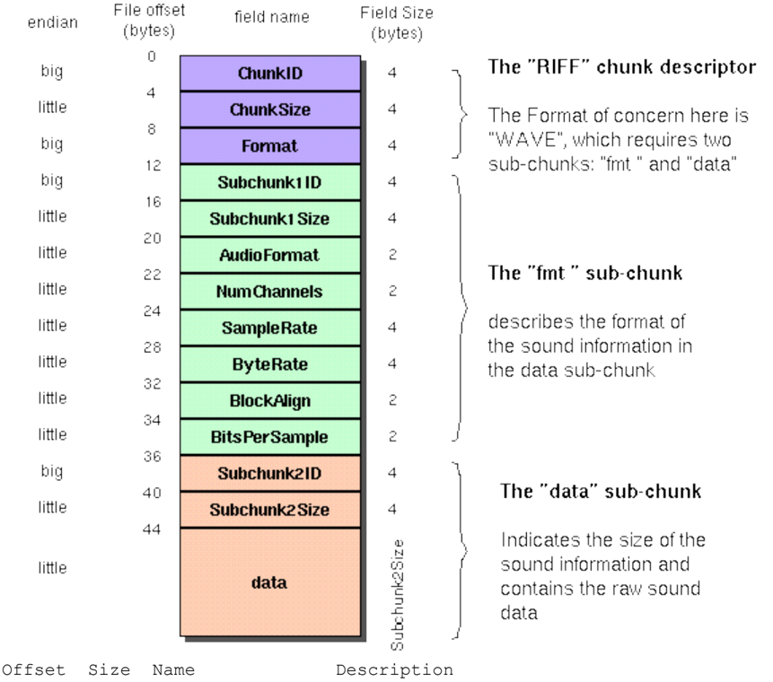
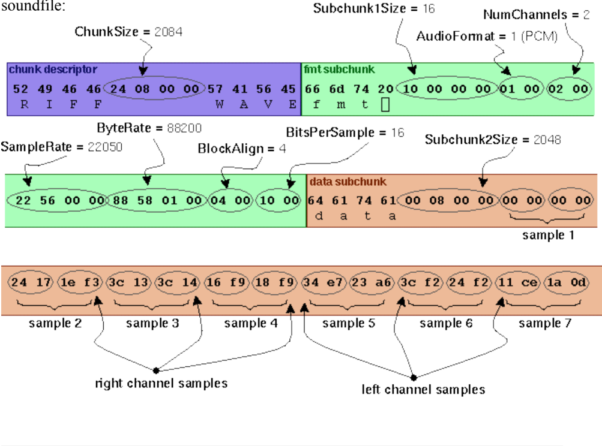
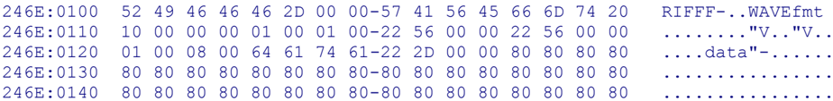

## EE 356 WAV File Format Notes

https://ccrma.stanford.edu/courses/422/projects/WaveFormat/

## WAVE PCM soundfile format

The WAVE file format is a subset of Microsoft's RIFF specification for the storage of multimedia files. A RIFF file starts out with a file header followed by a sequence of data chunks. A WAVE file is often just a RIFF file with a single "WAVE" chunk which consists of two sub-chunks -- a "fmt " chunk specifying the data format and a "data" chunk containing the actual sample data. Call this form the "Canonical form". Who knows how it really all works.

I use the standard WAVE format as created by the sox program:

endian big

little big

big little

little little

little little

little little

big little

little

Offset

The Canonical WAVE file format

File offset

(bytes)

0

4

Size

| 0     |   4 | ChunkID   | Contains the letters "RIFF" in ASCII form (0x52494646 big-endian form).                                                                                                   |
|-------|-----|-----------|---------------------------------------------------------------------------------------------------------------------------------------------------------------------------|
| 4     |   4 | ChunkSize | 36 + SubChunk2Size, or more precisely: 4 + (8 + SubChunk1Size) + (8 + SubChunk2Size) This is the size of the rest of the chunk following this number. This is the size of |
| the 8 |   4 | Format    | entire file in bytes minus 8 bytes for the two fields not included in this count: ChunkID and ChunkSize. Contains the letters "WAVE" (0x57415645 big-endian form).        |

The "WAVE" format consists of two subchunks: "fmt " and "data":

field name

Field Size

## (bytes) ChunkID The "RIFF" chunk descriptor

ChunkSize

The Format of concern here is

| The        | "fmt "   | subchunk describes                       | the sound data's format:                                                                                                                                                         |
|------------|----------|------------------------------------------|----------------------------------------------------------------------------------------------------------------------------------------------------------------------------------|
| 12         | 4        | Subchunk1ID                              | Contains the letters "fmt " (0x666d7420 big-endian form).                                                                                                                        |
| 16         | 4        | Subchunk1Size                            | 16 for PCM. This is the size of the rest of the Subchunk which follows this                                                                                                      |
| number. 20 | 2        | AudioFormat                              | PCM = 1 (i.e. Linear quantization) Values other than 1 indicate some form of compression.                                                                                        |
| 22         | 2        | NumChannels                              | Mono = 1, Stereo = 2, etc.                                                                                                                                                       |
| 24         | 4        | SampleRate                               | 8000, 44100, etc.                                                                                                                                                                |
| 28         | 4        | ByteRate                                 | == SampleRate * NumChannels * BitsPerSample/8                                                                                                                                    |
| 32         | 2        | BlockAlign                               | == NumChannels * BitsPerSample/8 The number of bytes for one sample including all channels. I wonder what happens when this number isn't an integer?                             |
| 34         | 2 2 X    | BitsPerSample ExtraParamSize ExtraParams | 8 bits = 8, 16 bits = 16, etc. if PCM, then doesn't exist space for extra parameters                                                                                             |
| The        | "data"   | subchunk contains                        | the size of the data and the actual sound:                                                                                                                                       |
| 36         | 4        | Subchunk2ID                              | Contains the letters "data" (0x64617461 big-endian form).                                                                                                                        |
| 40         | 4        | Subchunk2Size                            | == NumSamples * NumChannels * BitsPerSample/8 This is the number of bytes in the data. You can also think of this as the size of the read of the subchunk following this number. |
| 44         | *        | Data                                     | The actual sound data.                                                                                                                                                           |

As an example, here are the opening 72 bytes of a WAVE file with bytes shown as hexadecimal numbers:

52 49 46 46 24 08 00 00 57 41 56 45 66 6d 74 20 10 00 00 00 01 00 02 00 22 56 00 00 88 58 01 00 04 00 10 00 64 61 74 61 00 08 00 00 00 00 00 00 24 17 1e f3 3c 13 3c 14 16 f9 18 f9 34 e7 23 a6 3c f2 24 f2 11 ce 1a 0d soundfile:

ChunkSize = 2084

Subchunk1Size = 16

NumChannels = 2

AudioFonnat = 1 (PCM)

fimt subchunk

## Here is the interpretation of these bytes as a WAVE

R

SampleRate = 22050

22 56 00 00 88 58 01 00 04 00 10 00

‹24 17

le f3

sample 2

## Notes:

- The default byte ordering assumed for WAVE data files is little-endian. Files written using the big-endian byte ordering scheme have the identifier RIFX instead of RIFF.
- The sample data must end on an even byte boundary. Whatever that means.
- 8-bit samples are stored as unsigned bytes, ranging from 0 to 255. 16-bit samples are stored as 2's-complement signed integers, ranging from -32768 to 32767.
- There may be additional subchunks in a Wave data stream. If so, each will have a char[4] SubChunkID, and unsigned long SubChunkSize, and SubChunkSize amount of data.
- RIFF stands for Resource Interchange File Format .

## General discussion of RIFF files:

Multimedia applications require the storage and management of a wide variety of data, including bitmaps, audio data, video data, and peripheral device control information. RIFF provides a way to store all these varied types of data. The type of data a RIFF file contains is indicated by the file extension. Examples of data that may be stored in RIFF files are:

- Audio/visual interleaved data (.AVI)
- Waveform data (.WAV)
- Bitmapped data (.RDI)
- MIDI information (.RMI)
- Color palette (.PAL)
- Multimedia movie (.RMN)
- Animated cursor (.ANI)
- A bundle of other RIFF files (.BND)

NOTE: At this point, AVI files are the only type of RIFF files that have been fully implemented using the current RIFF specification. Although WAV files have been implemented, these files are very simple, and their developers typically use an older specification in constructing them.

For more info see http://www.ora.com/centers/gff/formats/micriff/index.htm

## References:

1. http://netghost.narod.ru/gff/graphics/summary/micriff.htm RIFF Format Reference (good).
2. http://www.lightlink.com/tjweber/StripWav/WAVE.html

http://technology.niagarac.on.ca/courses/ctec1631/WavFileFormat.html

## CTEC1631 Course Notes: WAV File Format

WAV files are probably the simplest of the common formats for storing audio samples. Unlike MPEG and other compressed formats, WAVs store samples "in the raw" where no pre-processing is required other that formatting of the data.

The following information was derived from several sources including some on the internet which no longer exist. Being somewhat of a proprietary Microsoft format there are some elements here which were empirically determined and so some details may remain somewhat sketchy. From what I've heard, the best source for information is the File Formats Handbook by Gunter Born (1995, ITP Boston)

The WAV file itself consists of three "chunks" of information: The RIFF chunk which identifies the file as a WAV file, The FORMAT chunk which identifies parameters such as sample rate and the DATA chunk which contains the actual data (samples).

Each Chunk breaks down as follows:

## RIFF Chunk (12 bytes in length total)

| Byte Number   |                                                           |
|---------------|-----------------------------------------------------------|
| 0 - 3         | "RIFF" (ASCII Characters)                                 |
| 4 - 7         | Total Length Of Package To Follow (Binary, little endian) |
| 8 - 11        | "WAVE" (ASCII Characters)                                 |

## FORMAT Chunk (24 bytes in length total)

| Byte Number   |                                              |
|---------------|----------------------------------------------|
| 0 - 3         | "fmt_" (ASCII Characters)                    |
| 4 - 7         | Length Of FORMAT Chunk (Binary, always 0x10) |

| 8 - 9   | Always 0x01                                                                    |
|---------|--------------------------------------------------------------------------------|
| 10 - 11 | Channel Numbers (Always 0x01=Mono, 0x02=Stereo)                                |
| 12 - 15 | Sample Rate (Binary, in Hz)                                                    |
| 16 - 19 | Bytes Per Second                                                               |
| 20 - 21 | Bytes Per Sample: 1=8 bit Mono, 2=8 bit Stereo or 16 bit Mono, 4=16 bit Stereo |
| 22 - 23 | Bits Per Sample                                                                |

## DATA Chunk

| Byte Number   |                           |
|---------------|---------------------------|
| 0 - 3         | "data" (ASCII Characters) |
| 4 - 7         | Length Of Data To Follow  |
| 8 - end       | Data (Samples)            |

The easiest approach to this file format might be to look at an actual WAV file to see how data is stored. In this case, we examine DING.WAV which is standard with all Windows packages. DING.WAV is an 8-bit, mono, 22.050 KHz WAV file of 11,598 bytes in length. Lets begin by looking at the header of the file (using DEBUG). 246E:0100  52 49 46 46 46 2D 00 00-57 41 56 45 66 6D 74 20   RIFFF-..WAVEfmt 246E:0110  10 00 00 00 01 00 01 00-22 56 00 00 22 56 00 00   ........"V.."V.. 246E:0120  01 00 08 00 64 61 74 61-22 2D 00 00 80 80 80 80   ....data"-...... 246E:0130  80 80 80 80 80 80 80 80-80 80 80 80 80 80 80 80   ................ 246E:0140  80 80 80 80 80 80 80 80-80 80 80 80 80 80 80 80   ................ As expected, the file begins with the ASCII characters "RIFF" identifying it as a WAV file. The next four bytes tell us the length is 0x2D46 bytes (11590 bytes in decimal) which is the length of the entire file minus the 8 bytes for the "RIFF" and length (11598 - 11590 = 8 bytes). The ASCII characters for "WAVE" and "fmt " follow. Next (line 2 above) we find the value 0x00000010 in the first 4 bytes (length of format chunk: always constant at 0x10). The next four bytes are 0x0001 (Always) and 0x0001 (A mono WAV, one channel used). Since this is a 8-bit WAV, the sample rate and the bytes/second are the same at 0x00005622 or 22,050 in decimal. For a 16-bit stereo WAV the bytes/sec would be 4

times the sample rate. The next 2 bytes show the number of bytes per sample to be 0x0001 (8-bit mono) and the number of bits per sample to be 0x0008. Finally, the ASCII characters for "data" appear followed by 0x00002D22 (11,554 decimal) which is the number of bytes of data to follow (actual samples). The data is a value from 0x00 to 0xFF. In the example above 0x80 would represent "0" or silence on the output since the DAC used to playback samples is a bipolar device (i.e. a value of 0x00 would output a negative voltage and a value of 0xFF would output a positive voltage at the output of the DAC on the sound card). Note that there are extension to the basic WAV format which may be supported in newer systems -- for example if you look at DING.WAV in C:\Windows\Media you'll see some extra bytes added after the format chunk before the "data" area -- but the basic format remains the same. As a final example consider the header for the following WAV file recorded at 44,100 samples per second in 16-bit stereo. 246E:0100  52 49 46 46 2C 48 00 00-57 41 56 45 66 6D 74 20   RIFF,H..WAVEfmt 246E:0110  10 00 00 00 01 00 02 00-44 AC 00 00 10 B1 02 00   ........D....... 246E:0120  04 00 10 00 64 61 74 61-00 48 00 00 00 00 00 00   ....data.H...... 246E:0130  00 00 00 00 00 00 00 00-00 00 00 00 00 00 00 00   ................ Again we find all the expected structures. Note that the sample rate is 0xAC44 (44,100 as an unsigned int in decimal) and the bytes/second is 4 times that figure since this is a 16-bit WAV (* 2) and is stereo (again * 2). The Channel Numbers field is also found to be 0x02 here and the bits per sample is 0x10 (16 decimal).

This page is part of theCTEC1631 course home page http://www.ringthis.com/dev/wave\_format.htm

## Ring This... Wave File Format

This is a brief outline of the wav file spec. It isn't comprehensive, but it's enough to get you started writing wav files yourself.

## Quick and Dirty WAV layout

This is what is missing as far as documentation I've found. There's a lot of theory and introduction, but when it comes time to implement this bad boy, it's tough to find. So, without further ado, here is the wave header for a general purpose, PCM format WAV file:

| Description                    | Size (bytes) - Data Type (Windows)   | Usual contents                                                                                                                             |
|--------------------------------|--------------------------------------|--------------------------------------------------------------------------------------------------------------------------------------------|
| "RIFF" file description header | 4 bytes - FOURCC                     | The ascii text string "RIFF". mmsystem.h provides the macro FOURCC_RIFF for this purpose.                                                  |
| size of file                   | 4 bytes - DWORD                      | The file size LESS the size of the "RIFF" description (4 bytes) and the size of file description (4 bytes). This is usually file size - 8. |
| "WAVE" description header      | 4 bytes - FOURCC                     | The ascii text string "WAVE". Check out the mmioFOURCC macro in mmsystem.h.                                                                |

| "fmt " description header   | 4 bytes - FOURCC        | The ascii text string "fmt " (note the trailing space). Check out the mmioFOURCC macro in mmsystem.h.                                                                                                    |
|-----------------------------|-------------------------|----------------------------------------------------------------------------------------------------------------------------------------------------------------------------------------------------------|
| size of WAVE section chunck | 4 bytes - DWORD         | The size of the WAVE type format (2 bytes) + mono/stereo flag (2 bytes) + sample rate (4 bytes) + bytes/sec (4 bytes) + block alignment (2 bytes) + bits/sample (2 bytes). This is usually 16 (or 0x10). |
| WAVE type format            | 2 bytes - WORD          | Type of WAVE format. This is a PCM header, or a value of 0x01.                                                                                                                                           |
| mono/stereo                 | 2 bytes - WORD          | mono (0x01) or stereo (0x02)                                                                                                                                                                             |
| sample rate                 | 4 bytes - DWORD         | Sample rate.                                                                                                                                                                                             |
| bytes/sec                   | 4 bytes - DWORD         | Bytes/Second                                                                                                                                                                                             |
| Block alignment             | 2 bytes - WORD          | Block alignment                                                                                                                                                                                          |
| Bits/sample                 | 2 bytes - WORD          | Bits/Sample                                                                                                                                                                                              |
| "data" description header   | 4 bytes - FOURCC        | The ascii text string "data". Check out the mmioFOURCC macro in mmsystem.h.                                                                                                                              |
| size of data chunk          | 4 bytes - DWORD         | Number of bytes of data is included in the data section.                                                                                                                                                 |
| Data                        | Unspecified data buffer | Your data.                                                                                                                                                                                               |

## Some gotchas

 Make sure all numbers are in Intel's little endian format, that is, 0x12345678 should be written 0x78 0x56 0x34 0x12.

## Other WAV resources



TJW has a good page.



Also check out the MSDN.