## Floating-Point Reference Sheet for Intel® Architecture

https://software.intel.com/en-us/articles/floating-point-reference-sheet-for-intel-architecture (v2.13)

## Binary Format Floating-Point Number

logo

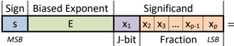

- Sign bit is s = 0 for '+', and s = 1 for '-' (also refer to 's' as 'sign')

Sign

Biased Exponent

Significand

= {

(-1) 𝑠 ×𝑥1.𝑥2𝑥3 ⋯𝑥𝑝-1𝑥𝑝 ×2 𝐸-𝐵 ,

if normal

(-1) 𝑠

×𝑥1.𝑥2𝑥3 ⋯𝑥𝑝-1𝑥𝑝

×2 𝑒𝑚𝑖𝑛 ,

if denormal

- Unbiased exponent is e = E - B - x1 + 1 for nonzero finite numbers

s

E

x1

x2

x3

…

xp-1

xp

- For standard formats, x1 equals (E ≠ 0) and is implicit

MSB

J-bit

Fraction

LSB

- For NaNs, the payload is the bit string from x3 to xp

## Floating-Point Classes, Encodings, and Parameters

* All examples are in little endian byte order      ** R Ind (Real Indefinite), a qNaN, must have sig n bit s = 1 and payload = 00…00

|                | E       | J   | Fraction      | Values           | Half (16b)   | Single (32b)        | Half (16b)          | Standard Formats* Double (64b)   | Standard Formats* Double (64b)   | Standard Formats* Double (64b)   | Quad      | (128b)        | Quad            | Extended Format* x87 (80b) t***   | Extended Format* x87 (80b) t***   | Extended Format* x87 (80b) t***   | Non-Std* Bfloat (16b)   |
|----------------|---------|-----|---------------|------------------|--------------|---------------------|---------------------|----------------------------------|----------------------------------|----------------------------------|-----------|---------------|-----------------|-----------------------------------|-----------------------------------|-----------------------------------|-------------------------|
| Zero           |         |     | 00…00         | +Zero            | 0000         | 0000 0000           | 0000                | 0000 0000                        | 0000                             |                                  | 0000      | 0000          | … 0000          | 0000                              | 0 000                             | … 0000                            | 0000                    |
| 00…00 Denormal |         | 0   | 00…01 11…11 ↔ | +D min +D max    | 0001 03ff    | 0000 0001 007f ffff | 0000 000f           | 0000 ffff                        | 0000 ffff                        | 0001 ffff                        | 0000 0000 | 0000 ffff     | … 0001 … ffff   | 0000 0 000 0 7                    | 000 … fff … ffff                  | 0001                              | 0001 007f               |
| Normal         | 00…01 ↔ |     | 00…00 ↔ 11…11 | +N min +One      | 0400 3c00    | 0080 0000 3f80 0000 | 0010 3ff0           | 0000 0000                        | 0000                             | 0000                             | 0001 3fff | 0000 0000     | … 0000 … 0000 … | 000 1 8 3fff                      | 000 … 000 … fff                   | 0000 0000                         | 0080 3f80 7f7f          |
|                | 11…10   |     |               | +N max +Infinity | 7bff         | 7f7f ffff           | 7fef                | ffff                             | 0000 ffff                        | 0000 ffff                        | 7ffe      | ffff          | ffff            | 8 7ff e f f 8                     | …                                 | ffff                              |                         |
| Infinity       |         | 1   | 00 … 00 00…01 |                  | 7c00 7c01    | 7f80                | 0000 7ff0 0001 7ff0 | 0000                             | 0000                             | 0000 0001                        | 7fff 7fff | 0000 0000     | … 0000 …        | 7ff 7fff                          | 000 … 000 …                       | 0000 0001                         | 7f80                    |
| sNaN           | 11…11   |     | 01…11 ↔       | '+' sNaN         | 7dff         | 7f80 7fbf           | ffff 7ff7           | 0000 ffff                        | 0000 ffff                        | ffff                             | 7fff      | 7fff          | 000 1 … ffff    | 8 7fff b                          | fff … …                           | ffff                              | 7f81 7fbf               |
|                |         |     | 10…00 ↔       | R Ind**          | fe00 7e00    | ffc0                | 0000 fff8 0000      | 0000                             | 0000                             | 0000                             | ffff 7fff | 8000 … 8000 … | 0000 0000       | ffff c 7fff c                     | 000 000 …                         | 0000 0000                         | ffc0                    |
| qNaN           |         |     | 11…11 '+'qNaN | Field s          | 7fff E J     | 7fc0 7fff J         | 7ff8 ffff 7fff      | 0000 ffff                        | 0000 ffff F                      | 0000 ffff                        | 7fff s    | ffff … J      | ffff F          | 7fff f s E                        | fff … J                           | ffff s                            | 7fc0 7fff               |
|                |         |     | # of Bits     | 1 5              | F 0          | s E 0               | F s                 | E                                | J 0                              |                                  | E 1 15    | 0             |                 | 1                                 | 1                                 | F 63 1                            | E J F 8 0 7             |
|                |         |     |               | 0x0f             | 10           | 1 8                 | 23 1                | 11                               |                                  | 52                               |           |               | 112             | 15                                |                                   |                                   |                         |
|                |         |     | Exp. bias (B) |                  | (15)         | 0x7f (127)          |                     | 0x3ff                            | (1023)                           |                                  | 0x3fff    | (16383)       |                 | 0x3fff (16383)                    | 0x3fff (16383)                    | 0x7f                              | (127)                   |
|                |         |     | e min : e max |                  | 15           | -126                | -1022               |                                  |                                  |                                  | -16382    |               | 16383           |                                   |                                   | -126                              | 127                     |
|                |         |     |               | -14              |              | 127                 |                     |                                  | 1023                             |                                  |           |               | -16382          | -16382                            | 16383                             | 16383                             |                         |

## Operation-Specific Results and Faults for Typical Intel® SSE or Intel® AVX Scalar Instructions

- If DAZ = 1, denormal inputs are replaced with appropriately signed zeros
- Q(X) (Quiet(X)) sets the most significant fraction bit of X (x2) to 1

bar chart

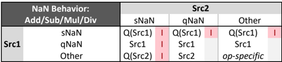

| NaN Behavior:   | NaN Behavior:   | Src2                       | Src2              | Src2                     |
|-----------------|-----------------|----------------------------|-------------------|--------------------------|
|                 | Add/Sub/Mul/Div | sNaN                       | qNaN              | Other                    |
| Src1            | sNaN qNaN Other | Q(Src1) I Src1 I Q(Src2) I | Q(Src1) Src1 Src2 | Q(Src1) Src1 op-specific |

bar chart

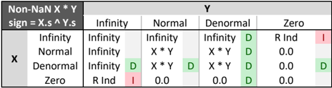

| Non-NaN X * Y    | Non-NaN X * Y    | Y        | Y        | Y        | Y      | Y        | Y        | Y     | Y    |
|------------------|------------------|----------|----------|----------|--------|----------|----------|-------|------|
| sign = X.s ^ Y.s | sign = X.s ^ Y.s | Infinity | Infinity | Normal   | Normal | Denormal | Denormal | Zero  | Zero |
| X                | Infinity         | Infinity |          | Infinity |        | Infinity | D        | R Ind | I    |
| X                | Normal           | Infinity |          | X * Y    |        | X * Y    | D        | 0.0   |      |
| X                | Denormal         | Infinity | D        | X * Y    | D      | X * Y    | D        | 0.0   | D    |
| X                | Zero             | R Ind    | I        | 0.0      |        | 0.0      | D        | 0.0   |      |

bar chart

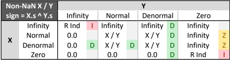

| Non-NaN X / Y   | Non-NaN X / Y   | Y        | Y        | Y        | Y      | Y        | Y        | Y        | Y    |
|-----------------|-----------------|----------|----------|----------|--------|----------|----------|----------|------|
| sign = X.s      | sign = X.s      | Infinity | Infinity | Normal   | Normal | Denormal | Denormal | Zero     | Zero |
| X               | Infinity        | R Ind    | I        | Infinity |        | Infinity | D        | Infinity |      |
| X               | Normal          | 0.0      |          | X / Y    |        | X / Y    | D        | Infinity | Z    |
| X               | Denormal        | 0.0      | D        | X / Y    | D      | X / Y    | D        | Infinity | Z    |
| X               | Zero            | 0.0      |          | 0.0      |        | 0.0      | D        | R Ind    | I    |

bar chart

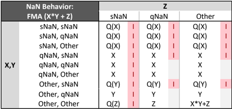

|              | NaN Behavior:   | Z   | Z    | Z    | Z     | Z     |
|--------------|-----------------|-----|------|------|-------|-------|
| FMA (X*Y     | + Z) sNaN       |     |      | qNaN | qNaN  | Other |
| X,Y sNaN,    | sNaN Q(X)       | I   | Q(X) | I    | Q(X)  | I     |
| sNaN, qNaN   | Q(X)            | I   | Q(X) | I    | Q(X)  | I     |
| sNaN, Other  | Q(X)            | I   | Q(X) | I    | Q(X)  | I     |
| qNaN, sNaN   | X               | I   | X    | I    | X     | I     |
| qNaN, qNaN   | X               | I   | X    |      | X     |       |
| qNaN, Other  | X               | I   | X    |      | X     |       |
| Other, sNaN  | Q(Y)            | I   | Q(Y) | I    | Q(Y)  | I     |
| Other, qNaN  | Y               | I   | Y    |      | Y     |       |
| Other, Other | Q(Z)            | I   | Z    |      | X*Y+Z |       |

## Control and Status Words

x87

SSE, AVX

bar chart

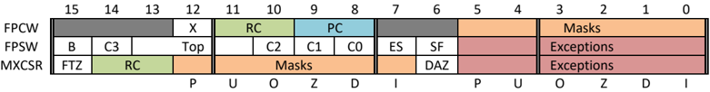

*E, *M: Exceptions and Masks

RC: Round Control

PC: Precision Control

Underflow / Denormals

Precision (P), Underflow (U), Overflow (O), Divide-by-Zero (Z), Denormal Inputs (D), Invalid Inputs (I)

RoundTiesToEven / RoundToNearestEven (RNE), RoundTowardsNegative (-INF), RoundTowardsPositive (+INF), RoundTowardZero (RTZ)

Single Precision (SP), Double Precision (DP), Double Extended Precision (DEP)

Flush to Zero (FTZ), Denormals Are Zero (DAZ)

- For more details on exception priorities and unmasked behavior, see flowchart on next page
- NaN payload's least significant bits are zero -extended or truncated to fit the destination

bar chart

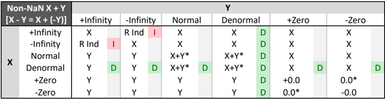

| Non-NaN X + Y      | Non-NaN X + Y      | Y         | Y         | Y         | Y         | Y      | Y      | Y        | Y     | Y     | Y     | Y     | Y   |
|--------------------|--------------------|-----------|-----------|-----------|-----------|--------|--------|----------|-------|-------|-------|-------|-----|
| [X - Y = X + (-Y)] | [X - Y = X + (-Y)] | +Infinity | +Infinity | -Infinity | -Infinity | Normal | Normal | Denormal | +Zero | +Zero | -Zero | -Zero |     |
|                    | +Infinity          | X         |           | R Ind     | I         | X      |        | X        | X     |       | X     |       |     |
|                    | -Infinity          | R Ind     | I         | X         |           | X      |        | X        | X     |       | X     |       |     |
|                    | Normal             | Y         |           | Y         |           | X+Y*   |        | X+Y*     | X     |       | X     |       |     |
|                    | Denormal           | Y         | D         | Y         | D         | X+Y*   | D      | X+Y*     | X     | D     | X     | D     |     |
|                    | +Zero              | Y         |           | Y         |           | Y      |        | Y        | +0.0  |       | 0.0*  |       |     |
|                    | -Zero              | Y         |           | Y         |           | Y      |        | Y        | 0.0*  |       | -0.0  |       |     |

* If X + Y is exactly 0, sign bit s equals (RC == -INF)

bar chart

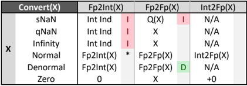

| Convert(X)                                | Fp2Int(X)                                     | Fp2Fp(X)                         | Int2Fp(X)                    |
|-------------------------------------------|-----------------------------------------------|----------------------------------|------------------------------|
| X sNaN qNaN Infinity Normal Denormal Zero | Int Ind Int Ind Int Ind Fp2Int(X) Fp2Int(X) 0 | Q(X) I X X Fp2Fp(X) Fp2Fp(X) D X | N/A N/A N/A Int2Fp(X) N/A +0 |

Int Ind

(Integer Indefinite) is defined to be the bit string 10…00

* If Fp2Int(X) is not representable in dest format, raise  I .

other

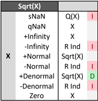

bar chart

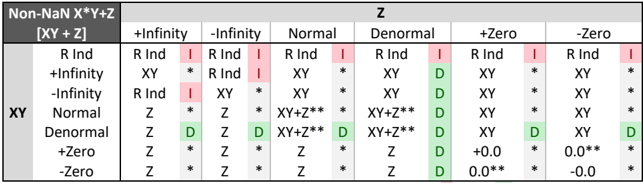

| Non-NaN X*Y+Z   | Non-NaN X*Y+Z   | Z         | Z         | Z         | Z         | Z      | Z      | Z        | Z        | Z     | Z     | Z     | Z     |
|-----------------|-----------------|-----------|-----------|-----------|-----------|--------|--------|----------|----------|-------|-------|-------|-------|
|                 | [XY + Z]        | +Infinity | +Infinity | -Infinity | -Infinity | Normal | Normal | Denormal | Denormal | +Zero | +Zero | -Zero | -Zero |
| XY              | R Ind R Ind     | I         | R         | Ind       | I         | R Ind  | I      | R Ind    | I        | R Ind | I     | R Ind | I     |
| XY              | +Infinity       | XY        | *         | R Ind     | I         | XY     | *      | XY       | D        | XY    | *     | XY    | *     |
| XY              | -Infinity       | R Ind     | I         | XY        | *         | XY     | *      | XY       | D        | XY    | *     | XY    | *     |
| XY              | Normal          | Z         | *         | Z         | *         | XY+Z** | *      | XY+Z**   | D        | XY    | *     | XY    | *     |
| XY              | Denormal        | Z         | D         | Z         | D         | XY+Z** | D      | XY+Z**   | D        | XY    | D     | XY    | D     |
|                 | +Zero           | Z         | *         | Z         | *         | Z      | *      | Z        | D        | +0.0  | *     | 0.0** | *     |
|                 | -Zero           | Z         | *         | Z         | *         | Z      | *      | Z        | D        | 0.0** | *     | -0.0  | *     |

* If X or Y is Denormal and X*Y+Z does not raise  I , raise  D .

** If XY + Z is exactly 0, sign bit s equals (RC == -INF)

logo

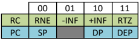

|    | 00   | 01   | 10   | 11   |
|----|------|------|------|------|
| RC | RNE  | -INF | +INF | RTZ  |
| PC | SP   |      | DP   | DEP  |

## Flowchart for a Typical Intel® SSE or Intel® AVX Floating-Point Scalar Instruction

other

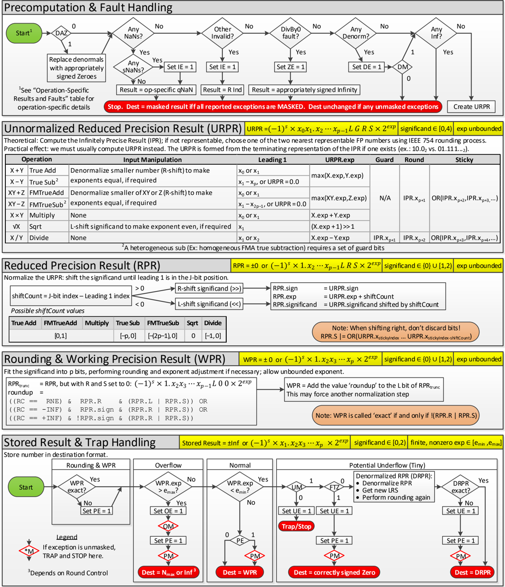

Intel disclaims all express and implied warranties, including without limitation, the implied warranties of merchantability, fitness for a particular purpose, and noninfringement, as well as any warranty arising from course of performance, course of dealing, or usage in trade.