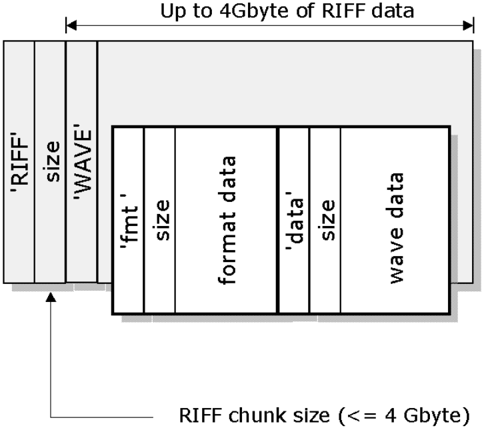
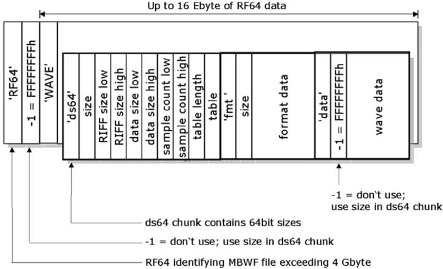
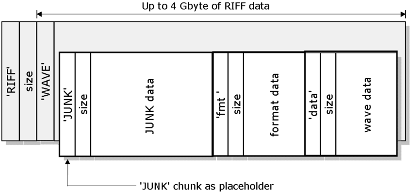

## RF64: An extended File Format for Audio

A BWF-compatible multichannel file format enabling file sizes to exceed 4 Gbyte

## Status: Technical Specification

Geneva

February 2007


## Contents

| 1.                                                               | INTRODUCTION                                                     |   5 |
|------------------------------------------------------------------|------------------------------------------------------------------|-----|
| 2.                                                               | BASIC USER REQUIREMENTS                                          |   5 |
| 3. DEFINITION OF A NEW FORMAT, RF64                              | 3. DEFINITION OF A NEW FORMAT, RF64                              |   6 |
| 3.1                                                              | Enhancement for a PCM stereo down mix                            |   6 |
| 3.2                                                              | Enhancement for control data                                     |   7 |
| 3.3                                                              | Enhancement for bitstream non-PCM data                           |   7 |
| 3.4                                                              | Breaking the 4 gigabyte barrier                                  |   7 |
| 3.5                                                              | Achieving compatibility between BWF and RF64                     |   9 |
| ANNEX A:FORMAL DESCRIPTION OF RIFF/WAVE AND RF64/WAVE STRUCTURES | ANNEX A:FORMAL DESCRIPTION OF RIFF/WAVE AND RF64/WAVE STRUCTURES |  11 |
| A.1                                                              | Chunks and Structs in the RIFF/WAVE (BWF) format                 |  11 |
| A.2                                                              | New Chunks and Structs in the RF64/WAVE (MBWF) format            |  12 |
| REFERENCES:                                                      | REFERENCES:                                                      |  14 |

Page intentionally left blank. This document is paginated for recto-verso printing

## RF64: An Extended File Format for Audio

| EBU Committee   |   First Issued | Revised       |   Re-issued |
|-----------------|----------------|---------------|-------------|
| PMC             |           2006 | December 2006 |        2007 |

Keywords: RF64, BWF, MBWF, Multichannel Audio, Files

## 1.  INTRODUCTION

The RF64 file format should fulfil the longer-term need for multichannel sound in broadcasting and archiving. The required effort for software implementers is very small. The changes that will be needed to update existing systems will be reasonable in cost.

An RF64 file has additions to the basic Microsoft RIFF/WAVE specification to allow for either, or both:

- ƒ more than 4 Gbyte file sizes when needed
- ƒ A maximum of 18 surround channels, stereo downmix channel and bitstream signals with non-PCM  coded  data.  This  specification  is  based  on  the Microsoft  Wave  Format Extensible [1] for multichannel parameters.

The file format is designed to be a compatible extension to the Microsoft RIFF/WAVE format and to the BWF [2]  [3] and  its  supplements  and  additional  chunks.  It  extends  the  maximum  size capabilities of the RIFF/WAVE and BWF thus allowing for multichannel sound in broadcasting and audio archiving.

RF64 can be used in the entire programme chain from capture to editing and play out and for short or long term archiving of multichannel files.

An RF64 file with a bext chunk becomes an MBWF (Multichannel BWF) file. The terms 'RF64' and 'MBWF' can then be considered synonymous.

## 2. BASIC USER REQUIREMENTS

The basic user requirements were derived from discussions with a group of EBU Members. They are summarised below:

- ƒ The file format should have an open, published specification
- ƒ Backwards compatibility to BWF and RIFF/WAVE must be maintained
- ƒ Linear PCM must be accommodated
- ƒ File sizes more than 4 Gbyte must be accommodated
- ƒ Minimum 8 channels (5.1 + stereo) must be accommodated
- ƒ Simulcast (5.1 + stereo in a single file) should be possible
- ƒ Streaming should be possible
- ƒ Editing should be possible

- ƒ A browsing version should be derivable directly from the file
- ƒ Must contain the technical Metadata necessary for play-back (e.g. Dolby Metadata)
- ƒ A low cost, easily accessible software player should be available
- ƒ Easy implementation for software developers and manufacturers.

Additionally, Swedish operational experience has demonstrated that production and archiving often require  storing  and  transport  of  PCM  and  non-PCM  audio  data,  both  or  either  in  a  single  file. Consequently, mechanisms for accommodating non-PCM audio streams (e.g. Dolby Digital and DTS) have been added to the RF64 format.

## 3. DEFINITION OF A NEW FORMAT, RF64

With  the  advent  of  Windows  2000  Microsoft  introduced  the  multichannel  extension  to  its RIFF/WAVE file format, called Wave Format Extensible . The main purpose of this file format was to support multichannel audio in PC gaming applications.

The  Wave  Format  Extensible channel  mask  contains  18  '#define'  settings  specifying  different loudspeaker  positions  (or  channel  allocations).  Another  '#define',  'SPEAKER\_ALL'  turns  on  all loudspeakers (channels).

## Microsoft Wave Format Extensible Channel Mask

| #define SPEAKER_FRONT_LEFT            | 0x00000001   |
|---------------------------------------|--------------|
| #define SPEAKER_FRONT_RIGHT           | 0x00000002   |
| #define SPEAKER_FRONT_CENTER          | 0x00000004   |
| #define SPEAKER_LOW_FREQUENCY         | 0x00000008   |
| #define SPEAKER_BACK_LEFT             | 0x00000010   |
| #define SPEAKER_BACK_RIGHT            | 0x00000020   |
| #define SPEAKER_FRONT_LEFT_OF_CENTER  | 0x00000040   |
| #define SPEAKER_FRONT_RIGHT_OF_CENTER | 0x00000080   |
| #define SPEAKER_BACK_CENTER           | 0x00000100   |
| #define SPEAKER_SIDE_LEFT             | 0x00000200   |
| #define SPEAKER_SIDE_RIGHT            | 0x00000400   |
| #define SPEAKER_TOP_CENTER            | 0x00000800   |
| #define SPEAKER_TOP_FRONT_LEFT        | 0x00001000   |
| #define SPEAKER_TOP_FRONT_CENTER      | 0x00002000   |
| #define SPEAKER_TOP_FRONT_RIGHT       | 0x00004000   |
| #define SPEAKER_TOP_BACK_LEFT         | 0x00008000   |
| #define SPEAKER_TOP_BACK_CENTER       | 0x00010000   |
| #define SPEAKER_TOP_BACK_RIGHT        | 0x00020000   |
| #define SPEAKER_ALL                   | 0x80000000   |

To fulfil the user requirements listed above, RF64 requires some enhancements to the basic Wave Format Extensible channel mask. Fortunately this is stored in a 32-bit variable that can therefore accommodate a further 13 '#defines' to allow this increased functionality.

## 3.1 Enhancement for a PCM stereo down mix

No PCM stereo signal is included in the basic Wave Format Extensible .

To include a stereo channel the following is added:

| #define SPEAKER_STEREO_LEFT   | 0x20000000   |
|-------------------------------|--------------|
| #define SPEAKER_STEREO_RIGHT  | 0x40000000   |

With  this  enhancement  a  multichannel  'X.1'  and  a  stereo  down  mix  can  be  accommodated  in  a single file.

## 3.2 Enhancement for control data

Addition of two new '#define' values for control data:

| #define SPEAKER_CONTROLSAMPLE_1   | 0x08000000   |
|-----------------------------------|--------------|
| #define SPEAKER_CONTROLSAMPLE_2   | 0x10000000   |

These  control  samples  can  be  stored  within  the  file.  Technical  or  content  metadata  can  be positioned with sample accuracy along the essence file time line. The details of this feature are yet to be defined.

## 3.3 Enhancement for bitstream non-PCM data

Bitstream signals according to IEC [4] and  SMPTE [5] standards carry non-PCM multichannel audio data coded with various perceptual methods.

Through this bitstream storage feature in the file format, Dolby AC3, Dolby E, DTS, MPEG-1 and  2 (at all three layers) and MPEG-2 AAC will be contained in the file as data bursts, 'disguised' as PCM linear.  The  bitstream  audio  signal  is  embedded  in  a  structure  that  is  similar  to  two  interleaved stereo audio channels in a linear PCM RIFF/WAVE or BWF file.

In  RIFF  files  there  is  only  one  format  chunk  defining  common  parameters  for  all  interleaved channels  in  the  audio  data  chunk.  The  format  of  the  bitstream  channels  must  comply  with  the format of other multichannel PCM or stereo PCM channels if they are present in the same file.

To a receiver of the file, the type of non-PCM audio coding will be known only when the bitstream is  decoded  from  AES3  or  SPDIF.  It  is  likely  that  a  new  chunk  will  be  developed  to  signal  the bitstream format contained in the file.

Adding  4  more  '#define'  values  to  the Wave  Format  Extensible channel  mask  will  allow  two different non-PCM formats, as follows:

| #define SPEAKER_BITSTREAM_1_LEFT   | 0x00800000   |
|------------------------------------|--------------|
| #define SPEAKER_BITSTREAM_1_RIGHT  | 0x01000000   |
| #define SPEAKER_BITSTREAM_2_LEFT   | 0x02000000   |
| #define SPEAKER_BITSTREAM_2_RIGHT  | 0x04000000   |

## 3.4 Breaking the 4 gigabyte barrier

The reason for the 4 Gbyte barrier is the 32-bit addressing in RIFF/WAVE and BWF. With 32 bits a maximum of 4294967296 bytes = 4 Gbyte can be addressed. To solve this issue, 64-bit addressing is needed.

'RIFF'

'WAVE'

Standard RIFF/WAVE format

Up to 4Gbyte of RIFF data size

Note: All fields except "format data" and "wave data" are 32-bit fields

•



Just changing the size of every field in a BWF to 64-bit would produce a file that is not compatible with the standard RIFF/WAVE format - an obvious but important observation.

The  approach  adopted  is  to  define  a  new  64-bit  based  Resource  Interchange  File  Format  called RF64 that is identical to the original RIFF/WAVE format, except for the following changes:

- ƒ The ID 'RF64' is used instead of 'RIFF' in the first four bytes of the file
- ƒ A mandatory 'ds64' (data size 64) chunk is added, which has to be the first chunk after the 'RF64 chunk'.

The  'ds64'  chunk  has  three  mandatory  64-bit  integer  values,  which  replace  three  32-bit fields of the RIFF/WAVE format:

- ƒ riffSize (replaces the RIFF size field)
- ƒ dataSize (replaces the size field of the 'data' chunk)
- ƒ sampleCount (replaces the sample count value in the 'fact' chunk)

For all three 32-bit fields of the RIFF/WAVE format the following rule applies:

If  the  32-bit  value  in  the  field  is  not  '-1'  (=  FFFFFFFF  hex)  then  this  32-bit  value  is  used. If the 32-bit value in the field is '-1' the 64-bit value in the 'ds64' chunk is used instead.

- ƒ One optional array of structs 2 (see Annex A) with additional 64-bit chunk sizes is possible

The complete structure of the RF64 file format is illustrated in the following figure:

2 'Struct' is a C/C++ keyword that defines a structure type and/or a variable of a structure type.

size

RF64/WAVE format for files up to 16 Ebyte (exa byte = 26° bytes)

-1 = FFFFFFFFh

'WAVE'

'ds64'

size

RIFF size low

RIFF size high

data size low

Note: All fields except "table", "format data" and "wave data" are 32-bit fields



## 3.5 Achieving compatibility between BWF and RF64

In spite of higher sampling frequencies and multi-channel audio, some production audio files will inevitably be smaller than 4 Gbyte and they should therefore stay in Broadcast Wave Format.

The  problem  arises  that  a  recording  application  cannot  know  in  advance  whether  the  recorded audio it is compiling will exceed 4 Gbyte or not at end of recording (i.e. whether it needs to use RF64 or not).

The solution is to enable the recording application to switch from BWF to RF64 on the fly at the 4 Gbyte size-limit, while the recording is still going on.

This is achieved by reserving additional space in the BWF by inserting a 'JUNK' chunk 3 that is of the same size as a 'ds64' chunk. This reserved space has no meaning for Broadcast Wave, but will become the 'ds64' chunk, if a transition to RF64 is necessary.

3 The 'JUNK' chunk is part of the original RIFF/WAVE standard. It is a placeholder and it will be ignored by any audio application.

'RF64'

size

'WAVE'

RIFF/WAVE format for upwards compatibility

Up to 4 Gbyte of RIFF data



'JUNK'

At the beginning of a recording, a RF64-aware application will create a standard RIFF/WAVE or BWF with a 'JUNK' chunk as the first chunk. While recording, it will check the RIFF and data sizes. If they exceed 4 Gbyte, the application will:

- ƒ Replace the chunkID 'JUNK' with 'ds64' chunk. (this transforms the previous  JUNK  chunk into a ds64 chunk).
- ƒ Insert the RIFF size, 'data' chunk size and sample count in the 'ds64' chunk
- ƒ Set RIFF size, 'data' chunk size and sample count in the 32 bit fields to -1 = FFFFFFFF hex
- ƒ Replaces the ID 'RIFF' with 'RF64' in the first four bytes of the file
- ƒ Continue with the recording.

## Annex A: Formal description of RIFF/WAVE and RF64/WAVE structures

## A.1 Chunks and Structs in the RIFF/WAVE (BWF) format

```
struct RiffChunk // declare RiffChunk structure { char chunkId[4]; // 'RIFF' unsigned int32 chunkSize; // 4 byte size of the traditional RIFF/WAVE file char riffType[4]; // 'WAVE' }; struct JunkChunk // declare JunkChunk structure { char chunkId[4]; // 'JUNK' unsigned int32 chunkSize; // 4 byte size of the 'JUNK' chunk. This must be at // least 28 if the chunk is intended as a // place-holder for a 'ds64' chunk. char chunkData[ ] 4 ; // dummy bytes }; struct FormatChunk 5 // declare FormatChunk structure { char chunkId[4]; // 'fmt ' unsigned int32 chunkSize; // 4 byte size of the 'fmt ' chunk unsigned int16 formatType; // WAVE_FORMAT_PCM = 0x0001, etc. unsigned int16 channelCount; // 1 = mono, 2 = stereo, etc. unsigned int32 sampleRate; // 32000, 44100, 48000, etc. unsigned int32 bytesPerSecond; // only important for compressed formats unsigned int16 blockAlignment; // container size (in bytes) of one set of samples unsigned int16 bitsPerSample; // valid bits per sample 16, 20 or 24 unsigned int16 cbSize // extra information (after cbSize) to store char extraData[22] // extra data of WAVE_FORMAT_EXTENSIBLE when necessary }; struct DataChunk // declare DataChunk structure { char chunkId[4]; // 'data' unsigned int32 chunkSize; // 4 byte size of the 'data' chunk char waveData[ ] // audio samples };
```

Note: Any other chunks that are valid in a RIFF/WAVE file are also valid in a RF64/WAVE file. For example, the BWF extensions for RIFF/WAVE can be used 'as is' in any RF64/WAVE file.

4 The  empty  bracket  is  not  standard  C/C++  syntax.  It  is  used  to  show  that  these  arrays  have  a  variable  number  of elements (which might even be zero).

5 This is already the specialised format chunk for PCM audio data.

## A.2 New Chunks and Structs in the RF64/WAVE (MBWF) format

```
struct RF64Chunk // declare RF64Chunk structure { char chunkId[4]; // 'RF64' unsigned int32 chunkSize; // -1 = 0xFFFFFFFF means don't use this data, use // riffSizeHigh and riffSizeLow in 'ds64' chunk instead char rf64Type[4]; // 'WAVE' }; struct ChunkSize64 // declare ChunkSize64 structure { char chunkId[4]; // chunk ID (i.e. 'big1' - this chunk is a big one) unsigned int32 chunkSizeLow; // low 4 byte chunk size unsigned int32 chunkSizeHigh; // high 4 byte chunk size }; struct DataSize64Chunk // declare DataSize64Chunk structure { char chunkId[4]; // 'ds64' unsigned int32 chunkSize; // 4 byte size of the 'ds64' chunk unsigned int32 riffSizeLow; // low 4 byte size of RF64 block unsigned int32 riffSizeHigh; // high 4 byte size of RF64 block unsigned int32 dataSizeLow; // low 4 byte size of data chunk unsigned int32 dataSizeHigh; // high 4 byte size of data chunk unsigned int32 sampleCountLow; // low 4 byte sample count of fact chunk unsigned int32 sampleCountHigh; // high 4 byte sample count of fact chunk unsigned int32 tableLength; // number of valid entries in array 'table' chunkSize64 table[ ]; };
```

The array of 'ChunkSize64' structs is used to store the length of any chunk other than 'data' in the optional part of the 'ds64' chunk. Currently, no standard chunk type other than 'data' is likely to exceed a size of 4 Gbyte even in extremely large audio files (e.g. the BWF 'levl' chunk will typically exceed 4 Gbyte only when the 'data' chunk reaches about 512 Gbyte).

```
struct Guid { unsigned int32 data1; unsigned int16 data2; unsigned int16 data3; unsigned int32 data4; unsigned int32 data5; }; struct FormatExtensibleChunk // declare FormatExtensibleChunk structure for // WAVE_FORMAT_EXTENSIBLE { char chunkId[4]; // 'fmt ' unsigned int32 chunkSize; // 4 byte size of the 'fmt ' chunk unsigned int16 formatType; // WAVE_FORMAT_EXTENSIBLE = 0xFFFE unsigned int16 channelCount; // 1 = mono, 2 = stereo, etc. unsigned int32 sampleRate; // 32000, 44100, 48000, etc. unsigned int32 bytesPerSecond; // only important for compressed formats unsigned int16 blockAlignment; // container size (in bytes) of one set of samples unsigned int16 bitsPerSample; // bits per sample in container size * 8, i.e. 8, 16, 24 unsigned int16 cbSize // extra information (after cbSize) to store unsigned int16 validBitsPerSample // valid bits per sample i.e. 8, 16, 20, 24 unsigned int32 channelMask // channel mask for channel allocation Guid subFormat // KSDATAFORMAT_SUBTYPE_PCM // data1 = 0x00000001 // data2 = 0x0000 // data3 = 0x0010 // data4 = 0xAA000080 // data5 = 0x719B3800 };
```

## REFERENCES:

| [1]                                                                                                | Wave Format Extensible:                                                                            | Multiple Channel Audio Data and WAVE Files                                                                                                          |
|----------------------------------------------------------------------------------------------------|----------------------------------------------------------------------------------------------------|-----------------------------------------------------------------------------------------------------------------------------------------------------|
| [2]                                                                                                | EBU Tech 3285                                                                                      | Specification of the Broadcast Wave Format (BWF) - Version 1 - first edition                                                                        |
| [3]                                                                                                | EBU Tech 3285 s 1 - 5                                                                              | Supplements to the BWF specification                                                                                                                |
| [4]                                                                                                | IEC 61937-1                                                                                        | Digital audio - Interface for non-linear PCM encoded audio bitstream applying IEC 60958 (AES3, SPDIF) - Part 1: General                             |
|                                                                                                    | IEC 61937-3                                                                                        | Part 3: Non-linear PCM bitstreams according to the AC-3 format                                                                                      |
|                                                                                                    | IEC 61937-5                                                                                        | Part 5: Non-linear PCM bitstreams according to the DTS format(s)                                                                                    |
|                                                                                                    | IEC 61937-6                                                                                        | Part 6: Non-linear PCM bitstreams according to the MPEG2 AAC audio formats                                                                          |
| [5]                                                                                                | SMPTE 337M-2000                                                                                    | Format for Non-PCM Audio and Data in an AES3 Serial Digital Audio Interface                                                                         |
|                                                                                                    | SMPTE 338M-2000                                                                                    | Format for Non-PCM Audio and Data in AES3 - Data Types (Supported data types: AC-3, MPEG-1 or MPEG-2, Layer 1, 2 or 3, SMPTE KLV data and Dolby E). |
|                                                                                                    | SMPTE 339M-2000                                                                                    | Format for Non-PCM Audio and Data in AES3 - Generic Data Types                                                                                      |
|                                                                                                    | SMPTE 340M                                                                                         | Format for Non-PCM Audio and Data in AES3 - ATSC A/52 (AC-3) Data Type                                                                              |
| Wave Format extensible is explained at: www.microsoft.com/whdc/device/audio/multichaud.mspx        | Wave Format extensible is explained at: www.microsoft.com/whdc/device/audio/multichaud.mspx        | Wave Format extensible is explained at: www.microsoft.com/whdc/device/audio/multichaud.mspx                                                         |
| EBU standards are available for free download from: www.ebu.ch/en/technical/publications/index.php | EBU standards are available for free download from: www.ebu.ch/en/technical/publications/index.php | EBU standards are available for free download from: www.ebu.ch/en/technical/publications/index.php                                                  |
| IEC- standards can be purchased via: www.iec.ch/searchpub/cur_fut.htm                              | IEC- standards can be purchased via: www.iec.ch/searchpub/cur_fut.htm                              | IEC- standards can be purchased via: www.iec.ch/searchpub/cur_fut.htm                                                                               |
| SMPTE-standards can be purchased via: www.smpte.org/smpte_store/standards/                         | SMPTE-standards can be purchased via: www.smpte.org/smpte_store/standards/                         | SMPTE-standards can be purchased via: www.smpte.org/smpte_store/standards/                                                                          |

(End of document)